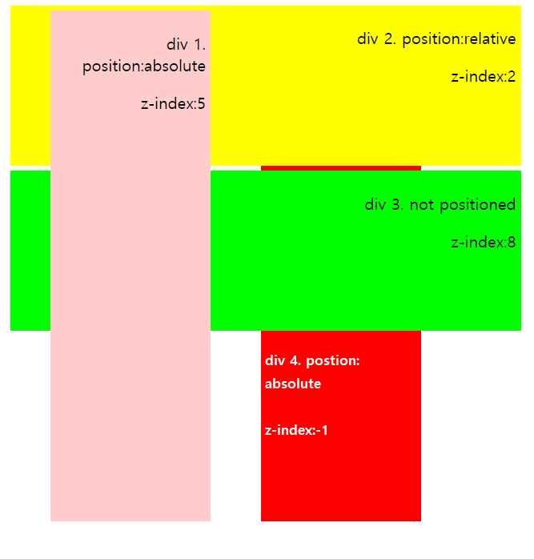
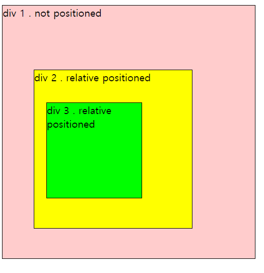

### Goal

- z-index의 사용 방법을 이해한다.
- 쌓임 맥락(stacking context)에 대해서 이해한다.

<br/>

## z-index 사용하기

요소들의 쌓임 순서를 달리하기 위해서는 두가지 조건이 필요하다.

1. **posiiton 속성을 설정한다.**
2. **z-index 속성을 설정한다.**

<br/>

여기서 z-index 속성은 정수값을 가지며, 이 값은 해당 엘리먼트의 z축 상의 위치를 나타내게 된다. <br/>

아래 예시를 통해 position 속성이 정해진 엘리먼트들끼리는 z-index에 의해 쌓임 순서가 결정되는 것을 알 수 있고, position 속성이 적용되지 않은 엘리먼트는 `기본 렌더링 레이어 (Layoer 0)`에 위치되는 것을 알 수 있다.
<br/>



```html
<!DOCTYPE html>
<html lang="en">
  <head>
    <meta charset="UTF-8" />
    <meta name="viewport" content="width=device-width, initial-scale=1.0" />
    <title>Document</title>
    <link rel="stylesheet" href="style.css" />
  </head>
  <body>
    <main class="container">
      <div>
        <p>div 1. position:absolute</p>
        <p>z-index:5</p>
      </div>
      <div>
        <p>div 2. position:relative</p>
        <p>z-index:2</p>
      </div>
      <div>
        <p>div 3. not positioned</p>
        <p>z-index:8</p>
      </div>
      <div>
        <p>div 3. position:absolute</p>
        <p>z-index:-1</p>
      </div>
    </main>
  </body>
</html>
```

```css
main {
  position: relative;
  width: 500px;
  height: 500px;
  text-align: right;
}

div {
  padding: 5px;
  margin: 5px;
}

div:nth-child(1) {
  position: absolute;
  width: 150px;
  height: 500px;
  left: 40px;
  background-color: rgba(255, 204, 204);
  z-index: 5;
}

div:nth-child(2) {
  position: relative;
  width: 500px;
  height: 150px;
  background-color: rgba(255, 255, 0);
  z-index: 2;
}

div:nth-child(3) {
  width: 500px;
  height: 150px;
  background-color: rgba(0, 255, 0);
  z-index: 8;
}

div:nth-child(4) {
  position: absolute;
  width: 150px;
  height: 500px;
  top: 0;
  left: 250px;
  background-color: red;
  z-index: -1;
}
```

<br/>

### z-index가 없는 경우

`모든 엘리먼트에 z-index 설정이 없을 경우`, 혹은 `여러 엘리먼트들이 같은 z-index를 가질 경우`, 엘리먼트들은 다음 순서대로 아래부터 위로 쌓인다.
동일한 순서일 경우 HTML 소스에 쓰여진 순서대로 순서가 결정된다. <br/>


1. **루트 엘리먼트의 배경, 테두리**
2. **position 속성과 floated 속성이 설정되지 않은 block level 엘리먼트들**
3. **position 속성이 설정되지 않은 floated 속성이 설정된 floated 엘리먼트들**
4. **position 속성이 설정되지 않은 inline 엘리먼트들**
5. **position 속성이 설정된 엘리먼트들**

<br/>

아래 예시를 통해서 z-index 속성이 지정되지 않은 경우 어떻게 쌓임 맥락이 결정되는지 알아보도록 하겠다.
<br/>
<br/> 먼저 첫번째 div는 position 속성이 지정되지 않은 block level 엘리먼트이고 두번째와 세번째 div는 position 속성이 relative로 지정되어있다. <br/>

위에서 알아본 순서대로 요소들이 쌓이는 것을 알 수 있다.



```html
<!DOCTYPE html>
<html lang="en">
  <head>
    <meta charset="UTF-8" />
    <meta name="viewport" content="width=device-width, initial-scale=1.0" />
    <title>Document</title>
    <link rel="stylesheet" href="style.css" />
  </head>
  <body>
    <div>
      div 1 . not positioned
    </div>
    <div>
      div 2 . relative positioned
    </div>
    <div>
      div 3 . relative positioned
    </div>
  </body>
</html>
```

```css
div {
  border: 1px solid black;
}

div:nth-child(1) {
  width: 400px;
  height: 400px;
  background-color: rgba(255, 204, 204);
}

div:nth-child(2) {
  position: relative;
  width: 250px;
  height: 250px;
  top: -300px;
  left: 50px;
  background-color: rgba(255, 255, 0);
}

div:nth-child(3) {
  position: relative;
  width: 150px;
  height: 150px;
  top: -500px;
  left: 70px;
  background-color: rgba(0, 255, 0);
}
```

<br/>

### 최종적으로 엘리먼트가 쌓이는 순서

HTML 소스 내 position이 설정된 요소와 그렇지 않은 요소, z-index가 설정된 요소와 그렇지 않은 요소가 있을 때 , 최종적으로 엘리먼트가 쌓이는 순서는 다음과 같다. 동일한 순서일 경우 HTML 소스에 쓰여진 순서대로 순서가 결정된다. <br/>


1. **루트 엘리먼트의 배경, 테두리**
2. **position 속성이 설정되고 z-index가 음수인 엘리먼트들**
3. **position 속성과 floated 속성이 설정되지 않은 block level 엘리먼트들**
4. **position 속성이 설정되지 않은 floated 속성이 설정된 floated 엘리먼트들**
5. **position 속성이 설정되지 않은 inline 엘리먼트들**
6. **position 속성이 설정되고 z-index가 0이거나 auto인 엘리먼트들**
7. **position 속성이 설정되고 z-index가 양수인 엘리먼트들**

<br/>

<br/>

## 쌓임 맥락 (Stacking Context)

쌓임 맥락이란 가상의 Z 축을 사용한 HTML 요소의 3차원 개념화이다. <br/>

위에서 알 수 있듯 특정 요소의 렌더링 순서는 자신의 z-index 속성 값에 의해 결정된다. 이는 **그 요소들이 가진 속성으로 인해** `쌓임 맥락`이 생성되기 때문이다. <br/>

쌓임 맥락은 대표적으로 아래 조건을 만족할 경우 생성된다. <br/>

1. 문서의 루트 요소 (html)
2. position이 absolute , relative 이며, z-index가 auto가 아닌 요소
3. position이 fixed , sticky 인 요소
4. flexbox 컨테이너의 자식 중 z-index가 auto가 아닌 요소
5. grid 컨테이너의 자식 중 z-index가 auto가 아닌 요소
6. opacity가 1보다 작은 요소

<br/>

<br/>

### 쌓임 맥락 내부의 자식 요소의 특징

1. 쌓이 맥락이 생성된 요소의 자식 요소는 쌓임 맥락 생성 규칙 및 z-index 규칙에 의해 동일하게 쌓인다.

2. 쌓임 맥락 내부에 또 쌓임 맥락이 포함 될 수 있다. 따라서 쌓임 맥락은 `계층 구조`를 이룬다.

   - HTML 의 모든 요소가 쌓임 맥락을 가지는 것은 아니므로, 쌓임 맥락 계층구조는 HTML 요소 계층구조의 `부분집합`이다.

3. 자식의 z-index 값은 부모 요소 내부에서만 의미 있다.

4. 자신의 쌓임 맥락을 만들지 않을 경우, 부모의 쌓임 맥락에 의해 동화 된다.

<br/>

<br/>

### Reference

- [ CSS reference z-index ](https://tympanus.net/codrops/css_reference/z-index/)
- [ MDN 쌓임 맥락 ](https://developer.mozilla.org/ko/docs/Web/CSS/CSS_Positioning/Understanding_z_index/The_stacking_context)
- [ MDN z-index적용 ](https://developer.mozilla.org/ko/docs/Web/CSS/CSS_Positioning/Understanding_z_index/Adding_z-index)
- [ MDN z-index가 없는 경우의 쌓임 ](https://developer.mozilla.org/ko/docs/Web/CSS/CSS_Positioning/Understanding_z_index/Stacking_without_z-index)
