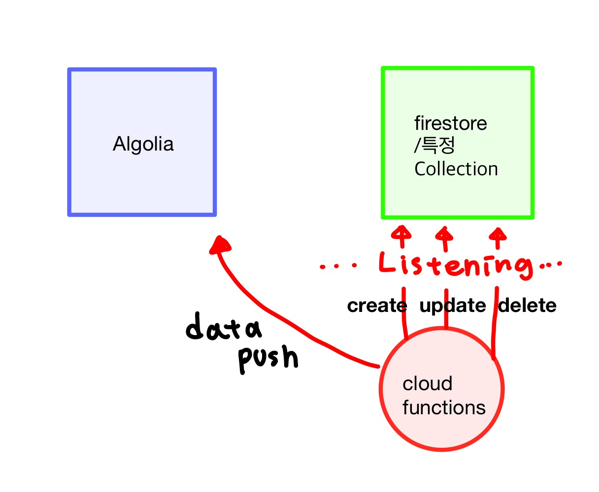
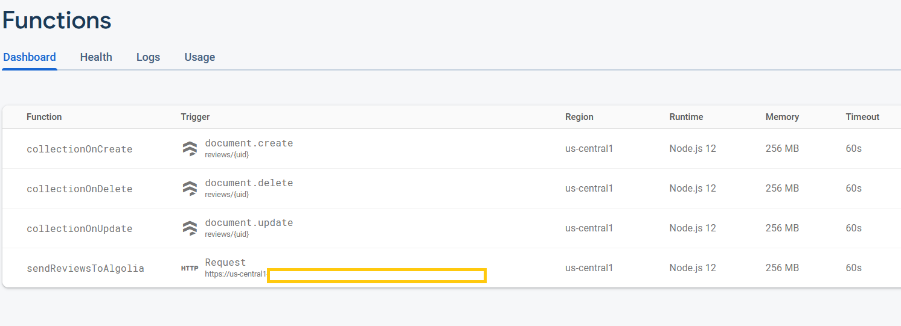

<br/>

## 문제파악

프로젝트에서 파이어베이스를 백엔드로 사용하고 있고, 프로젝트 내에서 **특정 지역명이 들어간 리뷰데이터를 검색**하는 기능을 구현해주어야 했습니다. <br/>

간략하게 리뷰데이터에는 아래와 같은 place_info 가 객체형식으로 저장되어있습니다. <br/>

```
place_info {
	address_name:'서울특별시 영등포구 여의도',
	place_name:'한강공원'
}

```

즉 파이어스토어에 저장된 데이터 중에서 `place name` 혹은 `address_name` 에 사용자가 입력한 키워드가 포함되어있다면 해당 데이터를 보여줘야합니다. <br/>

위의 데이터의 경우 _서울, 영등포, 여의도, 한강, 공원, 한강공원_ 키워드로 입력되었을 때 반환되어야 합니다. <br/>

하지만 큰 문제가 있었습니다..<br/>

파이어베이스에는 부분 문자열 검색 쿼리 기능이 부재하다는 것입니다. [관련문서](https://firebase.google.com/docs/firestore/query-data/queries)를 보면, 파이어베이스에서 제공해주는 검색 쿼리는 `전체문자열, 숫자, 배열(배열 내부 엘리먼트 전체 포함여부)` 가 전부이며, 어찌어찌 파이어베이스에서 제공하는 쿼리를 변형해봐도 문자열의 prefix 혹은 postfix 만 검색이 가능하게 됩니다. <br/>

따라서 무조건 전체 문자열 검색을 하기 위해서는 third-party library를 사용할 수 밖에 없습니다. <br/>

전체 문자열 검색 라이브러리는 Algolia와 Elastic Search 가 대표적이고, 저는 그 중에서 Algolia를 사용하기로 했습니다. <br/>

그럼 앞으로 어떻게 Algolia를 파이어스토어와 연결했는지 알아보겠습니다. <br/>

<br/>

## 문제해결 1) 구조파악

본격적으로 코드를 작성하기 전에 어떻게 Algolia를 이용해서 파이어스토어에 있는 데이터를 서치 할 수 있는지 알아보도록 하겠습니다. <br/>

### Cloud functions 사용

Algolia 와 Firestore 를 연결시키기기 위해서는 Cloud functions를 사용해야합니다. <br/>



위와 같이 Algolia에서 서치 작업을 하기 위해서는 파이어스토어에 있는 데이터가 필요합니다. 새로 생성된 데이터나 수정된 데이터, 그리고 삭제된 데이터에 대한 업데이트도 필요합니다. <br/>

따라서 우리가 Algolia에서 서치할 Collection 에 대한 `create, update, delete` 연산이 들어오는지 cloud functions가 항시 감시하고 있어야합니다. <br/>

Collection 에 연산이 들어오면 해당 연산으로 인한 데이터를 Algolia에 푸시 해주어서 Algolia에 저장된 데이터를 새로 업데이트 할 수 있습니다. <br/>

<br/>

이제 실제로 어떻게 구현이 되는지 알아보도록 하겠습니다.

<br/>

## 문제해결 2) 환경 설정

먼저 몇가지 유의사항이 있습니다.

1. 파이어스토어 무료 플랜에서는 구글 API를 제외한 외부 API에 대한 cloud functions 가 허용되지 않습니다. 따라서 사용량에 따라 금액이 결정되는 유료플랜으로 업데이트 시켜주셔야 합니다.
2. [Algolia](https://www.algolia.com/) 에 가입해주시고, index를 생성해주도록 합니다. 하나의 index에 하나의 Collection 데이터가 들어갑니다.
   - Algolia 역시 무료 플랜을 제공해주지만, 무료 플랜의 경우 한달에 10unit, 약 1000번정도의 연산까지만 제공됩니다. 따라서 Algolia 역시 사용 unit에 따라 금액이 결정되는 플랜으로 바꾸어 주시는게 편합니다. 하지만 1000번까지 연산을 하지 않으실거면 무료플랜이어도 상관없습니다.

<br/>

### Cloud functions 설정

Algolia의 가입 및 index 생성을 마쳤다면 이제 본격적으로 프로젝트의 cloud functions를 설정합니다. 여기서는 npm이 이미 설치 되어있다고 가정합니다. 해당 작업은 클라이언트 소스 폴더 외부에서 진행하도록 합니다.<br/>

<br/>

```
npm install firebase-tools
firebase login
firebase init functions
```

1. firebase CLI를 사용할 수 있도록 firebase-tools를 설치해줍니다.
2. firebase login 을 해서 자신의 파이어베이스 계정 내부 cloud functions에 배포되도록 합니다.
3. firebase init functions 커맨드를 실행하면 `functions`라는 내부 폴더가 생깁니다. 이 때 커맨드에서 JS/TS 설정, eslint 설정을 해줍니다.

<br/>

이제 생성된 functions 폴더 내부에서 진행합니다.

```
cd functions
npm install algoliasearch
npm install -D @types/algoliasearch // ts의 경우
```

1. algoliasearch 모듈을을 functions 내부에서 설치해줍니다.
2. 타입스크립트의 경우 @types를 설치해줘야합니다.

<br/>

이제 Algolia와 관련한 api Id와 Key 설정을 해줘야 Algoliasearch에 접근할 수 있겠죠? <br/>

Algolia의 대시보드 -> API keys에 보면 `Application Id`, `Serach Only API Key` , 그리고 `Admin API Key`가 있습니다. Algolia의 데이터를 조작할 때에는 `Admin API Key`을 사용해주시고, 이따가 클라이언트 사이드에서 Algolia의 서치 결과를 가져올 때에는 `Serach Only API Key`를 사용해주시면 됩니다.

파이어베이스에서는 아래와 같은 커맨드라인으로 환경변수를 간단하게 설정할 수 있도록 해줍니다. <br/>

아래 "API_ID"와 "ADMIN_API_KEY"에 발급받으신 ID와 KEY를 넣어서 환경변수를 저장해주세요.

```
firebase functions:config:set algolia.appid="API_ID" algolia.apikey="ADMIN_API_KEY"
```

<br/>

이렇게해서 Algolia와 연결된 Cloud functions를 파이어베이스에 배포하여 연결할 환경설정을 마쳐주었습니다.<br/>

<br/>

## 문제해결 2) 함수작성 및 배포

<br/>

먼저 필요한 모듈들을 import 해주고 초기화 합니다.

```typescript
import * as functions from 'firebase-functions'
import * as admin from 'firebase-admin'
import algoliasearch from 'algoliasearch'

admin.initializeApp()

const env = functions.config() // 환경변수
const db = admin.firestore() // 파이어스토어
const client = algoliasearch(env.algolia.appid, env.algolia.apikey) // algolia search 클라이언트
const index = client.initIndex('인덱스 명') // client 내부 index
```

`client.initIndex` 메서드에는 아까 생성한 인덱스 명을 넣어주세요.

<br/>

### 필요한 함수

Cloud functions에 배포할 함수는 아래 네 가지입니다.

- 현재 파이어스토어 Collection 에 있는 데이터를 전부 algolia로 옮겨 주는 함수
- 파이어스토어 Collection 의 create에 대한 연산을 감시하고, 그에 따라 algolia에 생성된 문서를 푸시해주는 함수
- 파이어스토어 Collection 의 update에 대한 연산을 감시하고, 그에 따라 algolia에 문서를 수정해주어 푸시해주는 함수
- 파이어스토어 Collection 의 delete에 대한 연산을 감시하고, 그에 따라 algolia에서 특정 문서를 삭제해주는 함수

. <br/>

여기서 로직을 더 간결화 하기 위해서 'Algolia에 데이터 저장' / 'Algolia에 데이터 수정(삭제 후 저장)' / 'Algolia에 데이터 삭제' 함수를 따로 작성해줍니다.

<br/>

### 보조함수 ) 1. Algolia에 데이터 저장

```typescript
const saveDocumentInAlgolia = async (
  snapshot: FirebaseFirestore.DocumentSnapshot
) => {
  try {
    if (snapshot.exists) {
      const data = snapshot.data()
      if (data) {
        // 저장 , objectID는 꼭 설정해야함
        await index.saveObject({ objectID: snapshot.id, ...data })
      }
    }
  } catch (error) {
    console.error(error)
  }
}
```

- 파이어스토어에서 Collection에서 특정 Document에 대해 .get() 함수를 실행하면 `snapshot`이 반환됩니다. 이 snapshot을 파라미터로 넣어주고, `snapshot.data()`를 통해 Document의 데이터를 복사해서 넣어줍니다. <br/>
- 이 때 objectID는 Algolia에서 저장될 데이터들을 구분하기 위한 고유 ID입니다. objectID를 파이어베이스의 해당 doucment의 id와 같게 설정해줍니다. objectID를 설정해주지 않으면 함수가 제대로 실행되지 않습니다.

<br/>

### 보조함수 ) 2. Algolia 데이터 삭제

```typescript
const deleteDocumentInAlgolia = async (
  snapshot: FirebaseFirestore.DocumentSnapshot
) => {
  try {
    if (snapshot.exists) {
      const objectID = snapshot.id
      // 삭제할 데이터의 Id를 가져와서 objectID에 저장해준다.
      await index.deleteObject(objectID)
      // 해당 objectID를 통해 index에서 데이터를 삭제해준다.
    }
  } catch (error) {
    console.error(error)
  }
}
```

- 데이터 삭제 역시 간단합니다. 파이어스토어에서 반환해주는 `snapshot`데이터를 통해 해당 document의 고유 id를 가져옵니다. 위에서 저장할 때, `document Id === objectID`가 되도록 저장했으니, 해당 id를 통해 삭제 연산을 진행해줍니다.

<br/>

### 보조함수) 3. Algolia 데이터 수정

```typescript
const updateDocumentInAlgolia = async (
  change: functions.Change<FirebaseFirestore.DocumentSnapshot>
) => {
  try {
    // 변경전 데이터
    const docBeforeChange = change.before.data()
    // 변경후 데이터
    const docAfterChange = change.after.data()
    if (docBeforeChange && docAfterChange) {
      await deleteDocumentInAlgolia(change.before) // 변경 전 데이터 삭제
      await saveDocumentInAlgolia(change.after) // 변경 후 데이터 저장
    }
  } catch (error) {}
}
```

- Algolia가 따로 update 메서드를 제공해주지 않으므로, 파이어스토어 업데이트 연산 후 반환되는 `change snapshot`데이터에서 `before data snapshot`과 `after data snapshot` 을 각각 추출해줍니다.
- 그리고 이전 데이터를 삭제해주고, 새로운 데이터를 저장해줍니다.

<br/>

<br/>

이제 기본적인 함수 작성을 마쳤으니 실제로 cloud functions에 배포할 함수 작성을 하겠습니다. <br/>

### 1. 파이어스토어 Collection 데이터 이전->Algolia 이전

```typescript
/** save all the reviews now in db to Algolia */
export const sendDocumentToAlgolia = functions.https.onRequest(
  async (req, res) => {
    try {
      const algoliaRecords: any[] = []
      // db Collection에 있는 데이터를 모두 가져와서 파싱해줍니다.
      const querySnapshot = await db.collection('reviews').get()
      querySnapshot.docs.forEach(doc => {
        const document = doc.data()
        const record = {
          objectID: doc.id, // objectID 저장
          ...document, // 기존 document 데이터 저장
        }
        // 저장된 내용을 배열에 담아줍니다.
        algoliaRecords.push(record)
      })

      // < saveObjects > 메서드를 통해 배열을 한꺼번에 저장해줍니다.
      index.saveObjects(algoliaRecords, (_error: any, content: any) => {
        res.status(200).send('succeeds!')
      })
    } catch (error) {
      res.status(400).send(error)
    }
  }
)
```

- 해당 함수는 http 리퀘스트 함수로, 실행하기 위해서는 이따가 cloud functions에 배포한 후에 직접 url을 열어서 요청을 보내주어야 합니다.
- 로직은 간단합니다. 파이어스토어에서 algolia에 저장할 collection 내부 데이터를 모두 가져와서, 파싱 (objectId와 나머지 데이터들)해줍니다. 파싱한 데이터들을 index에 저장해줍니다.

<br/>

### 2. 파이어스토어 Collection 감시 함수들 ( 생성/ 삭제 /수정 )

```typescript
// listen to create review
export const collectionOnCreate = functions.firestore
  .document('reviews/{uid}')
  .onCreate(async (snapshot, context) => {
    try {
      await saveDocumentInAlgolia(snapshot) // 저장
    } catch (error) {
      console.error(error)
    }
  })

// listen to update review
export const collectionOnUpdate = functions.firestore
  .document('reviews/{uid}')
  .onUpdate(async (change, context) => {
    try {
      await updateDocumentInAlgolia(change)
      수정
    } catch (error) {
      console.error(error)
    }
  })

// listen to delete review
export const collectionOnDelete = functions.firestore
  .document('reviews/{uid}')
  .onDelete(async (snapshot, context) => {
    try {
      await deleteDocumentInAlgolia(snapshot) // 삭제
    } catch (error) {
      console.error(error)
    }
  })
```

- 배포할 함수들로 ,`onCreate, onUpdate, onDelete` 메서드를 통해 Collection에 들어오는 연산을 감지합니다.

<br/>

<br/>

### 배포하기

이제 작성한 함수를 배포해줍니다.

```
firebase deploy --only functions
```

<br/>



배포후 파이어베이스에 접속하여 functions 대시보드에 접속하면 위와 같이 함수들이 모두 등록되어있는 것을 볼 수 있습니다. <br/>

여기서 아까 http 리퀘스트로 작성한 함수를 실행해주어야 합니다. 함수 아래에 적힌 url을 주소창에 입력하시면 리퀘스트가 실행되고 정상적으로 Algolia에 collection 내부 document가 저장되는 것을 보실 수 있습니다. <br/>

다른 감시 함수들도 파이어스토어 연산 시 실행됩니다.

<br/>

<br/>

## 문제해결 3) 클라이언트에서 Algolia 데이터 사용

이제 마지막으로 클라이언트 사이드에서 Algolia에 데이터 search 를 사용해야합니다. <br/>

- Algolia에서 자체적으로 React, vue, Angluar의 instant search UI를 제공합니다. 하지만 저는 데이터만 필요하고 UI는 필요하지 않으므로 생략합니다.

<br/>

```
npm install algoliasearch
npm install -D @types/algoliasearch
```

클라이언트 사이드에서 algoliasearch를 사용할 것이므로 또 algoliasearch 모듈과 types를 설치합니다.<br/>

그리고 아까 발급받았던 `Application Id`, `Serach Only API Key` 를 클라이언트 사이드 환경변수에 저장해줍니다.

 <br/>

<br/>

### search Keyword

```typescript
import algoliasearch from 'algoliasearch';
import * as T from 'types/API';

const client = algoliasearch(
  process.env.ALGOLIA_APP_ID || '',
  process.env.ALGOLIA_APP_KEY || ''
);
const index = client.initIndex('인덱스명);

const getDatasFromAlgolia = async (
  keyword: string // 유저가 검색한 키워드
): Promise<T.lightReviewData[]> => {
  try {
    const response = await index.search(keyword);
    return response.hits; // repsonse 데이터 내부 hits 프로퍼티에 데이터가 배열로 저장
  } catch (error) {
    throw error;
  }
};
```

- 환경번수로 client그리고 index를 설정해줍니다.
- `index.search(키워드)` 메서드를 통해 쿼리 실행 데이터를 가져옵니다. 데이터는 응답 데이터 내부 hits 프로퍼티에 array 형식으로 저장되어 있습니다.

<br/>

<br/>

## 마치며

이렇게 Algolia와 firestore를 연결해서 어떻게 firestore 데이터에 대해 전체문자열 검색을 할 수 있는지 알아보았습니다. <br/>

사실 처음에는 굉장히 막막했습니다. 너무 복잡해보였고, 어떻게든 파이어베이스가 제공하는 기본 쿼리를 통해 해결해보려고 했으나.. 약 3년전부터 최근까지 [스택오버플로](https://stackoverflow.com/questions/46568142/google-firestore-query-on-substring-of-a-property-value-text-search/52715590#52715590) 에서도 활발히 진행되고 있을만큼, 명확하게 파이어베이스 기본 쿼리를 통해 해결 할 수 있는 방법이 없었습니다. <br/>

그래서 새로운 도전이다! 생각하며 Algolia, cloud functions 를 처음으로 이용하게 되었습니다. 후기는 .. 보기보다 굉장히 간단히 구현될 수 있다는 것입니다 ㅎㅎ<br/>

글을 읽으시는 분들 중에 혹시 파이어베이스의 쿼리때문에 고민중이신 분이 계시다면 당장 써드파티를 도입하시길 적극 추천드립니다. 심지어 서치 속도도 굉장히 빠릅니다.

<br/>

<br/>

## Reference

- [Algolia Firestore Instant Search](https://www.youtube.com/watch?v=3Z0V3cvgns8&ab_channel=Fireship)

- [How to set up Firestore and Algolia using Cloud Functions.](https://medium.com/@soares.rfarias/how-to-set-up-firestore-and-algolia-319fcf2c0d37)
