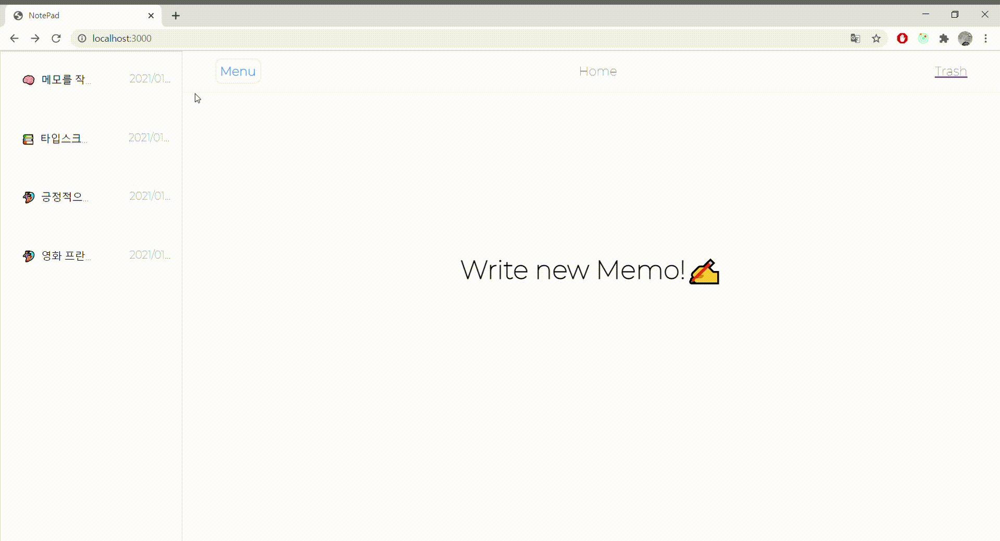
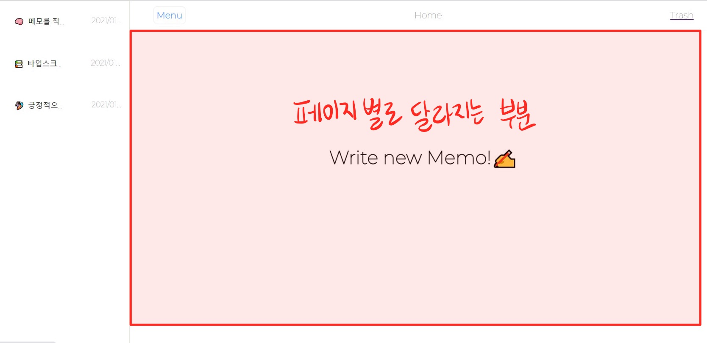
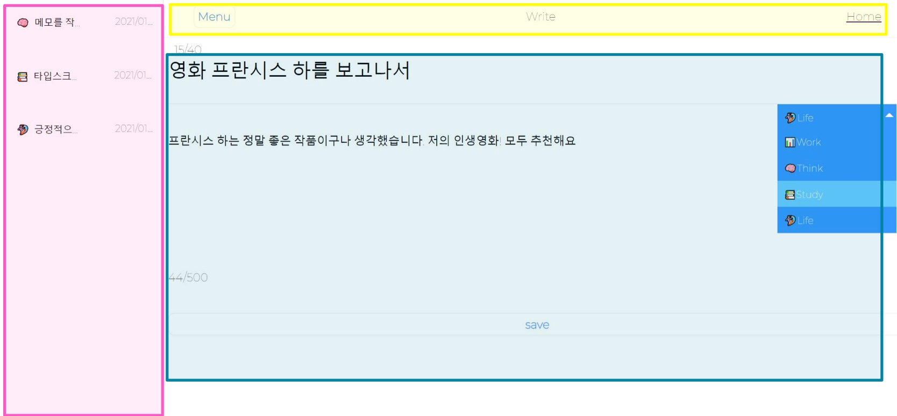
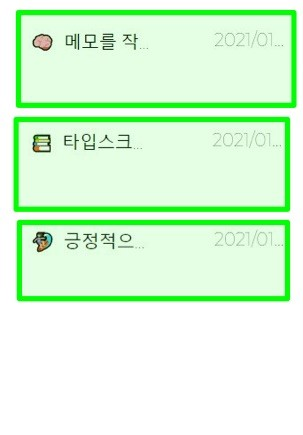
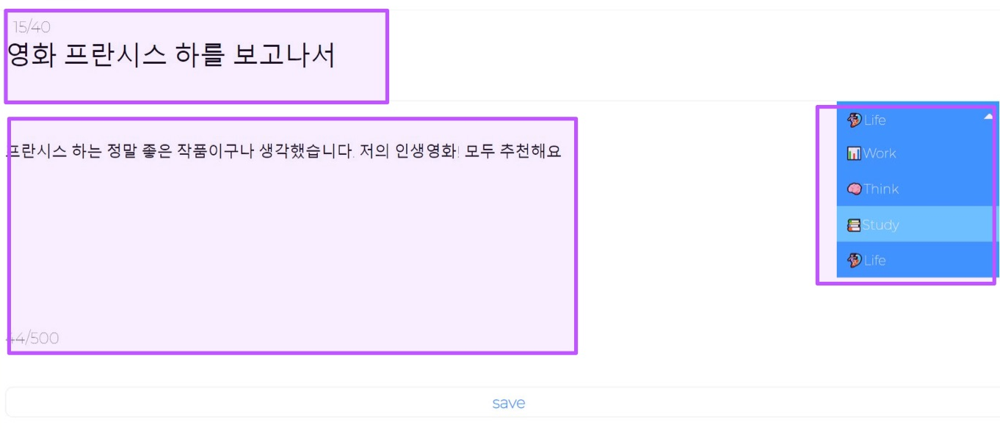
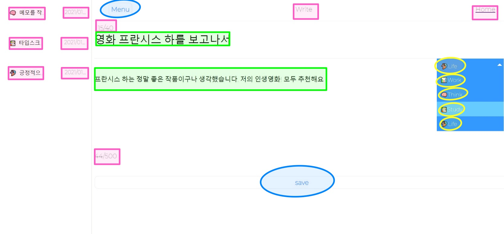

### 프로젝트 목적

여기서 만드는 메모장 어플리케이션은 규모가 크지도 않고, 코드 간 복잡도도 높지 않아 굳이 아토믹 패턴이 필요하지는 않지만, 이전에 계속해서 SPA 프로젝트를 하며 느꼈던 것은 `특정 컴포넌트를 계속해서 재사용할 수 있으면 효율적이겠다` 라는 것이었다. 또한 , 각각의 엘리먼트가 컴포넌트화 되어있으므로 특정 엘리먼트의 디자인을 변경할 때에도 더 효율적이겠다고 생각했다.<br/>

그러던 도중 컴포넌트를 Atoms -> Molecules -> Organisms -> Templates -> Pages 의 단계로 세분화하는 아토믹 디자인 패턴을 발견했다. 그렇다고 이전에 만든 프로젝트를 모두 아토믹 디자인 패턴으로 변경하기에는 시간상 무리가 있었기 때문에, 이를 활용해보기 위해 간단한 메모장 어플리케이션을 만들어보고자 한다. <br/>

**_아토믹 패턴이 처음이라 컴포넌트 설계가 완벽하지 않은 점을 이해해 주시길 바랍니다._**

[깃헙 소스코드 바로가기](https://github.com/moonheekim0118)

<br/>

### 아토믹 디자인 패턴에 대하여


<br/>

먼저 아토믹 디자인 패턴에 대해 정의를 내리고 가자 <br/>

1. **Atoms**
   - 가장 작은단위의 컴포넌트로 HTML 엘리먼트 하나에 해당한다.
   - Button, Input 필드, Span , Label가 여기에 해당한다.
2. **Molecules**
   - 2개 이상의 Atoms로 구성된 컴포넌트로, 하나의 단위로 함께 동작하는 UI 컴포넌트의 그룹이다.
   - Input 필드와 label을 함께 구성하여 Molecules를 만들 수 있다.
3. **Organisms**
   - Organisms는 Atoms, Molecules 또는 다른 Organisms 그룹으로 구성된 비교적 복잡한 컴포넌트이다.
   - 헤더 , 네비게이션, 회원가입 폼이 여기에 해당한다.
4. **Templates**
   - 실제 페이지에 대한 골격 구조로 이루어진 컴포넌트이다.
   - 실제 비즈니스 로직 없이 레이아웃 구조만 잡힌 상태이다.

<br/>

### 프로젝트 골격 잡기



아토믹 디자인 패턴으로 수행할 때 가장 어려웠던 점은, bottom-up 으로 설계를 해야한다는 점이었다. 따라서 특정 페이지를 만들 때 처음 시작이 막막했는데 , 나는 개인적으로 'Organisms'을 뭘로 할 지부터 결정 하고, 그 후에 Organisms에 들어갈 Molecules,그리고 Moelcules에서 나눠질 Atoms 순서대로 설계를 해보았다. <br/>

먼저 메모장 어플리케이션에 대해 간단하게 소개하자면, 파이어베이스로 간단하게 백엔드를 구축했고, 백엔드로부터 데이터를 쉽게 가져오고 작성하기 위해서 리덕스-사가를 이용했다. 페이지 리스트는 아래와 같다. <br/>

> / = 메인페이지로 , write Review 버튼이 있다. 네비게이션 바를 통해서 작성된 메모로 이동 가능하다.
>
> /:id = id에 따라서 작성된 메모를 불러온다. update 버튼을 통해 update/:id 페이지로 이동 가능하고, remove 버튼을 통해서 메모를 쓰레기통(trash)에 넣을 수 있다.
>
> /update/:id = id 에 해당하는 메모를 수정하는 페이지이다.
>
> /write = 새로운 메모를 작성하는 페이지이다.
>
> /trash = 쓰레기통 메인페이지로, 네비게이션 바를 통해서 쓰레기 통에 있는 다른 메모로 이동 가능하다.
>
> /trash/:id = id 에 따라서 특정 메모를 불러온다. restore 버튼을 통해서 쓰레기통에 있는 메모를 복구 가능하고, remove를 통해서 영구 삭제 가능하다.

<br/>

유의 할 점은, 이 메모장 어플리케이션은 모든 페이지의 레이아웃이 동일하다는 점이다. (네비게이션바와 헤더 그리고 페이지에 따라서 달라지는 메인 컨텐츠 )

<br/>

먼저 각 단계에 어떤 컴포넌트가 해당했는지 소개해보도록 하겠다. <br/>
<br/>

## Templates & Organisms


<br/>

먼저 템플릿 ( 레이아웃 ) 을 구성하면 위와 같아진다. 가운데의 컨텐츠만 페이지별로 달라지고, 네비게이션과 헤더는 공통이다. 위의 Template에서 Organisms을 추출해보도록 하겠다.
<br/>


<br/>

하나의 템플릿 내에서 Organisms가 되는 컴포넌트는 `Header`, `Navigation`, 그리고 메인 컨텐츠로 올`MemoEditor(메모 작성 컴포넌트 )` `,MemoView( 작성한 메모 보여주는 컴포넌트 )` 가 된다. <br/>

해당 컴포넌트의 공통점은 모두 `그 자체로 하나의 기능을 하고 있다`는 점이며, 여러 페이지에서 그 자체로 쓰일 수 있다는 것이다.

<br/>

## Molecules

Molecules에 들어갈 컴포넌트는 Organisms 컴포넌트에서 필요한 부분을 분해한 것이다.


<br/>

위에서 Organisms이 된 네비게이션 컴포넌트를 보자면, `Title - 메모작성 시간` 이 네비게이션이 되고 , 이는 네비게이션 바에서 반복되서 나타난다. <br/> 따라서 `Title - 메모 작성 시간` 을 보여주는 컴포넌트를 `ListItem` 컴포넌트로써 Molecules로 추출할 수 있다.


<br/>

MemoEditor 컴포넌트에서도 마찬가지이다. 메모의 Title을 입력받는 Textarea와 본문을 입력받는 Textarea는 서로 다른 레이아웃을 가지고 있기 때문에 각각 `TitleText` 와 `MainText`로 나누어 Molecules가 될 수 있다. <br/> 또한 메모의 종류를 선택가능한 Select 바 역시도 나중에 재사용할 수 있도록 Molecules로 추출할 수 있다. - `Select`<br/>

<br/>

해당 컴포넌트의 공통점은 모두 그 자체로 하나의 기능은 하지 못하지만, Organisms 컴포넌트에 있어서 핵심 요소가 될 수 있다는 것이다.

<br/>

## Atoms

마지막으로 Atoms로 분류할 것들을 찾아보자. Atoms는 가장 작은 단위로 나눌 수 있는 것을 넣어야 한다. 그렇게 되면 아까 나눈 Molecules 들에서 공통적으로 쓰이는 컴포넌트들을 찾아보도록 하겠다.
<br/>



- 분홍색으로 표시 된 부분은 모두 같은 Span 요소를 사용한다. 사이즈와 색상만 달라질 뿐이다.

- 초록색으로 표시 된 부분은 모두 같은 Textarea 필드를 사용한다. 이 역시 사이즈만 달라질 뿐이다.
- 파란색으로 표시된 부분은 모두 같은 Button 요소를 사용한다. 이 역시 스타일링만 달라질 뿐이다.
- 노란색으로 표시된 부분은 모두 같은 li 요소를 사용한다.

따라서 위에서 작성한 Molecules로부터 추출되는 Atoms는 `Span`, `Textarea`, `Button`, `li (Option)` 이 된다. <br/>

해당 컴포넌트의 공통점은 컴포넌트 자체가 하나의 요소로서 사용된다는 것이다. <br/>

<br/>

## Templates

이제 다시 Templates로 돌아왔다! <br/>

일단 해당 어플리케이션에서는 모든 페이지의 레이아웃이 동일하므로 **하나의 Templates를 사용**하고, **페이지별로 children 을 다르게 주는 방법**을 택했다. <br/>

그리고 서버사이드렌더링이 구현되지 않았기 때문에 `useEffect`를 통해서 페이지별로 서버로부터 데이터베이스를 가져와야했는데 공통된 연산, 즉 `모든 메모 리스트 || 쓰레기통 리스트 불러오기` 같은 경우는 Templates 에서 처리해주도록 했다. <br/>

코드는 아래와 같다. <br/>

```typescript
import React, { useEffect } from 'react'
import { useDispatch, useSelector } from 'react-redux'
import { loadMemoAction, loadTrashAction } from '../../actions/memo'
import useToggle from '../../hooks/useToggle'
import Navigation from '../../components/organisms/Navigation'
import Header from '../../components/organisms/Header'
import styled from 'styled-components'

interface Props {
  pageName: string
  children?: React.ReactNode
  type: 'memos' | 'trash'
}

const Templates = ({ pageName, children, type }: Props) => {
  const dispatch = useDispatch()
  const { memos, trash } = useSelector(state => state.memo)
  // Toggle Navigation -> 네비게이션 토글과 관련한 상태 및 토글 함수를 관리한다.
  const [openNav, toggleNav] = useToggle()

  useEffect(() => {
    // API 요청을 보내준다.
  }, [])

  return (
    <Main open={openNav}>
      <Navigation
        open={openNav}
        datas={type === 'memos' ? memos : trash}
        type={type}
      />
      <Header onToggle={toggleNav} pageName={pageName} />
      {children} // 받아온 children
    </Main>
  )
}

const Main = styled.main<{ open: boolean }>`
  position: absolute;
  right: 0;
  display: flex;
  flex-direction: column;
  justify-content: center;

  height: 80%;
  transition: width 0.5s ease;
  width: ${props => (props.open ? 'calc(100% - 280px);' : '100%')};
`

export default Templates
```

<br/>
<br/>

### 마치며

매우 간단한 어플리케이션을 아토믹 패턴으로 구현해보면서 `재사용성 있는 컴포넌트 설계` 에 대해서 더 깊이 생각해 볼 수 있었다. 컴포넌트 설계가 아직 많이 부족하지만 추후 사이드프로젝트 구현 시에 꽤 유용하게 사용 할 수 있을 것 같다. <br/>
하지만, 컴포넌트 설계에 꽤 오랜시간이 걸린다는 것과, 처음 설계 할 때 갈피를 못겠다는 점, 그리고 상태를 넘겨줄 때의 애매모호함과 같은 단점도 있으니..도입할때는 많은 고민을 해봐야할 것 같다.

<br/>

### Reference

[리액트 어플리케이션 구조 - 아토믹 디자인](https://ui.toast.com/weekly-pick/ko_20200213) <br/>
[Atomic Design으로 Todo 만들기](https://velog.io/@thsoon/%EC%93%B8%EB%95%8C%EC%97%86%EC%9D%B4-%EA%B3%A0%ED%80%84%EC%9D%B8-%ED%88%AC%EB%91%90%EB%A6%AC%EC%8A%A4%ED%8A%B8-%EB%A7%8C%EB%93%A4%EA%B8%B0-FE-2.-%EB%B7%B0-%EC%84%A4%EA%B3%84) <br/>
[Atomic Design](https://velog.io/@moaikang/Atomic-Design%EC%9D%84-%EC%9D%91%EC%9A%A9%ED%95%B4-React-%ED%94%84%EB%A1%9C%EC%A0%9D%ED%8A%B8-%EA%B5%AC%EC%A1%B0%EB%A5%BC-%EC%84%A4%EA%B3%84%ED%95%98%EA%B3%A0-%EA%B8%B0%EC%88%A0-%EC%8A%A4%ED%83%9D%EC%9D%84-%EA%B2%B0%EC%A0%95%ED%95%9C-%EA%B2%BD%ED%97%98)
