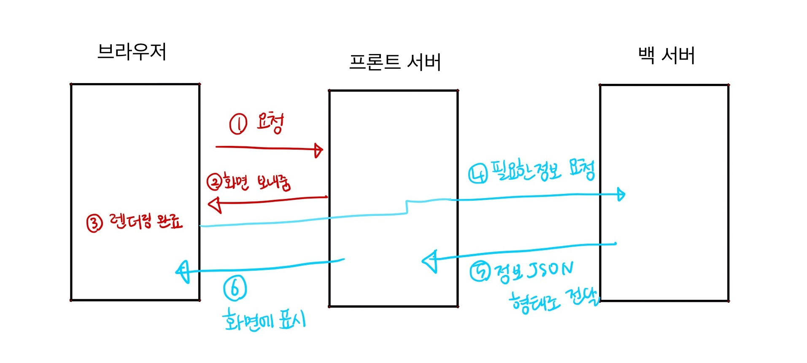
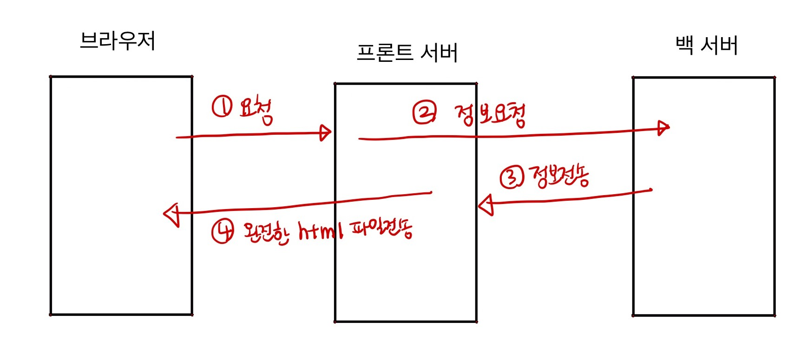

## Goal

- 클라이언트 사이드 렌더링과 서버 사이드 렌더링의 개념을 이해한다.
- 각각의 이점과 단점을 이해한다.

 

## Rendering 이란 ?

- 브라우저가 서버로부터 받아온 HTML 파일을 화면에 보여주는 과정을 뜻한다.

 

## Single Page Application란 ?

- SPA는 클라이언트 사이드 렌더링 (CSR) 방식이다.

- single page application (SPA) 란, `최초 브라우저 로딩시 한번만 전체 페이지를 로드`하고, 이 후에는 필요할 때마다 서버에서 컨텐츠를 JSON 형태로 받아오는 방식이다. 즉, 서버에서 데이터를 HTML로 받아오지 않는다.

- SPA는 최초 로딩으로 화면 구성에 필요한 HTML 데이터를 브라우저가 받아오고 , 필요한 데이터를 JSON으로 받아오기 때문에 화면 전체를 다시 구성하는게 아니라 화면의 일부분만 재구성하므로 최초 로딩 이후에는 화면 구성 속도가 매우 빠르다.

## Client Side Rendering 과정

1. 사용자가 해당 페이지에 접속하면 브라우저가 프론트서버로 파일 (화면) 을 요청한다.
2. 요청받은 프론트 서버가 해당 화면 (번들링된 파일)을 브라우저로 보내준다.
3. 브라우저는 프론트 서버로부터 받은 HTML 파일을 다운로드 하고, 자바스크립트 파일을 다운로드 한후, 자바스크립트를 실행한다.
4. 이 때 자바스크립트가 실행되면서, 백 서버로의 데이터 요청이 있을 경우 프론트 서버에서 백 서버로 요청이 전달된다.
5. 백 서버는 해당 요청에 대한 응답을 JSON 형식으로 보내준다.
6. 프론트서버가 백 서버로부터 받아온 해당 데이터를 브라우저에 전달함으로써 브라우저 화면에 fetch 된 데이터가 표시된다.

- 초기 로딩 이후에는 페이지가 바뀌거나 사용자 행동에 따라 4~6번 과정만 실행된다.

 

### CSR의 장점

- 사용자의 요청에 따라 필요한 부분의 데이터만 읽어들이기 때문에 사용자와의 인터렉션이 매우 빠르다.
  - 심지어 다른 페이지로 이동하더라도, hash 방법이나 html 파일만 변경하는 방법을 사용함으로써 전체 화면을 다시 그릴 필요가 없다.

### CSR의 단점

- 최초 로딩시 빈 HTML 파일을 가져오기 때문에 검색 엔진에 노출이 되지 않는다.
- 최초에 html 다운로드 후 자바스크립트 실행까지 마쳐야 하므로 초기 구동 속도가 느리다.

 

 

## Server Side Rendering 과정

1. 사용자가 해당 페이지에 접속하면 브라우저는 프론트 서버로부터 파일 (화면) 을 요청한다.
2. 이 때 최초로 프론트 서버에서 백 서버로 필요한 정보를 모두 요청 한다.
3. 백 서버는 해당 정보를 프론트 서버로 전송한다.
4. 프론트 서버는 백 서버로부터 받아온 데이터에 기반하여 완전한 HTML 파일을 브라우저로 전송한다. 이 후 브라우저에서 자바스크립트 파일을 다운로드 받는다.

- 초기 로딩 이후에 페이지가 바뀌면 1번~4번의 과정을 다시 반복한다.

 

### SSR의 장점

- 최초 로딩이 빠르다. 브라우저가 html 파일 다운로드 -> 자바스크립트 다운로드 -> 서버에 요청 과정 없이 완벽한 html 파일을 받아오기 때문이다.

- 최초 로딩시 데이터가 모두 채워진 HTML 파일을 받아옴으로, 검색엔진에 노출이 용이하다.

 

### SSR의 단점

- 페이지 이동이 있을 때마다 데이터를 새로 다시 받아오고 HTML을 새로 그리기 때문에 비효율적이다.
  - 심지어 이전 페이지와 겹치는 정보가 있더라도 해당 정보를 서버로부터 다시 받아서 모든 화면 전체를 다시 그려야 한다.

 
 
 

---

이번 트위터 클론 프로젝트에서 Next.js로 SSR 을 구현하며 SSR이 주는 장점과 이점을 모두 이해할 수 있었다. 역시 가장 큰 단점은 페이지가 바뀔 때마다 계속해서 같은 데이터를 요청하고 화면을 새로 그려야한다는 점이 었다.   다른 페이지로 라우팅 됨에 따라 바뀌는 데이터는 단 하나임에도 불구하고 같은 데이터를 계속해서 불러와야해서 매우 비효율 적이었다. 그럼에도 불구하고 SSR은 유저에게 안정적으로 데이터가 로딩된 웹페이지를 보여줄 수 있고, SEO도 적용할 수 있기 때문에 장점이 더 큰 듯하다. 물론, 프로젝트의 성질과 방향에 따라 어떤 렌더링 방식이 최적일지는 달라지겠지만 말이다.

 
 

## Reference

[왜 서버사이드 렌더링이 필요할까요](https://medium.com/@donggyu9410/%EC%99%9C-%EC%84%9C%EB%B2%84-%EC%82%AC%EC%9D%B4%EB%93%9C-%EB%A0%8C%EB%8D%94%EB%A7%81%EC%9D%B4-%ED%95%84%EC%9A%94%ED%95%A0%EA%B9%8C%EC%9A%94-eb41a594f94b)

[Server-Side Rendering (SSR), the Pros & Cons](https://techstacker.com/server-side-rendering-ssr-pros-and-cons/)

[SPA와 SPA 라우팅원리](https://reimaginer.tistory.com/entry/spa-and-spa-routing)
