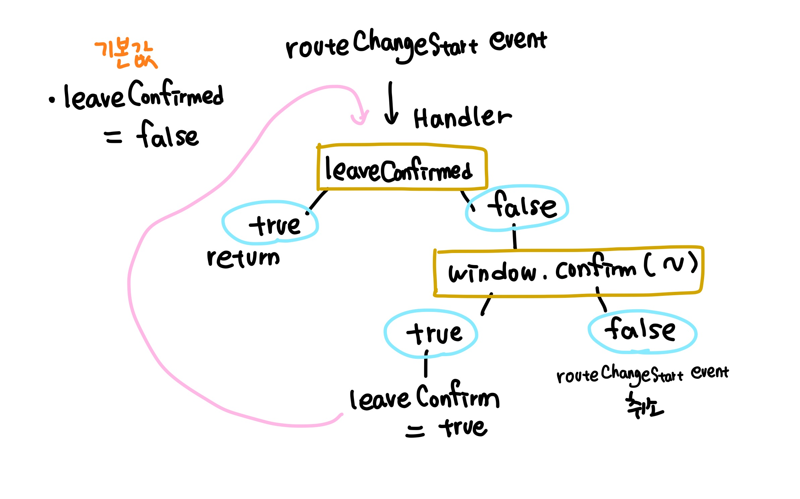

오늘은 Next.js 의 `router`를 이용해 사용자가 페이지를 벗어나려고 하는지 감지할 수 있는 방법에 대해 기록하고자 합니다.

먼저 요구사항은 아래와 같습니다.

<br/>

### 요구사항

1. 뒤로가기 / 앞으로 가기 / 탭 닫기와 같은 브라우저 탭을 벗어나려고 할 때 Alert을 띄워주고, 취소를 클릭하면 페이지에 머무른다.

2. 앱 내부에서 라우팅을 변경하려고 할때 Alert를 띄워주고, 취소를 클릭하면 페이지에 머무른다.

<br/>

여러 페이지에서 쓰일 수 있으므로 커스텀훅스로 구현하도록 하겠습니다. <br/>

먼저 첫번째 요구사항부터 해결해봅니다. <br/>

뒤로가기 / 앞으로가기 / 탭 닫기 연산은 어플리케이션 내부에서 라우팅이 변경되는게 아니라 브라우저 History 자체를 변경해주는 것입니다. 따라서 이는 window의 이벤트리스너로 해결이 가능합니다.

<br/>

### beforeunload 이벤트

해당 이벤트를 간단히 소개하자면 아래와 같습니다. <br/>

1. 현재 페이지 내부의 리소스가 사라지려고 할 때 (unload) 이벤트가 트리거 됩니다.
2. 이벤트가 트리거 된 시점에서 리소스는 아직 사라지지 않고 유저에게 보여지며, 이 시점에서 우리는 unload 이벤트를 취소 할 수 있습니다.

위의 특징에 따라 사용자가 뒤로가기 - 앞으로가기 혹은 탭 닫기 버튼을 눌렀을 때 이벤트가 트리거 되고, 우리는 alert 창을 띄워서 사용자에게 unload 이벤트를 취소할 것인지, 아니면 해당 페이지를 벗어날 것인지 물어볼 수 있습니다. <br/>

### alert 창 띄우기

beforeunload 이벤트가 트리거 되었을 때, alert 창을 띄우기 위해서는 아래와 같이 이벤트 핸들러에서 `e.preventDefault` 를 실행 해주어야 합니다. <br/>

```javascript
const handleWindowClose = e => {
  e.preventDefault()
}

window.addEventListener('beforeunload', handleWindowClose)
```

<br/>

alert 창 내부 메시지를 바꾸기 위해서는 아래와 같이 `e.returnValue` 에 원하는 메시지를 넣어주시면 됩니다.

```javascript
const handleWindowClose = e => {
  e.preventDefault()
  return (e.returnValue = '변경사항이 저장되지 않습니다. 나가시겠습니까>')
}

window.addEventListener('beforeunload', handleWindowClose)
```

<br/>

<br/>

### Next.js 앱 내부 라우팅 변경 감지

그렇다면 next.js 내부에서 라우팅 변경은 어떻게 감지할 수 있을까요? 위의 설정만으로는, Next.js의 Link나 router.push 등에 의한 주소 변경을 감지 할 수 없습니다. <br/>

대신 Next.js의 router에는 아래와 같은 이벤트가 있고 이에 대하여 핸들러를 등록 할 수 있습니다 .<br/>

### routeChangeStart 이벤트

**라우팅 변경이 시작 될 때** 트리거 됩니다. 이 역시 이벤트가 트리거 되었을 때 beforeunload 이벤트 처럼 중단 시킬 수 있습니다. 현재 구현상황에서는 쓰이지 않지만, routeChangeComplete 이벤트도 존재합니다. 라우팅이 완료되었을 때 트리거 됩니다. <br/>

그렇다면 Next.js에서는 어떻게 해당 이벤트를 중단시킬 수 있을까요? 아래와 같은 로직을 따릅니다. <br/>



먼저 기본값으로 leaveConfirm 을 false 로 저장해놓습니다.

1. routeChangeStart 이벤트가 트리거 되었습니다.
2. leaveConfirm이 true 라면 핸들러 함수를 종료시키고 라우팅 변경을 시작합니다.
3. leaveConfirm 이 false 라면, window.confirm (~) 을 통해서 alert 창을 띄웁니다.
4. alert 창의 결과가 true라면 leaveConfirm 을 true 로 변경해줍니다, 그러면 아직 rouetChangeStart 이벤트가 종료되지 않았으므로 다시 핸들러 함수를 동작시켜서 2번으로 돌아가 라우팅 변경이 됩니다.
5. alert 창의 결과가 falase 라면 rouetChangeStart 를 취소합니다.

<br/>

아래와 같이 구현할 수 있습니다. `router.events.emit` 을 통해서 현재 실행된 이벤트를 취소하고, 에러를 throw 합니다. <br/>

```typescript
const hanlder = () => {
  if (leaveConfirm.current) return
  if (window.confirm(PAGE_LEAVE_WARNING)) {
    leaveConfirm.current = true
  } else {
    router.events.emit('routeChangeError')
    throw 'routeChange aborted.'
  }
}
router.events.on('routeChangeStart', hanlder)
```

### 커스텀 훅스로 구현하기

#### 먼저, 예외 처리하기

위의 routeChangeStart 이벤트에는 문제점이 하나 있습니다. <br/>

예를 들어, `write` 페이지에서 위와 같이 페이지를 벗어날 때 alert을 준다고 했을 때, `submit`버튼을 누른 후 다른 페이지로 `router.push`를 설정해주었으면 이 때 역시도 alert 창이 뜨게 됩니다. <br/>

즉, 페이지별로 예외 사항(=예외 url)을 설정해주어야 합니다. 예외 url로 이동할 때는 alert이 뜨지 않게 말입니다. <br/>

따라서 커스텀 훅스의 props로 `exception` 을 받아와서, 이동하려는 페이지와 exception이 일치하는지 확인합니다. 만약 일치한다면 바로 이동해주도록 합니다.<br/>

이동하려는 페이지의 주소는 **handler의 파라미터 값**으로 들어옵니다. <br/>

따라서 위의 예외사항까지 더해서 커스텀 훅스로 구현하면 아래와 같이 구현됩니다. <br/>

- leaveConfirm 상태는 useRef로 구현하여 변경되어도 리렌더링이 일어나지 않도록 구현했습니다.
- useEffect를 두 개로 나눈 이유는 어플리케이션 내부 라우트 변경과 브라우저 영역의 히스토리 변경을 구분해주기 위함입니다.

```typescript
import { useEffect, useRef } from 'react'
import { PAGE_LEAVE_WARNING } from 'common/constant/string'
import { useRouter } from 'next/router'

const useWarnUsavedChange = (exception?: string) => {
  const router = useRouter()
  const leaveConfirm = useRef<boolean>(false)

  useEffect(() => {
    leaveConfirm.current = false
  }, [])

  // pop up when try to leave page inner app
  useEffect(() => {
    const hanlder = (route: string) => {
      // exception 이 존재하고, 변경하려는 route가 exception을
      // 포함한다면 라우트 변경
      if (exception && route.includes(exception)) return
      if (leaveConfirm.current) return
      if (window.confirm(PAGE_LEAVE_WARNING)) {
        leaveConfirm.current = true
      } else {
        router.events.emit('routeChangeError')
        throw 'routeChange aborted.'
      }
    }
    router.events.on('routeChangeStart', hanlder)
    return () => router.events.off('routeChangeStart', hanlder)
  }, [])

  useEffect(() => {
    const handleWindowClose = e => {
      e.preventDefault()
      return (e.returnValue = PAGE_LEAVE_WARNING)
    }
    window.addEventListener('beforeunload', handleWindowClose)

    return () => window.removeEventListener('beforeunload', handleWindowClose)
  }, [])
}

export default useWarnUsavedChange
```

<br/>

### Reference

- [MDN Window: beforeunload event](https://developer.mozilla.org/en-US/docs/Web/API/Window/beforeunload_event)

- [Next.js docs - useRouter](https://nextjs.org/docs/api-reference/next/router)
