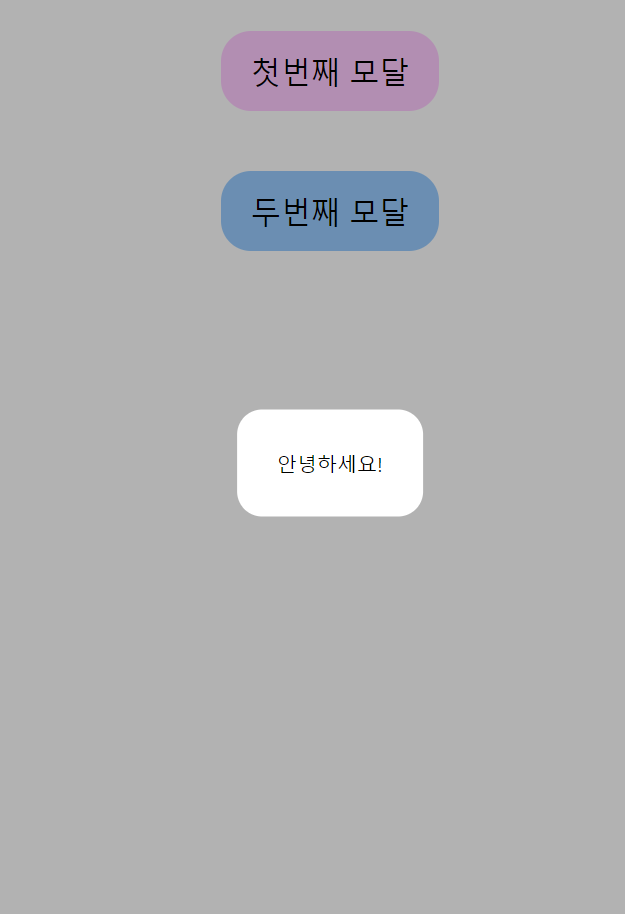
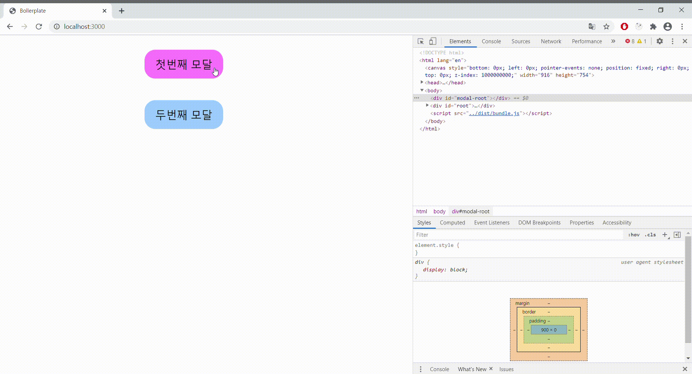

## Goal

- 리액트에서 모달창 구현의 어려움을 이해한다.
- portal을 이용해 모달창을 구현해본다.

<br/>
<br/>

​ 이번 프로젝트를 하면서 어플리케이션의 여러군데에서 모달창을 띄워줘야 했습니다. 리액트 초보이기 때문에 최대한 혼자힘으로 구현하고 싶어서 react-modal 라이브러리는 사용하지 않기로 했습니다.

​ 구현하면서 발견한 문제점은 대부분 모달창의 오픈과 클로즈를 책임지는 컴포넌트가 돔 트리 구조상 안쪽에 위치했다는 것이었습니다. 따라서 아무런 조치 없이 해당 컴포넌트에서 모달창을 띄워주면 원하는대로 모달창의 레이아웃이 잡히지 않음을 알게 됩니다. 특히 Overaly가 제대로 위치하지 않게 되는 문제가 생기게 되고 이에 따라 모달창 클로즈를 제대로 기능시키게 될 수 없습니다.

​ 그래서 제가 모달창 구현 문제를 해결한 방법을 공유해보고자 합니다. 물론 이보다 더 효율적인 방법은 많으므로 참고삼아 봐주시면 감사하겠습니다.

<br/>

### 첫번째 접근법

그래서 제가 시도한 첫번째 접근법은 `리덕스`를 활용한 것이었습니다. 리덕스에 showModal 이라는 상태를 놓고, 모달이 오픈되는 이벤트가 발생하면 SHOW_MODAL 액션을 디스패치하여 showModal 상태를 true로 변경시킵니다. 반대로 모달이 클로즈되는 이벤트가 발생하면 showModal상태를 false로 변경시키는 것이었습니다. 이렇게 구현함으로써 모달을 트리 구조상 제일 윗층 컴포넌트 - html 구조상 body 바로 아래-에 놓으면 모달창이 제대로 구현 되는 것을 볼 수 있었습니다.

### 문제점

하지만 이러한 구현 방법은 보기만해도 큰 결함을 가지고 있습니다.

1. **모달창의 오픈-클로즈에 따라 최상위 컴포넌트가 리렌더링 됩니다.**

사실 모달창은 엄연히 하나의 컴포넌트의 작업임에도 불구하고 이 때문에 최상위 컴포넌트가 계속해서 리렌더링 될수 밖에 없었습니다.

2. **모달창이 필요없는 페이지에서도 모달창과 관련된 상태 관리를 하게 됩니다.**

이를 피하려면 페이지별로 각각 상태-모달창 컴포넌트를 넣어줘야하는데 매우 비효율적이게 됩니다.

<br />

이러한 문제점들을 직면하면서 어떻게하면 효율적으로, 모달창 오픈-클로즈를 담당하는 컴포넌트 내부에서 모달을 제대로 띄워줄 수 있을까? 고민하게 되었고, 구글링의 결과 `portal` 을 발견하게 되었습니다. portal을 이용하면 DOM 트리 구조에 종속되지 않고 원하는 곳에 특정 컴포넌트를 위치시킬 수 있다는 것을 알게 되었고 이를 이용해 모달창을 구현하기로 했습니다.

## Portal

간단하게 아래와 같은 모달창을 띄워보도록 하겠습니다. 스타일링은 styled-components로 구현합니다.

<br/>


<br/>
먼저 index.html 파일에 아래와 같이 모달을 붙일 root-modal 태그를 넣어주세요.

```html
<body>
  <div id="modal-root"></div>
  // 여기에 모달을 붙일 겁니다
  <div id="root"></div>
  <script src="../dist/bundle.js"></script>
</body>
```

<br/>

그리고 모달을 불러올 Layout 컴포넌트와 모달을 구현할 Modal 컴포넌트를 각각 만들어보겠습니다.

### 1. Layout 컴포넌트

먼저 스타일링입니다. 일부러 컴포넌트에 종속되지 않음을 증명하기 위해 position의 값을 relative로 하고 width와 height을 아래와 같이 정했습니다. 그리고 누르면 모달을 오픈시켜줄 버튼 컴포넌트를 만듭니다.

```javascript
const Wrapper = styled.div`
  display: flex;
  flex-direction: column;
  align-items: center;

  position: relative;
  width: 800px;
  height: 300px;
`

const Button = styled.button`
  margin: 1.5rem;
  padding: 1rem 1.5rem;
  border: none;
  border-radius: 24px;
  font-size: 1.5rem;
  color: black;
  cursor: pointer;

  background-color: ${props => props.color};

  &:hover {
    background-color: ${props => props.hoverColor};
  }

  &:focus {
    outline: none;
  }
`
```

<br/>

컴포넌트를 아래와 같이 구현합니다.

- 첫번째 모달이라고 써있는 버튼을 누르면 첫번째 모달을 오픈하고, 두번째 모달이라고 써있는 버튼을 누르면 두번째 모달을 오픈하도록 구현했습니다. 각각 모달 컴포넌트의 props로 onClose 함수를 전달해주었습니다.
- 여기서 show , open, close 를 useState가 아니라 `커스텀훅`으로 구현했습니다. 해당 커스텀훅 소스는 아래에 있습니다. 중복되는 연산이기 때문에 커스텀훅으로 따로 빼놓아서 간편하게 구현했습니다.

```javascript
import React from 'react'
import styled from 'styled-components'
import useToggle from '../../hooks/useToggle'
import Modal from '../Modal'

const Layout = () => {
  const [showFirst, openFirst, closeFirst] = useToggle() // 커스텀 훅입니다.
  const [showSecond, openSecond, closeSecond] = useToggle()
  return (
    <Wrapper>
      <Button color="#ffccff" hoverColor="#ff80ff" onClick={openFirst}>
        첫번째 모달
      </Button>
      <Button color="#99ccff" hoverColor="#3399ff" onClick={openSecond}>
        두번째 모달
      </Button>
      {showFirst && <Modal onClose={closeFirst}>안녕하세요!</Modal>}
      {showSecond && <Modal onClose={closeSecond}>반갑습니다!</Modal>}
    </Wrapper>
  )
}
```

<br/>

아래는 useToggle 커스텀 훅입니다.

```javascript
import { useState, useCallback } from 'react'

const useToggle = (initialValue = false) => {
  const [show, setter] = useState(initialValue)
  const open = useCallback(() => {
    setter(true)
  }, [])

  const close = useCallback(() => {
    setter(false)
  }, [])
  return [show, open, close]
}

export default useToggle
```

<br />

### 2. Modal 컴포넌트

먼저 스타일링 입니다. 별다를 것 없는 Overaly와 모달 컨텐츠를 담아서 화면 정가운데에 띄워줄 ModalBox입니다.

```javascript
const Overaly = styled.div`
  position: absolute;
  top: 0;
  left: 0;
  right: 0;
  bottom: 0;
  z-index: 5000;

  background-color: rgba(0, 0, 0, 0.3);
`

const ModalBox = styled.div`
  position: absolute;
  top: 50%;
  left: 50%;
  transform: translate(-50%, -50%);
  text-align: center;
  padding: 2rem;
  border-radius: 20px;
  z-index: 6000;

  background-color: #fff;
`
```

<br/>

컴포넌트를 아래와 같이 구현합니다.

- createPortal은 ReactDOM에서 제공하므로 ReactDOM을 꼭 import 해주세요.
- 먼저 해당 컴포넌트를 붙일 엘리먼트를 불러와서 root 라는 변수에 저장했습니다. 아까 만들어둔 modal-root라는 id를 가진 엘리먼트에 붙입니다.
- 그리고 구현해놓은 Overaly와 ModalBox를 createPortal 안에 넣어주세요.
- Overaly는 클릭하면 모달창이 닫히도록 구현합니다.

```javascript
import ReactDOM from 'react-dom'

const Modal = ({ children, onClose }) => {
  const root = document.getElementById('modal-root')

  return ReactDOM.createPortal(
    <>
      <Overaly onClick={onClose} />
      <ModalBox>{children}</ModalBox>
    </>,
    root
  )
}

Modal.propTypes = {
  children: PropTypes.node.isRequired,
  onClose: PropTypes.func.isRequired,
}
```

### 완성된 모습



모달창을 오픈하는 순간 모달창이 html의 modal-root 엘리먼트에 붙고, 클로즈하면 사라지는 것을 볼 수 있습니다.

---

이렇게 처음으로 Portal을 이용해서 모달창을 구현해볼 수 있었습니다. 이전에 리덕스로 구현한 방법보다 훨씬 더 깔끔해졌습니다. 또한, 모달 오픈과 클로즈를 담당하는 디스패치 보내지 않아도 되서 더 효율적이어졌다고 생각합니다. <br/>

리액트로 처음 프로젝트를 하면서 느낀것은, DOM과 관련된 처리를 리액트가 알아서 해주다보니, 편리하지만 생각보다 불편하기도 하다는 점이었습니다^^;; 물론 리액트 내부에서 개발자가 직접 DOM을 처리해줄 수 있지만 지양되는 패턴이라서 사용하지는 않습니다. 바닐라 자바스크립트로 프로그래밍 할 때와는 사뭇 다르게 생각해야한다는 점이 어려웠습니다. <br/>
