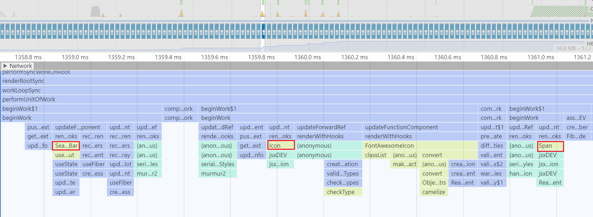
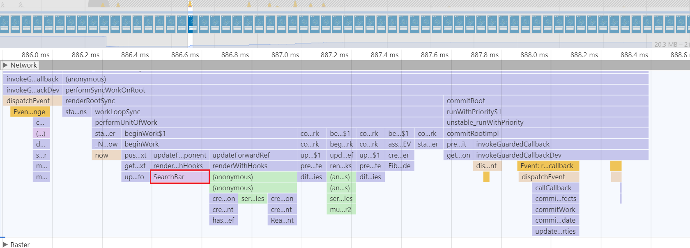

오늘은 제가 프로젝트를 진행하면서 React.memo를 어떻게 사용했는지 간략하게 정리해보고자 합니다. 잘못된 정보에 대한 지적은 늘 환영입니다 . <br/>

리액트의 `React.memo` 는 존재는 알았지만 대체 어디에 사용해야 할지 늘 모호했습니다. 컴포넌트 자체를 메모이제이션 해놓으면 성능상 좋은거 아닐까? 라고 막연히 생각했지만 그렇게 간단하지만은 않았습니다. <br/>리렌더링이 자주 일어나는 컴포넌트의 경우 사실 메모이제이션이 무용 지물이고, 오히려 메모이제이션으로 인해 연산이 추가되는 셈이니까요. <br/>

<br/>

그러던 도중 , 프로젝트를 진행하면서 여러 컴포넌트를 만들다가 부모 컴포넌트 내부에 있는 자식 컴포넌트들이 부모 컴포넌트의 리렌더링에 따라서 같이 리렌더링 되는 현상을 목격했습니다. 심지어 그 자식 컴포넌트들은 Props 값이 변하지도 않고, 내부에서 리렌더링이 자주 일어나지도 않는데 말입니다 .<br/>

이렇듯 **Props 값에 변함이 거의 없어서 리렌더링이 일어나지 않지만 , 부모 컴포넌트의 잦은 리렌더링에 의해 애꿏게 리렌더링 되는 컴포넌트**들을 구원하기 위해 **React.memo**를 사용하게 되었습니다 .

<br/>

## React.memo

React.memo 는 리액트에서 제공하는 _고차 컴포넌트 (High Order Component)_ 입니다. <br/> 간단히 말해서 React.Memo로 감싸져있는 컴포넌트를 메모이징 (Memoizing) 함으로써 불필요한 리렌더링을 생략해줍니다 .<br/>

<br/>

### 기존의 컴포넌트 업데이트 방식과 비교

리액트는 컴포넌트를 업데이트 할 경우, **먼저 컴포넌트를 렌더링 한 뒤,** 이전 결과와 비교하여 DOM 을 업데이트를 결정합니다. <br/> 여기서 이전 결과와 다르다면 DOM 을 업데이트합니다. 따라서 **_무조건 컴포넌트가 매번 렌더링_** 됩니다. <br/>
<br/>

React.memo 의 경우 초기 렌더링에 메모이징 함수를 통해 렌더링 결과를 저장해놓습니다. <br/> 그리고, 다음 렌더링 시, 빠르게 props를 비교하여 **props가 같다면 이전에 메모이징 해놓은 결과값을 재사용**합니다. 따라서 불필요한 리렌더링은 피하여 속도를 향상시킬 수 있습니다. <br/> 물론 React.memo로 감싼 컴포넌트의 내부의 state가 변경되는 경우는 기존의 리액트와 마찬가지로 리렌더링 됩니다.

<br/>

### 사용 예시


위와 같이 인풋 필드 위에 Icon과 Span엘리먼트 (버튼용) 이 있는 서치바를 구현합니다.<br/> Icon과 Span은 각각 재사용성이 높으니 Atom Component로 분리하여 Props에 따라 내용만 바뀌도록 구현했습니다. <br/>

아래 코드를 통해 컴포넌트 구조를 알아보도록 하겠습니다. ( 가독성을 위해 props types와 스타일링은 생략했습니다.)

<br/>

#### Icon

```javascript
import React from 'react'
import {
  FontAwesomeIcon,
  FontAwesomeIconProps,
} from '@fortawesome/react-fontawesome'
// type 생략

const Icon = ({
  iconsize,
  icon,
  color,
  rotate,
  cursor,
  iconClickHandler,
}: Props) => {
  return (
    <StyledIcon
      icon={icon}
      iconsize={iconsize}
      color={color}
      rotate={rotate}
      cursor={cursor}
      onClick={iconClickHandler}
    />
  )
}

// styling 생략

export default Icon
```

<br/>

#### Span

```typescript
import React, { memo } from 'react'
import { colorCode, colorTypes } from '../../model/colorCode'
import styled from '@emotion/styled'

// type 생략

const Span = ({
  fontsize,
  color,
  hoverColor,
  children,
  cursor,
  margin,
  spanClickHandler,
}: Props) => {
  return (
    <StyledSpan
      fontsize={fontsize}
      color={color}
      hoverColor={hoverColor}
      cursor={cursor}
      margin={margin}
      onClick={spanClickHandler}
    >
      {children}
    </StyledSpan>
  )
}

// styling 생략

export default Span
```

<br/>

#### SearchBar

```typescript
import React from 'react'
import useInput from '../../hooks/useInput'
import Icon from '../../atoms/Icon'
import Span from '../../atoms/Span'
import { faSearch } from '@fortawesome/free-solid-svg-icons'

// Props 생략

const PLACEHOLDER = '지역명을 입력하세요. 예) 강원도 속초시'

const SearchBar = ({ color }: Props) => {
  const [keyword, keywordChangeHanlder] = useInput()

  return (
    <Form>
      <Input
        type="text"
        color={color}
        value={keyword}
        onChange={keywordChangeHanlder}
        placeholder={PLACEHOLDER}
      />
      <IconContainer color={color}>
        // Icon 컴포넌트 사용
        <Icon icon={faSearch} iconsize={20} rotate={180} />
      </IconContainer>
      <SpanContainer color={color}>
        // Span 컴포넌트 사용
        <Span fontsize={1} cursor="pointer">
          Go
        </Span>
      </SpanContainer>
    </Form>
  )
}

// styling 생략

export default SearchBar
```

<br/>

처음엔 이렇게 위와 같이 **SearchBar** 컴포넌트 내부에 **Icon** 컴포넌트와 **Span**컴포넌트를 삽입했습니다.

**Icon**과 **Span**은 내부에 State도 없으며, SearchBar로부터 주입받는 props가 변하지 않습니다. <br/>
<br/>

### memo 사용 전


SearchBar내부의 Input value의 변화에 따라 **SearchBar 컴포넌트가 리렌더링 될 때마다 Icon 컴포넌트와 Span 컴포넌트도 함께 리렌더링** 되는 모습을 발견할 수 있습니다. Icon 과 Span 컴포넌트는 Props의 변화도 없는데 말입니다. <br/>
<br/>



크롬 퍼포먼스 프로파일링을 통해 더 자세히 알 수 있습니다. 이벤트가 디스패치 된 후 SearchBar 컴포넌트와 함께 Icon 컴포넌트, Span 컴포넌트가 다시 렌더링 됩니다.

<br/>

바로 이런 경우 Memo 고차컴포넌트를 사용할 수 있습니다. 아래와 같이 Icon 컴포넌트와 Span 컴포넌트를 Memo 로 감싸주도록 수정했습니다.

```typescript
import React, { memo } from 'react'
export default memo(Icon) // Icon

export default memo(Span) // Span
```

<br/>

### memo 사용 후


이제 Icon과 Span은 아무리 SearchBar가 리렌더링 되더라도 Props가 변하지 않으므로 리렌더링되지 않는 것을 알 수 있습니다.



크롬 퍼포먼스 프로파일링을 통해 더 자세히 알 수 있습니다. 이벤트가 디스패치 되어도 SearchBar 컴포넌트만 렌더링 되지, Icon과 Span 컴포넌트는 렌더링 되지 않고 있습니다.

<br/>

특히나 SearchBar와 같은 인풋 필드의 경우 사용자가 인풋 값을 자주, 많이 변경 할 수 있기 때문에 컴포넌트 자체에 리렌더링이 많이 일어날 수 있습니다. 이 때 조금이라도 성능 향상을 위해 , Icon과 Span, 혹은 Button 컴포넌트를 메모이징해놓고, 기존에 저장해놓은 내용을 재사용함으로써 리렌더링을 막을 수 있습니다.

<br/>

### 그래서, 언제 써야할까?

저의 기준으로는 아래의 세 조건을 충족 시 사용하면 성능향상에 도움이된다고 판단하였습니다.

- **컴포넌트가 쓰이는 곳이 리렌더링이 자주 일어나는 경우**
  - 리렌더링이 일어나지 않는다면, 사용되는 컴포넌트들이 리렌더링 될 경우가 적으므로, 굳이 메모이징 연산을 추가 할 필요가 없습니다.
- **Props가 거의 변하지 않는 경우**
  - Props가 자주 변한다면 오히려 리렌더링 때마다 props를 비교하는 연산이 추가됩니다. 또한 기존의 리액트의 DOM 업데이트를 위한 비교 연산까지 더해져서 memo가 오히려 성능을 악화시킵니다.
- **컴포넌트 내부의 상태(state)가 없거나, 자주 변하지 않는 경우**
  - 컴포넌트 내부의 상태가 자주 변한다면 굳이 메모이징을 해놓을 필요가 없습니다. 어차피 내부 상태의 변화로 자주 리렌더링 되기 때문입니다.

<br/>

<br/>

### 나아가서 - Compare 함수

React.memo의 Props 비교방식은 아래와 같이 **얕은 비교 (Shallow Equal)** 방식으로 구현되어 있습니다. [소스코드 출처](https://github.com/facebook/react/blob/v16.8.6/packages/shared/shallowEqual.js) <br/>

즉 객체 비교 시 객체의 속성을 모두 비교하는 것이 아니라 `객체 레퍼런스`만 비교합니다. <br/>

```javascript
function shallowEqual(objA: mixed, objB: mixed): boolean {
  if (is(objA, objB)) {
    return true
  }

  if (
    typeof objA !== 'object' ||
    objA === null ||
    typeof objB !== 'object' ||
    objB === null
  ) {
    return false
  }

  const keysA = Object.keys(objA)
  const keysB = Object.keys(objB)

  if (keysA.length !== keysB.length) {
    return false
  }

  // Test for A's keys different from B.
  for (let i = 0; i < keysA.length; i++) {
    if (
      !hasOwnProperty.call(objB, keysA[i]) ||
      !is(objA[keysA[i]], objB[keysA[i]])
    ) {
      return false
    }
  }

  return true
}
```

[React.memo의 소스코드](https://github.com/facebook/react/blob/master/packages/react/src/ReactMemo.js)를 보면 compare함수를 수정할 수 있도록 구현되어있습니다 . 따라서 memo의 두번째 인자를 통해 props 비교 방식을 변경할 수도 있습니다.

```javascript
function memo<Props>(
  type: React$ElementType,
  compare?: (oldProps: Props, newProps: Props) => boolean,
){...}
```

<br/>

<br/>

## 마치며

프로젝트에서 React.memo를 어떻게 사용했고, 앞으로 어떻게 사용할 것인지 알아보았습니다. <br/>

결국 핵심은 React.memo는 성능 최적화를 위한 고차 컴포넌트이며, 상황에 맞춰서 사용되면 렌더링 성능을 향상 시켜줄 수 있지만, 불필요하게 사용될 경우 오히려 성능을 악화시킨다는 것입니다. <br/>
앞으로 리액트로 프로젝트를 진행할 때 이를 염두해두고 memo의 사용 여부를 판단해야겠습니다.

<br/>

### Reference

- [React Official docs- React.memo](https://reactjs.org/docs/react-api.html#reactmemo)
- [React.memo 현명하게 사용하기](https://ui.toast.com/weekly-pick/ko_20190731)
