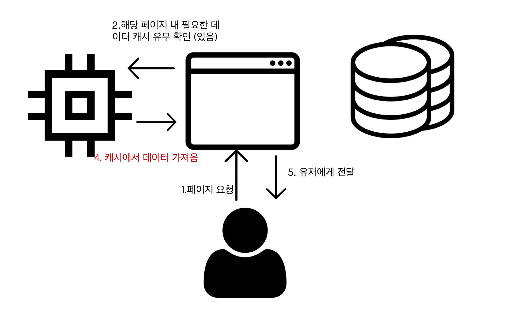

이번 프로젝트에서 저는 store에 저장할 것과 state에 저장할 것을 아래와 같이 나누었습니다.

- store 에 저장 : UI 관련 상태 ( Notification 보임 / 숨김 ) , 로그인 한 유저 정보
- state 에 저장 : API 응답 데이터

또한, 백엔드는 파이어베이스를 사용했기 때문에, 데이터를 가져올 때 react-query 나 swr 같은 라이브러리는 따로 사용하지 않았습니다.

## 왜 위와 같이 나누었나

이전에는 리덕스와 리덕스 미들웨어를 사용하여 전역 store에 API 응답으로부터 오는 모든 데이터를 저장해놨습니다. 그래서 필요할 때 쉽게 꺼내오고, 알아서 캐싱되고, API 응답 처리도 리덕스 사가에서 처리하도록 말입니다.

하지만, 로그인된 유저 정보를 제외하고 API 요청을 통해 가져오는 데이터는 사실 여러 페이지에서 쓰이지 않습니다. 대부분 한 페이지에서만 쓰이게 됩니다.

그런데 그런 (높은 가능성으로 사이즈가 클) 데이터를 전역 상태에 저장해놓는 것은 매우 비효율적으로 보였습니다.

## 상태 변경에 따른 리액트 동작

- 컴포넌트 내부 state 가 setState로 변할 때
  - **해당 컴포넌트를 기준**으로 버추얼 돔(Virtual DOM)이 갱신
- 스토어가 변할 때
  - 제일 위 부터 버추얼 돔의 갱신이 필요한지 확인하여 갱신, 즉 **최상위 컴포넌트**부터 비교

위처럼, 스토어가 변하면 스토어에 저장된 데이터를 사용하는 컴포넌트 뿐만 아니라, 해당 컴포넌트가 속한 최상위 컴포넌트부터 비교하는 연산이 추가됩니다. <br/>

UI 상태나 유저의 로그인 정보의 경우는 전역에서 사용되므로 스토어에 저장해놓는게 최선의 방법이겠지만, API 로부터 받은 데이터는 그렇지 않습니다. <br/>

API 응답 데이터는 사실상 하나의 페이지 / 하나의 컴포넌트 내부에서만 사용되기 때문입니다. 물론 데이터가 전역에서 사용되어야한다면, 스토어에 저장하는게 맞다고 생각합니다. <br/>

<br/>

그래서 이번 프로젝트를 진행하며 API 요청으로부터 오는 데이터는 모두 해당 페이지 내부 상태(state)에 저장하게 되었습니다. 그러면 여기서 문제가 생깁니다.

state는 새로 렌더링 될 때마다 초기화되고 그렇게 되면 페이지를 벗어났다가 다시 들어오면 모든 데이터를 새로 API로부터 받아와야합니다. <br/>
그래서 저는 `메모리에 데이터를 캐싱`해놓는 방법을 구현하였습니다.

## 캐시 동작 방식

### 캐시가 없는 경우 (초기 렌더링)


1. 페이지에서 필요한 데이터를 가져오기 위해서 먼저 캐시를 확인합니다.
2. 캐시가 없는 경우, 백엔드로 API 요청을 보냅니다.
3. 백엔드로부터 받아온 데이터를 캐시에 저장하고, 유저에게 제공합니다.

<br/>

### 캐시가 있는 경우



1. 페이지에서 필요한 데이터를 가져오기 위해 먼저 캐시를 확인합니다.
2. 캐시가 있을 경우, 백엔드 요청을 보내지 않고 캐시에 저장된 데이터를 유저에게 제공합니다.

<br/>

- 이 때 캐시 , 백엔드로부터 받아온 데이터는 컴포넌트 내부 상태(state)에 저장하여 관리합니다.

- 데이터에 대해 수정 / 삭제 / 추가 요청이 들어올 경우 API 요청을 보내고 해당 요청이 성공할 시, 캐시에도 해당 변화를 반영시켜줘야합니다.

<br/>

그렇다면 어떻게 제가 사용했는지 코드로 알아보겠습니다.

<br/>

### 캐시 프로토타입

- 캐시 프로토타입을 이용하여 캐시의 저장 및 유무 확인, 삭제 등의 연산을 구현했습니다.
- 캐시가 저장될 때 저장되는 시간을 기준으로 만료 시간을 저장하여 캐시가 50분 후에 접근시에는 초기화 되도록 구현했습니다.
- 프로토타입 생성 시 제네릭 타입을 받아와서 캐시에 저장될 value의 타입을 정할 수 있게 해주었습니다.

<br/>

```typescript
const EXPIRE_TIME = 3000000

interface CacheData<T> {
  // 캐시 구조 , key와 value
  [key: string]: ValueData<T>
}

// 캐시 내부 value 타입
// expiry 를 저장하여 만료시간 기입
interface ValueData<T> {
  value: T
  expiry: number
}

class cacheProto<T> {
  private data: CacheData<T>

  constructor() {
    this.data = {}
  }

  // key 에 해당하는 캐시가 있는지 확인
  has = (key: string): boolean => {
    if (this.data[key]) {
      // 만료시간 지나지 않은 경우
      if (this.data[key].expiry > new Date().getTime()) {
        return true
      }
      // 만료시간이 지났을 경우 삭제
      this.delete(key)
    }
    return false
  }

  // key로 데이터를 가져옴
  get = (key: string): T | null => {
    return this.data[key]?.value || null
  }

  // key 와 value로 캐시를 저장
  set = (key: string, value: T) => {
    this.data[key] = {
      value,
      expiry: new Date().getTime() + EXPIRE_TIME,
    }
  }

  // key에 해당하는 캐시를 삭제
  delete = (key: string) => {
    delete this.data[key]
  }

  // 모든 캐시 초기화
  clear = () => {
    this.data = {}
  }
}

export default cacheProto
```

### 사용하기

- 아래의 커스텀 훅스는, Id 값에 해당하는 리뷰 데이터를 가져오는 로직을 수행합니다.
- 아래는 단일 데이터 (postId에 따른 리뷰 데이터) 를 저장하지만, 하나의 id에 해당하는 여러 데이터를 저장해야할 경우(ex, 특정 리뷰에 저장된 댓글 리스트) 키를 postId로 하고 value를 array로 저장하면 됩니다.

<br/>

```typescript
import * as T from 'types/API'
// 새로운 캐시 객체를 만듭니다.
const CACHE = new cacheProto<T.ReviewData>()

const useSingleReview = () => {
  ....,
  const [singleReview, setSingleReview] = useState<T.ReviewData | null>(null)

  // API 응답 처리 useEffect
  useEffect(() => {
    if (getReviewResult.type === SUCCESS) {
      setSingleReview(getReviewResult.data)
      // API 로부터 받아온 데이터를 캐시에 저장
      CACHE.set(getReviewResult.data.docId, getReviewResult.data)
    }
  }, [getReviewResult])

  // 초기 데이터 가져오는 메서드
  const fetchData = useCallback((postId: string) => {
    // 캐시가 있을 경우, 캐시 데이터를 저장
    if (CACHE.has(postId)) {
      return setSingleReview(CACHE.get(postId))
    }
    // 없을 경우 API 요청
    getReviewFetch({ type: REQUEST, params: [postId] })
  }, [])

  // postId에 해당하는 캐시 삭제
  const removeCache = useCallback((postId: string) => {
    CACHE.delete(postId)
  }, [])

  // postId에 해당하는 캐시 업데이트
  const updateCache = useCallback((postId: string, data: T.ReviewData) => {
    CACHE.set(postId, data)
  }, [])
}

export default useSingleReview
```

### 유저 구분하기

위처럼 메모리에 캐시를 저장할 경우, 브라우저를 껐다 끄거나 새로고침하면 캐시가 초기화됩니다.

그렇다면 유저가 A 아이디로 로그인했다가, 로그아웃 후 B아이디로 다시 로그인 할 경우, 두개의 ID는 캐시를 공유하게 됩니다. (중간에 브라우저를 새로고침 하지 않는 이상) <br/>

그렇다면 위와 같이 리뷰 데이터에 관한 캐시가 아니라, 특정 유저ID에 한정되어있는 데이터의 경우 유저 ID에 대한 확인을 추가해주어야 합니다. 예를들면 `북마크 데이터`가 그렇습니다. <br/>

아래는 북마크 정보를 가져오는 로직입니다. CACHE 와 함께 CACHED_USER에 현재 유저의 ID 정보를 저장해놓습니다. 그리고 추후, 초기 데이터 요청이 들어올 경우 현재 로그인된 유저와 캐시에 저장된 유저의 정보가 같은지 확인 후 데이터를 제공 혹은 파기합니다.

<br/>

```typescript
const CACHE = new cacheProto<BookMarkListType[]>();
let CACHED_USER = '';

const BookMarkList = ({ userId, pageNum }: Props) => {
  ....,
  useEffect(() => {
    if (userId) { // 먼저 userId를 확인
        // 캐싱된 유저와 userId 가 일치하는지 확인
      if (CACHED_USER === userId && CACHE.has(userId)) {
        const cachedData = CACHE.get(userId);
        if (cachedData) {
          setReviewList(sliceArray(cachedData, pageNum));
          setTotalLength(cachedData.length);
        }
      } else { // 일치하지 않을경우
        CACHED_USER = userId;
        CACHE.clear();
        getBookMarksFetch({ type: REQUEST, params: [userId] });
      }
    }
  }, [userId, pageNum]);

}
```

이렇게하면 유저에 따라 독립되어야 할 데이터가 서로 다른 두 아이디 사이에 공유될 일이 없습니다.

<br/>

## 캐시 데이터가 out of date 되는 현상/ 해결책

캐시의 목적은 결국 백엔드에 대한 연산을 줄여주고, 클라이언트 사이드의 데이터 제공속도를 늘리는데에 있습니다. <br/>

캐시의 가장 큰 단점은 만료되기 전까지 **저장된 데이터가 업데이트 되지 않는 상태로 유지**된다는 것입니다.

데이터가 업데이트 되지 않는 경우는 크게 살펴보면 두가지 경우입니다. <br/>

1. **새로 들어온 데이터를 반영하지 못하는 경우**

예를들어 서버에서 10개의 데이터를 가져와서 캐시에 넣어놓은 후 유저가 접근할 때마다 해당 캐시에 있는 데이터를 제공 할 경우, 이 사이에 새로 들어온 데이터는 제공하지 못하게 됩니다. <br/>

2. **기존 데이터의 수정/ 삭제를 반영하지 못하는 경우**

예를들어 유저 A가 해당 페이지에 접근 한 후 (캐시가 저장 된 후) , 유저 B가 페이지 내부 데이터를 수정해도 유저 A는 업데이트 된 결과를 볼 수 없습니다. <br/>

이를 방지하기 위해서는 어쩔 수 없이 해당 페이지에 진입할 때마다 서버에 새로 요청을 보내야하는 선택을 해야합니다. 하지만 저의 프로젝트의 경우 작은 프로젝트이고, 데이터의 수정 및 삭제가 많이 일어나지 않기 때문에 2번 문제는 제쳐두고, *1번 문제만 해결*하기로 했습니다.

### 해결방법


- 먼저, 데이터 캐싱 시, 맨 처음 혹은 마지막 데이터의 데이터베이스 내 key 값 (=initialKey)을 함께 캐싱해줍니다. (여기서 맨 처음 / 마지막은 데이터 정렬 기준에 따라 달라집니다) 저장된 initialKey를 통해 데이터베이스에서 어디부터 캐시에 저장되어있지 않은지 확인하기 위한 용도입니다. <br/>

1. 해당 페이지에 요청이 들어오면 캐싱된 데이터가 있는지 확인합니다. 캐싱된 데이터가 있을 경우 initialKey 값을 통해서 initialKey에 해당하는 데이터 이후 부터 가장 최신의 데이터까지 모두 가져옵니다.
2. 가져온 데이터를 캐싱된 데이터와 함께 합병하여 캐시를 업데이트 해줍니다.

<br/>

#### 예제 코드

```typescript
useEffect(() => {
  // 캐시 유무 확인
  if (CACHE.has('general-search')) {
    const cachedData = CACHE.get('general-search')
    if (cachedData) {
      setAllReviews(cachedData.reviews)
      setLastKey(cachedData.lastKey)
      setHasMore(cachedData.hasMore)
      // 저장된 initialKey로 recentReviews 가져오기
      recentReviewsFetch({
        type: REQUEST,
        params: [cachedData.initialKey],
      })
    }
  }
}, [])
```

이렇게 할 경우, 1번의 문제, 즉 새로 생성된 데이터에 대한 캐시의 out of date 문제는 해결됩니다. 2번까지 해결하기 위해서는 어쩔 수 없이 모든 데이터를 매 요청마다 서버에서 새로 받아오는 수 밖에 없습니다. <br/>

<br/>

## 향후 개선점

이렇게 리액트 캐싱을 구현했습니다. 하지만 조금 찝찝한 면이 있으시지 않으신가요? <br/> 지금은 앱의 크기가 작고, 데이터가 많지 않아서 괜찮지만 추후에 데이터가 많아질 경우 너무 많은 데이터를 캐싱하게 될 가능성이 있습니다. <br/> 또한 앱의 크기가 클 경우, 더이상 사용하지 않을 데이터를 캐싱하게 될 가능성(메모리 누수)도 높아집니다.<br/>

이를 방지하기 위해서는 아래와 같은 방법을 도입하여 개선해볼 수 있다고 생각합니다.

#### 캐싱 시, 최대 저장 가능 데이터 크기 명시

만료기한(expiry)와 함께 배열의 크기의 최댓값을 명시해 줄 수 있습니다. 그래서 새로 들어오는 데이터 값에 의해 최댓값의 개수를 넘어버리면 캐시를 clear 하고 새로운 데이터부터 다시 카운팅 해주는 방식을 구현할 수 있을 것이라 생각합니다. <br/>

이렇게 구현하면 캐시의 크기가 필요이상으로 커질 위험이 줄어들 수 있겠습니다.

<br/>

#### 캐시 Key 값에 대하여

저의 프로젝트는 크기가 매우 협소하고, 캐시를 사용하는 곳이 많지 않고 차지하는 크기도 적기 때문에 별로 문제될 것은 없지만 추후에 크기가 커지고, 여러 곳에서 캐시를 사용 할 경우 매우 key 값을 정하는게 매우 복잡해지고 헷갈릴 것이라고 생각합니다. <br/>

지금은 단순히 postId나 userId와 같은 key 값을 사용하지만 추후에는 해당 키 값을 해시화 하여 저장하거나 url 을 기준으로 키값을 정하면 더 명료하고 안전해지지 않을까생각합니다.

<br/>

<br/>

## 나가며

이번 프로젝트를 진행하면서 리덕스와 미들웨어 없이 생짜로 API 요청을 컴포넌트에서 보내고, 받아온 데이터를 메모리에 캐싱하는 과정을 직접 구현 해보았습니다. 이전에 리덕스를 사용 할 때는 별로 이런 것에 대한 고민이 없었습니다. API 요청은 미들웨어에서 처리해주고, 받아온 데이터는 스토어에 저장해주는 로직이 너무 명료해보였거든요. 하지만, 깊게 생각해보면 굳이 스토어에 저장해야하나 싶어서 위와 같이 구현해볼 수 있었습니다. <br/>

아직 너무 부족하고, 메모리와 캐시에 관해서도 학습해야할 것 투성이이지만 그래도 이번에 캐시를 구현하면서 참 많은 것을 배워간 것 같아서 기쁩니다. <br/>

잘못된 점이나 궁금하신 점은 댓글 남겨주시면 감사하겠습니다.

<br/>
<br/>

## Reference

- [Stale-while-revalidate Data Fetching with React Hooks: A Guide](https://www.toptal.com/react-hooks/stale-while-revalidate)
- [전역 상태 관리에 대한 단상 (stale-while-revalidate)](https://jbee.io/react/thinking-about-global-state/)
