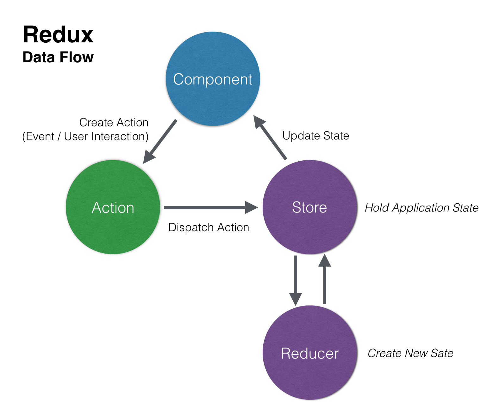
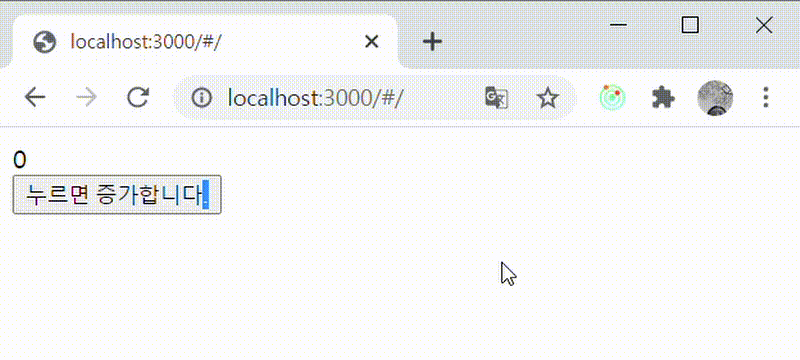

리액트에서 리덕스, 리덕스 사가를 어떻게 설정하고 사용하는지 정리하고자 합니다. <br/>

먼저 리덕스는 어떻게 상태를 관리하며, 왜 미들웨어인 리덕스 사가 혹은 썽크가 필요한지 알아보겠습니다.<br/>

<br/>

## 리덕스의 상태관리 데이터 플로우



1. 컴포넌트에서 특정 이벤트가 일어나면 액션 객체를 생성합니다.
2. 생성된 액션객체를 스토어로 보내줍니다.
3. 스토어는 받은 액션을 리듀서로 전달해줍니다. 리듀서는 분기를 통해서 상태를 변경합니다.
4. 다시 변경된 상태를 스토어에 반영해주어서, 컴포넌트에 반영되도록 합니다.

<br/>

위와 같은 과정은 동기적으로 일어납니다. 때문에 비동기적인 API 통신은 리덕스 상태관리만으로 구현할 수 없습니다. <br/> 하지만 우리는 특정 이벤트에 대해 서버로부터 데이터를 받아오기도 해야합니다. <br/> 따라서 이 때 사용하는게 **리덕스 미들웨어** 입니다. 해당 포스팅에서는 리덕스 사가를 설명하도록 하겠습니다. <br/>

<br/>

### 비동기 요청 상태 관리 플로우

먼저 아래 설정에 들어가기 전에 비동기 요청에 대한 상태 관리 플로우가 어떻게 되는지 알아보겠습니다. <br/>

예를들어 어떤 버튼을 누르면 회원 정보를 서버로부터 받아온다고 할 때는 아래와 같이 분기 할 수 있습니다. <br/>

1. **CLIENT DATA REQUEST** : 버튼을 누르면 데이터를 요청 했을 때의 상태입니다. 요청하면 서버로 데이터를 요청합니다. 로딩 메시지를 띄워 줄 수 있습니다.
2. **CLIENT DATA SUCCESS** : 서버로부터 데이터를 응답 받았을 때의 상태입니다. 이 때 받아온 데이터를 뷰에 뿌려줍니다.
3. **CLIENT DATA FAIL** : 데이터 요청 후에 서버에서 제대로 응답하지 못했을 때의 상태입니다. 에러 메시지 등을 띄워줄 수 있습니다.

<br/>

그러면 우리는 Request일 때의 스토어에 적용될 데이터의 상태, Success 일 때의 스토어에 적용될 데이터의 상태, 그리고 Fail 일때 스토어에 적용될 데이터의 상태를 각각 리듀서에서 구현 할 수 있게 됩니다.

<br/>

<br/>

그렇다면 **미들웨어가 추가된 리덕스의 상태 관리 플로우**는 어떻게 될까요? <br/>

1. 컴포넌트에서 특정 이벤트가 일어나면 액션 객체를 생성합니다.
2. 생성된 액션객체를 스토어로 보내줍니다.
3. 스토어는 받은 액션을 리듀서와 미들웨어로 전달해줍니다. 리듀서는 분기를 통해서 상태를 변경하고, 이 때 미들웨어는 비동기 처리를 해줍니다.
4. 미들웨어가 비동기 처리가 끝난 후 스토어로 다시 액션 객체를 보냅니다.
5. 받은 액션을 리듀서로 전달하여 리듀서가 상태를 변경해줍니다.
6. 다시 변경된 상태를 스토어에 반영해주어서, 컴포넌트에 반영되도록 합니다.

<br/>

미들웨어는 정말 '중간다리' 역할을 해줍니다. 리듀서가 하지 못하는 비동기 처리를 하고, 그 결과를 리듀서로 다시 보내주는 것입니다.

<br/>

이제 본격적으로 리덕스 / 리덕스 사가를 리액트 프로젝트에서 설정해보겠습니다.

<br/>

## 리덕스 , 리덕스 사가 설정

예시는 간단하게 카운터 버튼으로 하겠습니다. 중간에 비동기 요청은 없지만 사가를 이용해서 상태를 변경해보도록 하겠습니다. <br/>

### 1. 설치

```javascript
npm i redux react-redux redux-devtools-extension redux-saga
```

여기서 redux-devtools-extionsion을 사용하기 위해서는 크롬 익스텐션을 따로 설치해야합니다. 개발모드에서 리덕스 상태관리를 시각적으로 볼 수 있는 익스텐션입니다. <br/>

<br/>

### 2. 설정

리덕스 / 리덕스 사가를 설정하기 위해서는 세 개의 폴더가 필요합니다.

```javascript
> action // 액션 타입, 객체를 정의해줍니다.
> reducer // 리듀서를 작성합니다.
> saga // 사가를 작성합니다.
> store // 스토어를 설정 / 생성하고 반환해줍니다.
```

### 1) Action

먼저 아래와 같이 액션 타입을 정의해주세요. 타입을 따로 변수로 정의해서 빼주는 이유는 액션이 많아지다보면 하나하나 하드코딩하기 힘들기 때문입니다.

action/counter.js

```javascript
export const COUNTER_REQUEST = 'COUNTER_REQUEST'
export const COUNTER_SUCCESS = 'COUNTER_SUCCESS'
export const COUNTER_FAIL = 'COUNTER_FAIL'

// 액션 객체를 생성해주는 함수입니다.
// 여러군데에서 같은 액션 객체를 생성하면 비효율적이므로 이렇게 코딩할 수 있습니다.
export const counterAction = () => {
  return { type: COUNTER_REQUEST }
}
```

<br/>

### 2) Reducer

리듀서를 작성해봅시다. 먼저 counter 리듀서를 작성하는데, 스토어에 저장될 초기 상태를 먼저 아래와 같이 정의해줍니다.<br/>

```javascript
export const initialState = {
  counterLoading: false, // 로딩 상태
  counterDone: false, // 완료 상태
  counterError: null, // 에러 메시지
  number: 0, // 초기 number
}
```

<br/>

그리고 리듀서를 아래와 같이 작성해줍니다. 각각 액션에 따라서 어떻게 상태를 변경할 지 코딩해주었습니다. COUNTER_SUCCESS 액션을 받으면 number를 1 추가해줍니다. <br/>

```javascript
export const initialState = {
  counterLoading: false,
  counterDone: true,
  counterError: null,
  number: 0,
}

const reducer = (state = initialState, action) => {
  switch (action.type) {
    case type.COUNTER_REQUEST:
      return {
        ...state,
        counterLoading: true,
        counterDone: false,
        counterError: null,
      }
    case type.COUNTER_SUCCESS:
      return {
        ...state,
        counterLoading: false,
        counterDone: true,
        number: state.number + 1,
      }
    case type.COUNTER_FAIL:
      return {
        ...state,
        counterLoading: false,
        counterDOne: false,
        counterError: '에러에러',
      }

    default:
      return state
  }
}

export default reducer
```

<br/>

리듀서는 추후에 추가될 수 있으니 , index 파일에서 한꺼번에 처리해주도록 합니다 .아래는 reducer/index.js 파일입니다. <br/>

```javascript
import { combineReducers } from 'redux'
import counter from './counter'

const rootReducer = (state, action) => {
  switch (action.type) {
    default: {
      const combineReducer = combineReducers({ counter })
      return combineReducer(state, action)
    }
  }
}

export default rootReducer
```

<br/>

### 3) Saga

Saga 코드는 세부분으로 나뉩니다. <br/>

1. 특정 액션을 계속 주시하고 있다가 액션이 dispatch 되면 2번 함수를 실행해주는 함수
2. 액션이 dispatch 되었을 때 비동기 요청을 행하는 함수(3번)를 실행해주고, 그 결과에 따라 SUCCESS 혹은 FAIL 액션을 다시 디스패치 해주는 함수
3. 비동기 요청을 수행해주는 함수

<br/>

여기서는 간단한 카운터라서 사실 Saga가 필요 없지만 어떻게 동작하는지 알아보기 위해서 코드를 작성했습니다. <br/>

#### 1번 함수

saga-effect인 takeLatest는 특정 시간에 여러 요청이 들어올 경우 가장 마지막 요청에만 함수를 실행해줍니다. <br/>

```javascript
function* watchCounter() {
  yield takeLatest(type.COUNTER_REQUEST, counter)
}
```

<br/>

#### 2번 함수

원래대로라면 saga-effect인 call 함수로 위의 비동기 함수를 실행해주지만, 실행할 비동기 처리가 업식 때문에 그냥 delay를 해서 로딩에서 성공으로 바뀌는 과정을 보겠습니다. <br/> delay가 끝나면 put 함수로 다시 SUCCESS 액션 혹은 FAIL 액션을 dispatch 합니다. <br/>

```javascript
function* counter() {
  try {
    //yield call(counterAPI);
    yield delay(1000)
    yield put({
      type: type.COUNTER_SUCCESS,
    })
  } catch (error) {
    yield put({
      type: type.COUNTER_FAIL,
    })
  }
}
```

<br/>

#### 3번 함수

```javascript
function* counterAPI() {
  // axios로 API 요청을 보내고 결과를 return 해주면 됩니다.
}
```

<br/>

그리고 마지막으로 1번 함수에 대해 아래와 같이 fork 해줌으로써 작성한 미들웨어를 등록해줍니다.

```javascript
export default function* counterSaga() {
  yield all([fork(watchCounter)])
}
```

<br/>

전체 소스코드는 아래와 같습니다.

```javascript
import * as type from '.action/counter'
import { all, fork, takeLatest, put, call, delay } from 'redux-saga/effects'

function* counterAPI() {
  // API
}

function* counter() {
  try {
    //yield call(counterAPI);
    yield delay(1000)
    yield put({
      type: type.COUNTER_SUCCESS,
    })
  } catch (error) {
    yield put({
      type: type.COUNTER_FAIL,
    })
  }
}

function* watchCounter() {
  yield takeLatest(type.COUNTER_REQUEST, counter)
}

export default function* counterSaga() {
  yield all([fork(watchCounter)])
}
```

<br/>

<br/>

### 4) 스토어 생성 및 Provider 설정

이제 스토어를 생성해주고, 작성한 리듀서와 미들웨어를 등록해줍니다. <br/>

store/configureStore.js를 만들고 아래와 같이 작성합니다. <br/>

```javascript
import { applyMiddleware, createStore } from 'redux'
import createSagaMiddleware from 'redux-saga'
import { composeWithDevTools } from 'redux-devtools-extension'
import rootSaga from '../saga' // 작성한 사가
import rootReducer from '../reducer' // 작성한 리듀서

const sagaMiddleware = createSagaMiddleware() // 사가 미들웨어 생성

const configureStore = () => {
  // 미들웨어를 적용해줍니다.
  // 개발모드에서만 익스텐션 사용하도록 설정
  const MiddleWare =
    process.env.NODE_ENV === 'production'
      ? applyMiddleware(sagaMiddleware)
      : composeWithDevTools(applyMiddleware(sagaMiddleware))

  //루트리듀서와 함께 스토어를 등록해줍니다.
  const store = createStore(rootReducer, MiddleWare)

  // 아까 생성한 사가를 구동해줍니다.
  sagaMiddleware.run(rootSaga)

  // 등록된 스토어 반환
  return store
}

export default configureStore
```

<br/> 이렇게 생성해준 스토어를 리액트 엔트리 파일 ( index.js) 에 적용해주어야 합니다. 이 때 react-redux에서 제공하는 Provider를 사용하여 생성한 스토어를 props로 넣어줍니다. <br/>

```javascript
import React from 'react'
import ReactDOM from 'react-dom'
import App from './App'
import { Provider } from 'react-redux'
import configureStore from './store/configureStore'

const store = configureStore() // 스토어 생성

ReactDOM.render(
  // 생성된 스토어를 Provider의 Props로 제공
  <Provider store={store}>
    <App />
  </Provider>,
  document.getElementById('root')
)
```

<br/>

<br/>

## CRA가 아닐 경우

CRA환경이 아닐 경우에는 Saga에서 적용한 Generator 함수를 제대로 컴파일 해줄 수 있도록 바벨 설정을 수정해줘야 합니다. <br/>

아래 바벨 플러그인을 설치해줍니다.

```javascript
npm i -D @babel/plugin-transform-runtime
```

<br/>

설치된 플러그인은 .babelrc 플러그인 항목에 추가해줍니다.

```javascript
{
    "presets": [
        "@babel/preset-env",
        "@babel/preset-react",
    ],
    "plugins": [ "@babel/plugin-transform-runtime"]
}

```

<br/>

<br/>

## 3. 컴포넌트에서 사용

자 이제 상태 변경 액션을 디스패치해보고, 해당 상태를 받아와서 띄워보도록 하겠습니다. <br/>

아래 버튼 컴포넌트에서 해당 버튼을 누르면 , 카운터 리퀘스트 디스패치를 보내도록 구현했습니다. <br/>

```javascript
import React, { useCallback } from 'react'
import { useDispatch } from 'react-redux'
import { counterAction } from '../action/counter'

const Button = () => {
  const dispatch = useDispatch()
  const onClick = useCallback(() => {
    dispatch(counterAction()) // 디스패치
  }, [])

  return <button onClick={onClick}>누르면 증가합니다.</button>
}

export default Button
```

<br/>

그릐고 아래 Home 컴포넌트에서는 스토어에 등록되어있는 상태에 따라 다른 결과값을 반환해주도록 했습니다. 지금 counterLoading 상태가 true라면 '로딩중' 이라는 글자를 렌더링 해주고, 로딩이 끝나면 number를 렌더링 해주도록 구현했습니다. <br/>

```javascript
import React from 'react'
import { useSelector } from 'react-redux'

const Home = () => {
  const { number, counterLoading } = useSelector(state => state.test)

  return <div>{counterLoading ? '로딩중' : number}</div>
}

export default Home
```

<br/>

결과는 아래와 같이 잘 실행 됩니다. <br/>



<br/>

Redux dev tools를 통해서 액션이 디스패치 되고 리듀서가 실행된 과정을 볼 수 있습니다. <br/>


<br/>

<br/>

---

이렇게해서 간단히 리덕스 , 리덕스 사가를 어떻게 리액트 프로젝트에 적용하는지 알아보았습니다. 혹시 잘못된점이 있거나 질문이 있으시면 편하게 댓글 달아주시면 감사하겠습니다. <br/>

<br/>

<br/>

### Reference

[Learn Redux — Introduction To State Management With React](https://medium.com/codingthesmartway-com-blog/learn-redux-introduction-to-state-management-with-react-b87bc570b12a)

[리덕스 사가 사용하기](https://jeonghwan-kim.github.io/dev/2019/07/22/react-saga-ts-1.html)
