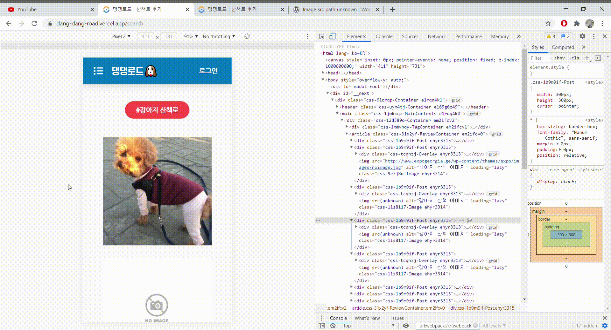

현재 프로젝트에서 여러 포스트를 인피니트 스크롤링으로 불러와줍니다. 이 때 사용자가 아직 접근하지 않은 영역까지 이미지를 로딩해주는 것을 발견했고 이를 개선하기 위해 이미지 레이지 로딩을 구현하게 되었습니다. <br/>

레이지로딩을 어떻게 구현했는지 자세히 알아보겠습니다.

<br/>

## 이미지 레이지 로딩

이미지 레이지 로딩은 하나의 페이지에 속한 이미지를 페이지가 로딩 될 때 한번에 읽고, 모두다 DOM 에 렌더링하는게 아니라, **사용자가 현재 보고 있는 영역**에 대한 이미지만 가져와서 DOM에 렌더링 하는 방식을 뜻합니다. <br/>

인스타그램을 예로 들면 , 포스팅이 1000개가 넘어가는 유저가 있을 때 1000개의 썸네일 사진을 첫 로딩시 모두 로딩하려면 시간이 오래 걸리게 됩니다.<br/> 물론 페이지네이션으로 1000개의 포스팅을 한번에 보여주지는 않지만, 무조건 사용자가 현재 보지 않는 영역이 생기고, 어쩌면 사용자가 그 영역까지 스크롤을 내리지 않고 페이지를 벗어 날 수 도 있습니다. <br/>

이 때 모든 이미지를 한번에 불러와서 DOM에 렌더링시키는 것은 매우 비효율적인 일입니다. 이를 위해서 이미지 레이지 로딩을 구현했습니다. <br/>

<br/>

## 레이지 로딩 구현하기

### 1. 사용자가 현재 보고 있는 영역에 대한 정보 알기

레이지 로딩을 구현하기 위해서는 사용자가 현재 화면에서 어느 영역을 보고 있는지 알아야합니다. 물론 스크롤 이벤트 핸들러를 통해 구현할 수도 있지만, 그럴경우 너무나 많은 스크롤 이벤트가 트리거 되어 비효율적입니다. <br/>

<br/>

### Intersection Observer

스크롤 이벤트 대신 사용될 수 있는 것이 Intersection Observer 입니다. 저는 현재 프로젝트에서 인피니트 스크롤링과 스크롤에 따른 인터렉티브한 CSS 애니메이션에도 Intersection Observer를 사용했습니다. <br/>

Intersection Observer는 브라우저 뷰포트와 설정한 요소의 교차점을 관찰하며, 요소가 뷰포트에 포함 되는지 판단해줍니다. <br/>

또한, Intersection Observer는 비동기적으로 실행되기 때문에, 스크롤 이벤트보다 더 가볍게 사용할 수 있습니다. <br/>

### 사용방법

```javascript
let observer = new IntersectionObserver(callback, options)
```

위와 같이 객체를 생성하여 사용합니다.

- callback : 관찰 대상이 등록되거나, 관찰 대상이 보이면 실행되는 콜백 함수가 들어갑니다.
- options
  1. root : 타겟의 가시성(visiablility)을 검사하는 기준 루트가 됩니다. 기본값은 null 로 뷰포트 대신 사용할 요소를 넣을 수 있습니다.
  2. rootMargin : 마진 값을 이용해 루트(root)의 범위를 확장 / 축소 합니다. 기본값은 0px 0px 0px 0px 입니다
  3. threshold : 옵저버가 실행되게 위해 타겟의 가시성이 얼마나 진행되어야 할지 퍼센테이지로 알려줍니다. 0.5의 경우 가시성이 50% 진행되었을 때, 옵저버가 실행됩니다.

<br/>

### 커스텀 훅스로 구현하기

그렇다면 이를 커스텀 훅스로 구현하여 레이지 로드를 여러군데에서 편리하게 사용할 수 있도록 구현해보도록 합니다. <br/>


1. 이미지를 렌더링 해주는 컴포넌트에서 **, Image 요소를 타겟 요소**로 등록해줍니다.
2. 해당 Image 요소가 교차대상이 아닐 때, 즉 가시성이 0 일 때는 `src=''` 으로 비워주거나 다른 이미지를 넣을 수 있습니다.
3. Image 요소가 교차대상이 되어 가시성이 50% 진행되었다면 src를 원래 이미지 소스로 변경해줍니다.

### useImageLazyLoad

```typescript
import { useState, useRef, useEffect } from 'react'

// props로 원본 이미지 src를 받아놓습니다.
const useLazyLoadImage = (src: string) => {
  // 실제로 화면에 보여줄 이미지 소스입니다.
  const [imageSrc, setImageSrc] = useState<string>('')
  // 이미지 요소에 ref를 등록하여 타겟으로 삼습니다.
  const imageRef = useRef<HTMLImageElement>(null)

  useEffect(() => {
    let observer
    if (imageRef) {
      observer = new IntersectionObserver(
        ([entry]) => {
          // 교차되었을 경우 (50%)
          if (entry.isIntersecting) {
            setImageSrc(src) // 이미지 소스를 원본 이미지 소스로 수정
            observer.unobserve(imageRef.current) // 구독 취소
          }
        },
        { threshold: [0.5] }
      )
      observer.observe(imageRef.current)
    }
    // observer 연결 해제
    return () => observer && observer.disconnect(imageRef)
  }, [])

  return [imageSrc, imageRef] as const
}

export default useLazyLoadImage
```

<br/>

### 사용되는 컴포넌트

```typescript
const Preview = ({ thumnail }: Props): React.ReactElement => {
  const [imageSrc, imageRef] = useLazyLoadImage(thumnail || DEFAULT_IMAGE_URL)

  return (
    <S.Post>
      <S.Image
        src={imageSrc}
        ref={imageRef}
        alt={REVIEW_IMAGE_ALT}
        loaded={imageSrc.length > 0}
        loading="lazy"
      />
    </S.Post>
  )
}

export default Preview
```

<br/>

### 결과



위와 같이 이미지 소스가 unknown 으로 설정되어있다가, 가시성이 50%가 넘으면 올바른 소스가 DOM에 렌더링됩니다.

<br/>

<br/>

## 나가며

이렇게 이번 프로젝트에서 대량의 이미지를 가져올 때 레이지 로딩을 구현했습니다.

저는 Intersection Observer로 구현했지만, CSS의 백그라운드 이미지를 이용하는 방법도 있습니다. 다음에 기회가 된다면 포스팅 해보고싶습니다
