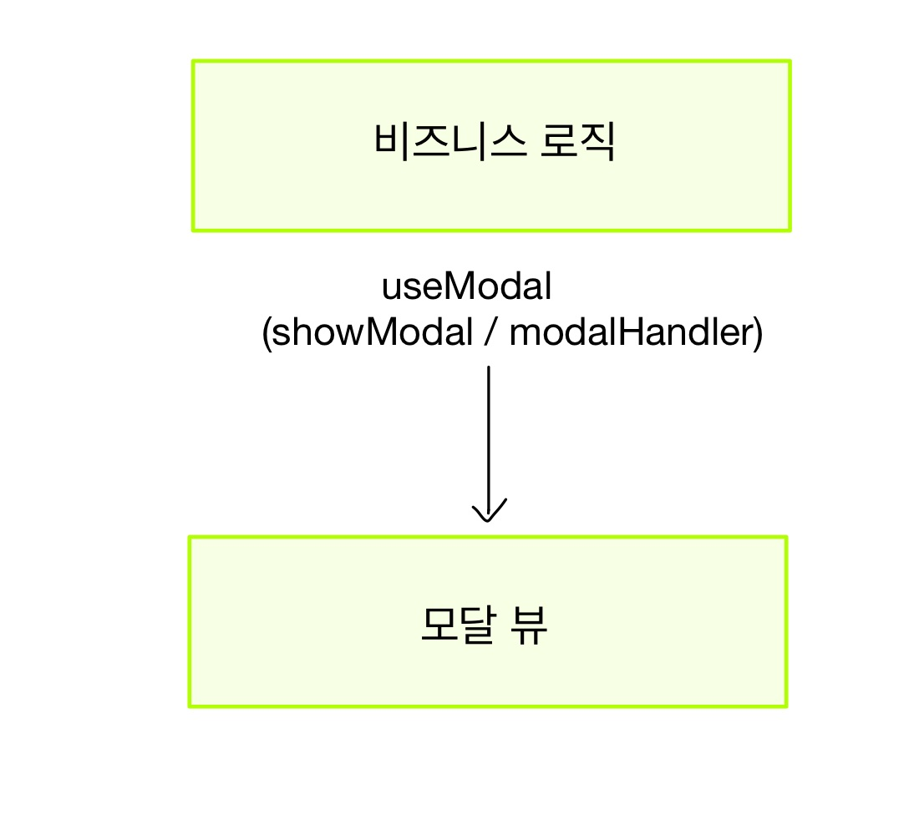

늘 프로젝트 할 때마다 모달은 필수적으로 구현해야하는 UI 입니다. <br/>

이전 프로젝트를 진행할 때는 여러모로 부족했기 때문에 모달을 굉장히 더럽고(..) 재사용성이 떨어지게 구현했었습니다..그래서 현재 프로젝트를 진행할 때 이번에는 정말 모달을 딱 하나의 컴포넌트와 하나의 훅스로 사용할 수 있도록 만들게쒀!! 라고 다짐했고 제가 어떻게 모달을 구현했는지 소개해보고자 합니다. <br/>

<br/>

일단 react-dom에서 제공해주는 `Portal`을 사용합니다.

## 뷰와 로직 나누기



모달은 하나의 컴포넌트와 하나의 커스텀 훅스를 통해서 구현됩니다. <br/>

먼저 코드를 보기전에 간단하게 로직을 설명하면 아래와 같습니다. <br/>

0. 모달을 사용할 컴포넌트에서 **useModal 커스텀훅스**와 **Modal 컴포넌트** 그리고, 모달에 **메인으로 들어갈 컨텐츠**를 준비합니다. <br/>
   <br/>
1. 커스텀 훅스에서 **showModal** (모달 상태) 와 **modalHanlder** (모달 토글 함수) 를 반환해주고, 이를 모달 컴포넌트(뷰)에 Props로 삽입해줍니다. 모달에 메인으로 들어갈 컨텐츠는 children으로 삽입하므로 `<Modal><컴포넌트/></Modal>` 이렇게 삽입해줍니다. <br/>
   <br/>

1. 모달 컴포넌트에서는 현재 showModal 상태가 true라면 Portal을 통해 모달을 붙여줍니다. <br/>
   <br/>

1. 모달 컴포넌트에서는 overlay 화면을 누르면 modalHanlder를 동작시키므로 showModal 상태가 false가 됩니다.
   <Br/>
   <br/>

그러면 이제 코드를 보겠습니다.<br/>

### useModal

```typescript
import { useState, useEffect, useCallback } from 'react'

const useModal = (opened: boolean = false) => {
  const [showModal, setShowModal] = useState<boolean>(opened)

  useEffect(() => {
    setShowModal(opened)
  }, [opened])

  useEffect(() => {
    if (showModal) {
      document.body.style.overflowY = 'hidden'
    } else {
      document.body.style.overflowY = 'auto'
    }
  }, [showModal])

  const modalHandler = useCallback(() => {
    setShowModal(!showModal)
  }, [showModal])

  return [showModal, modalHandler] as const
}

export default useModal
```

1. Props로 `opened` 라는 boolean 변수를 받습니다. opened 가 true라면 `showModal`의 디폴트 상태가 true가 됩니다. <br/>
   <br/>

2. (optional) showModal 상태가 바뀌면 `document.body.style.overflowY` 를 변경해줍니다. open 된 경우에는 `hidden`으로 하여 뒷 화면의 스크롤을 막고 , close되면 원상복구 해줍니다. <br/>
   <br/>

3. modalHanlder 함수를 통해 modal 상태를 토글 해줍니다. <br/>
   <br/>
   <br/>

### Modal Component

```typescript
import React from 'react'
import ReactDOM from 'react-dom'
import { useElement } from 'hooks'
import styled from '@emotion/styled'

interface Props {
  /** Modal's inner contents */
  children: React.ReactNode
  /** show modal or not */
  showModal: boolean
  /** close / open modal handler */
  modalHandler: () => void
}

const Modal = ({
  children,
  showModal,
  modalHandler,
}: Props): React.ReactElement => {
  const root = useElement('modal-root')

  return showModal && root
    ? ReactDOM.createPortal(
        <>
          <Overlay onClick={modalHandler} />
          {children}
        </>,
        root
      )
    : null
}

const Overlay = styled.div`
  position: fixed;
  top: 0;
  left: 0;
  right: 0;
  bottom: 0;
  width: 100%;
  height: 100%;
  background-color: rgba(0, 0, 0, 0.3);
  z-index: 6000;
`

export default Modal
```

- 저는 Next.js를 사용했기 때문에 `document~`에 바로 접근할 수 없습니다. 따라서 `useElement`라는 훅스를 사용하여 원하는 document에 접근합니다. 자세한건 [이 포스팅](https://mooneedev.netlify.app/Frontend/next.js%20%EC%97%90%EC%84%9C%20document%20is%20not%20defined%20%EB%AC%B8%EC%A0%9C%20%ED%95%B4%EA%B2%B0%ED%95%98%EA%B8%B0/)을 참고해주시면 감사하겠습니다.

<br/>

1. props로 children (모달창 메인 컴포넌트) showModal(모달 상태) , modalHandler (모달 토글 함수) 를 받아옵니다.
   <br/>
   <br/>

2. `showModal === true` 일 때만 Portal을 통해 모달 컴포넌트를 붙여줍니다.

<br/>

### 사용되는 방식

```typescript
import { useModal } from 'hooks';
import { Modal } from 'components/ui';
import { baseModalStyle } from 'common/style'
import styled from 'styled-components';

const Example=()=>{
    const [showModal, modalHanlder] = useModal();
    return(
    <div>
        ....
        <Modal>
        	<MainContents/>
        </Modal>
    <div>
    );
};

const MainContents = styled.div`
	...
 	${baseModalStyle}
`;

export default Example;
```

- 이렇게 useModal Hooks와 Modal 컴포넌트를 통해 간단하게 모달을 구현했습니다. 내부에 들어가는 MainContents 컴포넌트만 바꾸면 되므로 재사용성도 좋습니다.
- 위에서 사용한 `baseModalStyle` 은 메인 컨텐츠를 전체 화면의 정 가운데에 놓기위한 css 코드입니다. 모든 Main Contents마다 똑같은 스타일링을 반복하는게 비효율적이어서 만들었습니다.

### baseModalStyle

```typescript
import { css } from '@emotion/react'

export const baseModalStyle = css`
  position: fixed;
  top: 50%;
  left: 50%;
  margin-right: -50%;
  transform: translate(-50%, -50%);
  z-index: 7000;
`
```

<br/>

<br/>

### 마치며

이렇게 간단하게 모달을 구현했습니다. 현재 프로젝트에서 굉장히 요긴하게 잘 쓰고 있습니다 ㅎㅎ 언제나 궁금하신 점이나 지적은 환영입니다.
