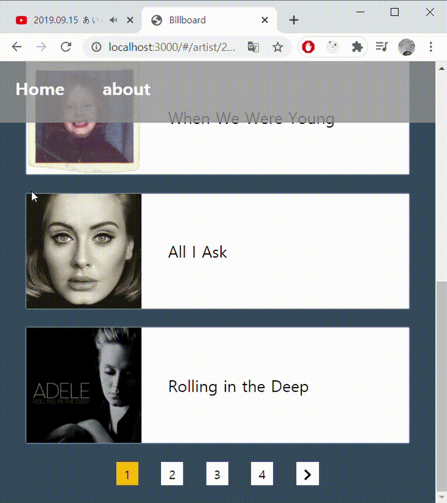

해당 포스팅에서는 리액트에서 어떻게 페이지네이션을 직접 구현했는지 정리하겠습니다. 리액트 7과 타입스크립트를 사용했습니다.<br/>

**페이지네이션에는 두가지 방법이 있습니다.**

1. 초기에 전체 데이터를 서버로부터 가져온 후, 데이터를 페이지별로 잘라서 보여주는 방법
2. 페이지를 변경할 때마다 서버에서 일정의 데이터를 가져와서 보여주는 방법

일단 제가 이 포스팅에서 사용하는 API는 전체 데이터를 지원하지 않고, 전체 데이터의 갯수마저 지원하지 않으므로 2번 방식으로 구현할 수 밖에 없었습니다.

<br/>



위와 같이 페이지네이션을 통해 페이지별로 다른 데이터를 API로부터 가져오도록 하는 것이 목표입니다. <br/>

<br/>

## Pagination 컴포넌트 구현

페이지네이션 바(bar) 를 보여줄 페이지네이션 컴포넌트를 구현합니다. <br/>

props로 받아야하는 값들은 아래와 같습니다. <br/>

1. nowPage : 현재 방문 중인 페이지
2. paginate : 페이지를 이동시켜주는 함수
3. lastPage : 마지막 페이지 ( 마지막 페이지가 있는 경우 ) - 저는 해당 API 전체 데이터의 개수를 지원하지 않아서 마지막 페이지를 알 수 없었기에 마지막 페이지 표시를 할 수 없었음을 알려드립니다. -

<br/>

### 페이지 UI


페이지 UI는 현재 페이지 부터 현재 페이지 + 3 페이지 까지 보여주도록 구현했습니다. <br/>

그리고, 현재 페이지가 2가 넘어가는 경우, 즉 1이 아닌 경우에는 위와 같이 앞에 가장 첫 페이지인 1페이지를 표시하여 1페이지로 쉽게 돌아갈 수 있도록 했습니다. <br/>

양 옆에 있는 ' < ' 와 ' > ' 페이지는 각각 4페이지 앞으로, 4페이지 뒤로 보내줍니다. 4페이지 앞으로 보내주는 버튼은 현재 페이지가 5 이상이 되어야만 보이도록 구현했습니다. <br/>

- 마지막 페이지를 알 수 있는 경우에는 현재 페이지와 마지막 페이지 간의 페이지 차이가 3 이하일 경우 , UI를 변경해줘야 합니다. 도한 '>' 페이지 역시 마지막 페이지로부터 3페이지 이하로 떨어져있는 페이지에 도달 했을 경우y 표시해주면 안됩니다.

<br/>

### 페이지 UI 구현하기

현재 페이지에 따라서 페이지의 UI가 변경되어야 하므로, 엘리먼트를 담은 페이지 리스트를 State로 관리합니다. <br/>

그리고 useEffect를 통해서 현재 페이지에 따라서 페이지 리스트를 변경해주도록 합니다. <br/>

- 페이지 리스트 엘리먼트를 생성 할 때 현재 방문중인 페이지에 해당하는 엘리먼트에는 props nowPage에 true값을 줘서 스타일링을 다르게 구현하도록 합니다. <br/>
- 받아온 paginate 함수를 onClick 이벤트에 등록함으로써, 해당 페이지 버튼을 누르면 페이지를 이동하도록 해줍니다.

<br/>

```typescript
const [pages, setPages] = useState<JSX.Element[]>([])

// 현재 페이지에 따라 page list 변경
useEffect(() => {
  const temp = []
  for (let i = 0; i < 4; i++) {
    const pageNumber = props.nowPage + i
    temp.push(
      <Page
        key={pageNumber}
        onClick={props.paginate.bind(this, pageNumber)}
        nowPage={props.nowPage === pageNumber}
      >
        {pageNumber}
      </Page>
    )
  }
  setPages(temp)
}, [props.nowPage])
```

<br/>

아래는 Pagination 컴포넌트 전체 코드입니다. 아이콘은 fontAwsome을 사용했습니다. <br/>

```typescript
import React, { useEffect, useState } from 'react';
import styled from 'styled-components';
import { FontAwesomeIcon } from '@fortawesome/react-fontawesome';
import {
    faChevronLeft,
    faChevronRight,
} from '@fortawesome/free-solid-svg-icons';

interface Props {
    nowPage: number;
    paginate: (target: number) => void;
}

const Pagination = (props: Props) => {
    const [pages, setPages] = useState<JSX.Element[]>([]);

    // 현재 페이지에 따라 page list 변경
    useEffect(() => {
        const temp = [];
        for (let i = 0; i < 4; i++) {
            const pageNumber = props.nowPage + i;
            temp.push(
                <Page
                    key={pageNumber}
                    onClick={props.paginate.bind(this, pageNumber)}
                    nowPage={props.nowPage === pageNumber}>
                    {pageNumber}
                </Page>
            );
        }
        setPages(temp);
    }, [props.nowPage]);

    return (
        <Container>
        	// nowPage가 5 이상 일경우 < 표시 해줍니다.
            {props.nowPage >= 5 && (
                <Page onClick={props.paginate.bind(this, props.nowPage - 4)}>
                    <FontAwesomeIcon icon={faChevronLeft} />
                </Page>
            )}
            // nowPage가 2 이상일 경우 맨 첫 페이지를 표시 해줍니다.
            {props.nowPage >= 2 && (
                <>
                    {' '}
                    <Page onClick={props.paginate.bind(this, 1)}>
                        1
                    </Page> ...{' '}
                </>
            )}
            {pages}
            <Page onClick={props.paginate.bind(this, props.nowPage + 4)}>
                <FontAwesomeIcon icon={faChevronRight} />
            </Page>
        </Container>
    );
};

const Container = styled.div`
    width: 100%;
    height: 30px;
    display: flex;
    justify-content: center;

    margin: 25px 0;
`;

const Page = styled.div<{ nowPage: boolean }>`
    background-color: ${(props) => (props.nowPage ? '#fcba03' : '#fff')};
    text-align: center;
    padding: 5px 10px;
    margin: 0 15px;

    cursor: pointer;
`;

export default Pagination;

```

<br/>

<br/>

## Pagination 컴포넌트 사용하기

그러면 위와 같이 준비해놓은 Pagination 컴포넌트를 원하는 Page에서 내 사용해야합니다. 앞으로 이 Page를 Pagination 컴포넌트의 '부모 컴포넌트'라고 하겠습니다. <br/>

먼저 부모컴포넌트에서 하는 일을 알아봅시다. <br/>

1. 데이터를 fetch 하고 받아와서 데이터를 뿌려줍니다.
2. 현재 페이지를 관리합니다.

<br/>

부모 컴포넌트에서 현재 페이지를 관리해줘야 하고, fetch 로부터 받아온 데이터를 저장해야 하므로 아래와 같이 State를 정의해주었습니다. ( 여기서 result 컴포넌트의 타입 result는 미리 정의해둔 받아올 데이터의 타입입니다.) <br/>

초기 페이지는 1로 정의해주도록 합니다.

```typescript
const [result, setResult] = useState<result[]>([])
const [page, setPage] = useState<number>(1)
```

<br/>

그러면 여기서 API를 fetch 할 타이밍은 어제일까요? 바로 페이지가 변경되었을 때 입니다. 따라서 아래와 같이 page 상태가 변경되었을 때마다 API fetch 함수를 불러와 줍니다. <br/>

```typescript
// page가 변경될 때 fetch를 다시 한다.
useEffect(() => {
  fetchAPI()
}, [page])

// API fetch 보내고, 받아온 값 저장하는 함수
const fetchAPI = useCallback(async () => {
  const response = await api.getArtistInfo(artist, page.toString())
  setResult(response.data.songs)
}, [page, result])
```

<br/>

그러면 page는 언제 변경될까요 ? 바로 이전에 만들어놓은 Pagination 컴포넌트에서 onClick 이벤트가 발생할 때 입니다. 따라서 Pagination 컴포넌트에 props로 넣어준 paginate 함수를 아래와 같이 정의합니다. <br/>

간단하게 page를 매개변수로 받아온 target으로 변경해줍니다.

```typescript
// target 으로 page Number를 받아와서 page number를 변경한다.
const paginate = useCallback((target: number) => {
  setPage(target)
}, [])
```

<br/>

그리고 아래와 같이 렌더링 해줍니다.

```typescript
return (
  <Layout title={'artist'}>
    <Container>
      {result.length > 0 &&
        result.map(data => <Card key={data.id} data={data} />)}
      <Pagination nowPage={page} paginate={paginate} />
    </Container>
  </Layout>
)
```

<br/>

<br/>

---

api 로부터 마지막 페이지 혹은 전체 데이터 갯수를 받아올 수 없어 아직 완벽한 페이지네이션 구현은 아니지만, 그래도 최대한 고민하면서 구현해보았습니다. 사실, 마지막 페이지가 있더라도 해당 구현 방식으로부터 그렇게 달라지는 점은 많지 않습니다 .ㅎ ㅎ <br/>

혹시 잘못된 점이나 궁금한 점이 있으시다면 편하게 댓글 달아주세요~

<br/>
