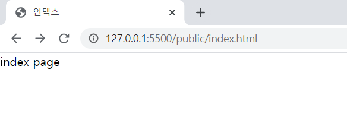
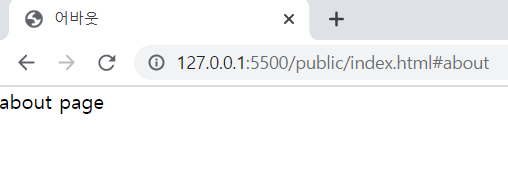

리액트를 사용 할 수록 내부에서 어떠한 동작이 일어나고, 어떻게 구현된건지 궁금증이 커져갔습니다. 그래서 바닐라 자바스크립트를 이용해 간단한 프로젝트들을 몇개 만들어보기로 했습니다. <br/>

리액트를 따라한다면 어플은 당연히 **SPA - single page application**로 구현되어야 겠죠? 그래서 이런저런 방법을 찾아보고, 구현해본 결과 가장 간단하게 구현할 수 있었던 방법을 소개해보고자 합니다. <br/>

<br/>

**먼저 해당 프로젝트는 타입스크립트를 사용했고 웹팩을 통해 자바스크립트 파일을 번들링했습니다. 해당 내용은 생략하도록 하겠습니다.**

### SPA ?

먼저 SPA에 대해 간단히 알아보겠습니다. SPA가 적용되지 않을 경우, 매 요청 시 마다 서버로부터 리소스들을 받아오고, 화면에 렌더링하는 작업을 해야합니다. <br/>

반면 SPA가 적용될 경우에는, 브라우저에 최초에 딱 한번 페이지 전체를 로드합니다. 그리고 그 후의 요청부터는 특정 부분만 ajax를 통해 데이터를 바인딩하여 화면을 변경해줍니다. <br/>

따라서 우리가 두 개의 페이지를 만들고 싶을 때 , 각각 다른 2개의 리소스를 가져오는게 아니라, 동일한 하나의 페이지 (index.html)를 최초에 가져온 후 요청에 따라 내부 컴포넌트만 변경해주는 것 입니다. <br/>

<br/>

 <br/>

해당 프로젝트에서는 세 개의 페이지(index, about, 404error)를 만들어보도록 하겠습니다.

## 해쉬(Hash Story)로 구현하기

url 해쉬를 사용하는 방법으로 `#` 앵커를 통해서 이동하게 됩니다. 예를들면 `app.html#index` 이렇게 이동할 수 있습니다. 주의 해야 할 점은, hash는 웹 페이지 내부에서 이동을 위한 것으로, history 관리가 되지 않습니다. 하지만 해당 프로젝트는 서버가 없는 정적 페이지이므로 hashHistory만으로 충분하다고 생각하여 해쉬 방법으로 구현하기로 했습니다. <br/>

<br/>

## 핵심 파일 구조

전체적인 파일구조는 아래와 같습니다. 여기서 더 나아가서 이후에는 페이지 내부에서 렌더링 될 컴포넌트 파일을 추가할 수 있습니다.

```
> public
  | index.html
  | bundle.js  // 번들링된 결과물
> pages
  | index.ts
  | about.ts
  | error.ts
| App.ts
| index.ts
| route.ts

```

<br/>

## index.html 작성

먼저 최초에 로드 될 단 하나의 html 페이지를 구현해줍니다. 저는 아래와 같이 구현하여 `.app`에 페이지 별로 각기 다른 Node를 넣을 수 있도록 했습니다. <br/>

모듈로 로드된 `bundle.js` 아래에서 작성할 자바스크립트 파일이 웹팩으로 번들링된 파일입니다.

```html
<!DOCTYPE html>
<html lang="en">
  <head>
    <meta charset="UTF-8" />
    <meta name="viewport" content="width=device-width, initial-scale=1.0" />
    <title>Document</title>
    <script type="module" src="./bundle.js"></script>
  </head>
  <body>
    <div class="app"></div>
  </body>
</html>
```

## 라우터 작성

해쉬값을 이용해 각 페이지와 `App.ts` 을 연결 시켜주는 라우터를 작성하도록 합니다. <br/>

### 1. 페이지와 라우트 연결

먼저 페이지를 불러와주고, 해당 페이지와, 그 페이지가 렌더링될 주소(라우트)를 연결해줍니다. <br/>

- routes : 각각 라우트(key)과 연결될 페이지(value) 를 저장해줍니다.
- nowPage : 현재 페이지의 이름 (해쉬값) 을 저장해줍니다. `window.location.hash`로 해쉬값을 받아와서 `#` 을 제거해줍니다.

```typescript
import indexPage from './pages/index'
import aboutPage from './pages/about'
import errorPage from './pages/error'

class Router {
  routes = {
    '': indexPage,
    about: aboutPage,
  }
  nowPage = ''

  constructor() {
    this.nowPage = this.parsePath(window.location.hash)
  }

  // pathname 파싱
  parsePath(path: string): string {
    return path.toString().replace('#', '')
  }
}
```

<br/>

### 2. 라우팅 함수 구현

첫번째 함수는 현재 해시 주소를 받아온 후, 해당 해시 주소와 연결된 페이지를 반환해줍니다. <br/>

여기서 위에서 저장한 `routes` 객체로부터 `pathLists`를 뽑아서, 현재 해시 주소가 유효한 페이지인지 확인해줍니다. 유효한 페이지가 아닐경우 error page를 라우팅 해줍니다.

```typescript
getCurrentURL(path: string) {
    const key = this.parsePath(path); // 파싱
    const pathLists = Object.keys(this.routes);
    if (pathLists.includes(key)) {
        return this.routes[key];
    } else {
       // pathLists에 없는 주소라면 404 Routing
        return errorPage;
     }
}
```

<br/>

두번째 함수는 문자열을 매개변수로 받아와서 강제로 해시를 변경해주는 함수입니다. 버튼을 클릭하거나 리다이렉트 할 때 사용가능합니다. <br/>

```typescript
push(pageName: string) {
    window.location.hash = pageName;
}
```

<br/>

전체 코드는 아래와 같습니다.

```typescript
import indexPage from './pages/index'
import aboutPage from './pages/about'
import errorPage from './pages/error'

class Router {
  routes: object
  nowPage = ''

  constructor() {
    this.nowPage = this.parsePath(window.location.hash)
    this.routes = {
      '': indexPage,
      about: aboutPage,
    }
  }

  // 현재 url 주소에 따라서 라우팅해주는 함수
  getCurrentURL(path: string) {
    const key = this.parsePath(path)
    const pathLists = Object.keys(this.routes)
    if (pathLists.includes(key)) {
      return this.routes[key]
    } else {
      // pathLists에 없는 주소라면 404 Routing
      return errorPage
    }
  }

  // pathname 파싱
  parsePath(path: string): string {
    return path.toString().replace('#', '')
  }

  // push to
  push(pageName: string) {
    window.location.hash = pageName
  }
}

const router = new Router()

export default router
```

## 페이지 작성

페이지에서는 아래와 같이 가장 상위의 엘리먼트를 작성해서 반환하도록 합니다. 추후에는 해당 엘리먼트에 여러 컴포넌트를 자식으로 붙여서 반환하면 되겠죠? 아래와 같이 다른 페이지도 구현합니다. <br/>

```typescript
import { changeTitle } from '../util/util'

const Index = () => {
  const container = document.createElement('div')
  container.className = 'container'
  container.innerText = 'index page'
  changeTitle('인덱스')

  return container
}

export default Index
```

**_위의 changeTitle 유틸함수는 페이지별로 title을 변경해줍니다._**

<br/>

<br/>

## 자바스크립트 파일 작성

### index.ts

웹팩에 번들링할 때 엔트리 파일이 될 코드를 아래와 같이 작성했습니다. 해당 파일에서는 코드가 구현된 `App.ts`파일과 스타일링을 위한 `style.scss`파일을 삽입하기만 합니다. <br/>

```typescript
const App = require('./App')
const style = require('./scss/style.scss')
```

<br/>

### App.ts

1. 먼저 초기에 렌더링 되자마자 현재 해시 주소에 해당하는 페이지를 받아온 후 해당 페이지를 화면에 뿌려줍니다. 주의 해야할 것이 `$target.innerHTML=""` 을 실행하지 않고 `appendChild`를 실행하면, 페이지들이 바뀌지 않고 계속 덧붙여집니다.

2. 두번째로 `window.onhashchange` 이벤트를 통해서 해쉬주소가 변경될 때마다 페이지 렌더링을 새로 해주도록 합니다.

```typescript
import Router from './route'

const App = ($target: Element) => {
  window.onhashchange = () => {
    render()
  }

  function render() {
    const renderingPage = Router.getCurrentURL(window.location.hash)
    $target.innerHTML = ''
    $target.appendChild(renderingPage())
  }

  render()
}

export default App(document.querySelector('.app'))
```

<br/>
이렇게 해서 아래와 같이 세 페이지가 구현되었습니다. <br/>

<br/>

1. 인덱스 페이지
   

<br/>

2. about 페이지
   

<br/>

3. 그외 error 페이지
   

위와 같이 잘 동작하는 것을 확인 할 수 있습니다!

전체코드는 [깃헙](https://github.com/moonheekim0118/vanillaReact/tree/bolierplate) 에서 확인 하실 수 있습니다

<br/>

<br/>

### Reference

[Vanilla JS에서 SPA 라우팅 시스템 구현하기](https://kdydesign.github.io/2020/10/06/spa-route-tutorial/)

[JavaScript로 라우터를 만들어 간단한 SPA를 구현해보기](https://junjangsee.tistory.com/entry/Javascript%EB%A1%9C-%EB%9D%BC%EC%9A%B0%ED%84%B0%EB%A5%BC-%EB%A7%8C%EB%93%A4%EC%96%B4-%EA%B0%84%EB%8B%A8%ED%95%9C-SPA%EB%A5%BC-%EA%B5%AC%ED%98%84%ED%95%B4%EB%B3%B4%EA%B8%B0)
