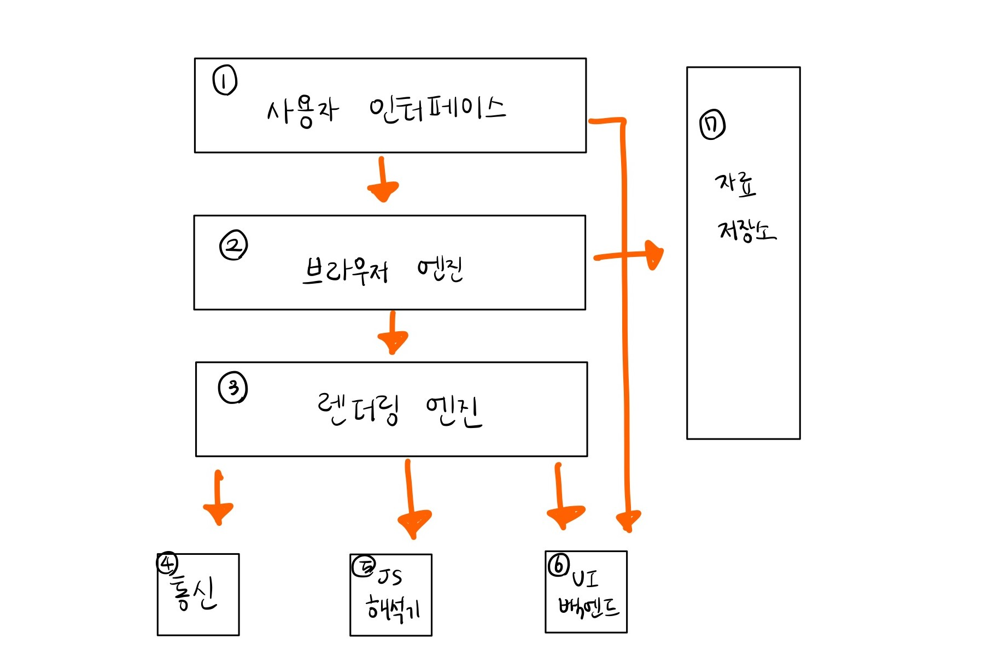
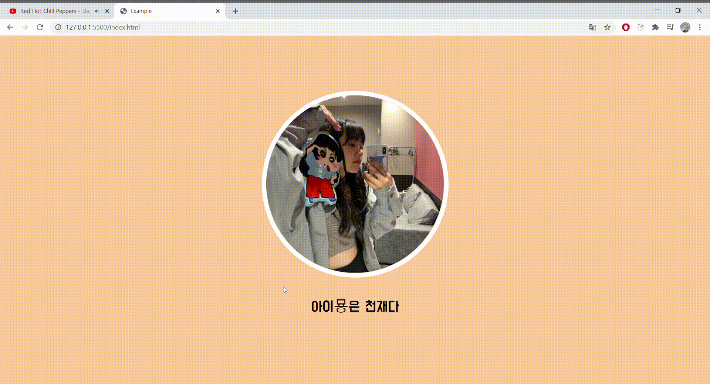
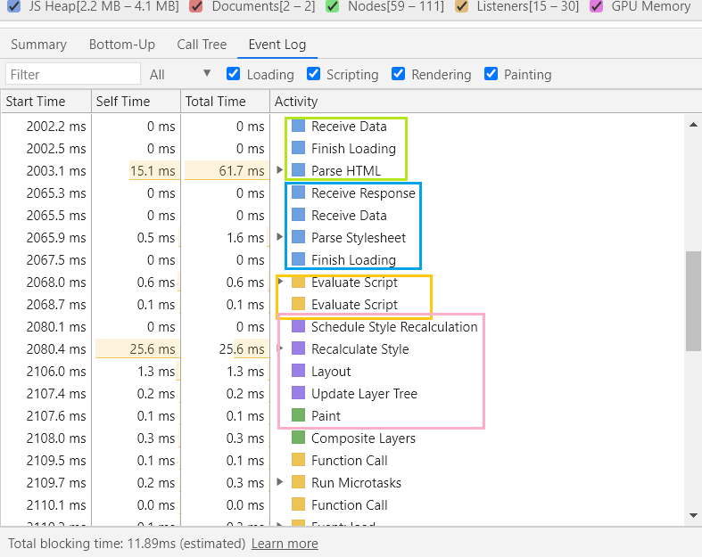
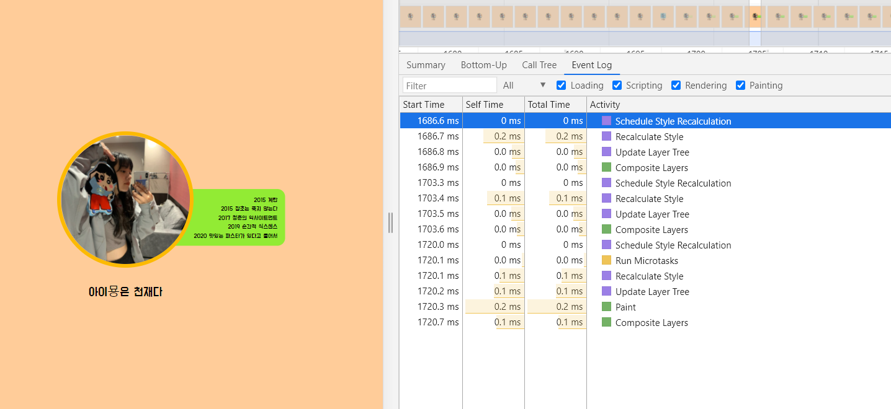
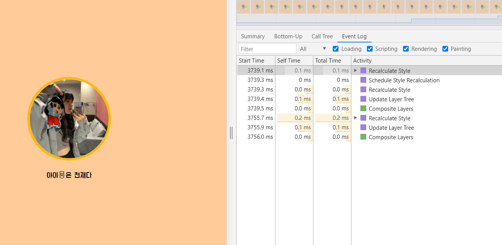
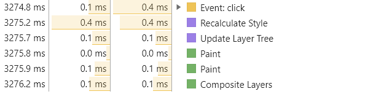

### Goal

- 브라우저의 렌더링 과정을 이해한다.
- 예시를 통해서 자바스크립트 이벤트가 발생할 때 브라우저가 어떻게 리렌더링 되는지 이해한다.

<br/>

## 브라우저의 구조


<br/>

1. **사용자 인터페이스** : 주소 표시줄, 이전 다음 버튼 등 요청한 페이지를 보여주는 창을 제외한 모든 부분을 일컫는다.
2. **브라우저 엔진** : 사용자 인터페이스와 렌더링 엔진사이의 동작을 제어 해준다.
3. **렌더링 엔진** : 요청한 콘텐츠를 표시해준다. html 파일과 CSS 파일을 파싱하여 표시해준다.
4. **통신** : HTTP 요청과 같은 네트워크 요청에 사용된다.
5. **자바스크립트 해석기** : 자바스크립트 코드를 해석하고 실행해준다.
6. **UI 백엔드** : 콤보박스 창과 같은 기본적인 장치를 그려준다.
7. **자료 저장소** : 로컬 스토리지, 쿠키와 같은 자료를 저장해준다.

<br/>

## 렌더링 엔진

- 요청받은 내용을 브라우저 화면에 표시해준다.
- 파이어폭스의 게코 (Gecko), 크롬과 사파리의 웹킷 (Webkit) 이 있다.

<br/>
<br/>

1. **DOM 트리 구축을 위해서 HTML 소스를 파싱하여 DOM(Document Object Model) 트리를 구축한다.**
   - DOM 트리는 완전히 구문 분석된 HTML 페이지의 Object 표현이다.
   - HTML의 장점은 부분적으로 실행 될 수 있다는 것이다. 따라서 페이지에 내용을 표시하기 위해 전체 문서를 로드할 필요가 없다.

<br/>

2. **CSS 파싱 후 CSSOM (CSS Object Model) 트리를 구축한다.**

   - CSSOM 트리는 DOM과 관련된 스타일의 Object 표현이다.
   - CSS는 `렌더링 차단 리소스(render blocking resource)`로서, 먼저 리소스를 완전히 파싱하지 않으면 렌더링 트리를 구성할 수 없다. 즉, HTML과 달리 CSS는 계단식 상속 특성 때문에 부분적으로 실행 될 수 없다. 따라서 스타일 시트 문서 앞부분에 정의된 스타일은 문서 뒤에 정의된 스타일에 의해 무시 될 수 있다.
   - 따라서 스타일 시트 전체가 파싱되기 전에 앞에서 정의한 CSS 스타일을 사용하기 시작하면 잘못된 CSS가 적용된다. 따라서 다음단계로 넘어가기 전에 CSS를 완전히 파싱해야 한다.

   <br/>

3. **자바스크립트 파일 실행**

   - HTML 중간에 스크립트가 있다면 HTML 파싱이 중단 된다.

   <br/>

4. **DOM과 CSSOM을 조합하여 렌더 트리 (Render Tree)를 구축한다.**

   - 렌더트리는 색상 혹은 면적이 같은 시각적 속성이 있는 사각형을 포함하는데, 정해진 순서대로 화면에 표시한다.

   <br/>

5. **렌더 트리를 배치한다** `Layout/Reflow`

   - 뷰포트를 기반으로 렌더트리의 각 노드가 가지는 정확한 위치, 크기를 계산한다.
   - 이 때 display:none 을 사용한 요소는 트리에 포함되지 않는다.

   <br/>

6. **렌더트리 그리기** `Paint`
   - UI 백엔드에서 렌더트리의 각 노드를 가로지르며 형상을 만들어낸다.

<br/>
<br/>

## 크롬 브라우저 렌더링 과정


- 위에서 알아본것 처럼 HTML과 CSS 각 각각 파싱되어 렌더 트리가 그려짐을 알 수 있다.
- 여기서 **어태치먼트(Attachment)**는 웹킷이 렌더 트리를 생성하기 위해 DOM 노드와 시각정보를 연결하는 과정이다.

<br/>
<br/>

## 예시

직접 간단한 HTML 문서를 코딩하여 렌더링이 이론대로 잘 굴러가는지 알아보도록 하겠다. <br/>



위와 같이 귀염뽀짝한 페이지를 간단하게 만들어보았다. <br/> 가운데 위치한 아이묭의 사진을 누르면 아이묭의 앨범 목록이 토글되도록 구현했다. 이를 통해 렌더링 과정이 잘 진행되는지 보도록 하겠다. 위 페이지의 소스코드는 아래와 같다.

<br/>
index.html

```html
<!DOCTYPE html>
<html lang="en">
  <head>
    <meta charset="UTF-8" />
    <meta name="viewport" content="width=device-width, initial-scale=1.0" />
    <title>Example</title>
    <link rel="stylesheet" href="style.css" />
  </head>
  <body>
    <div>
      
      <p>아이묭은 천재다</p>
    </div>
    <ul>
      <li>2015 계란</li>
      <li>2015 잡초는 죽지 않는다</li>
      <li>2017 청춘의 익사이트먼트</li>
      <li>2019 순간적 식스센스</li>
      <li>2020 맛있는 파스타가 있다고 들어서</li>
    </ul>
    <script src="app.js"></script>
  </body>
</html>
```

<br/>

style.css

```css
@import url('https://fonts.googleapis.com/css2?family=Do+Hyeon&display=swap');

body {
  background-color: #ffcc99;
  font-family: 'Do Hyeon', sans-serif;
}

div {
  text-align: center;
  width: 100%;
  position: absolute;
  left: 50%;
  top: 50%;
  transform: translate(-50%, -50%);

  z-index: 100;
}

div img {
  width: 25%;
  height: 25%;
  border-radius: 50%;
  border: 10px solid #fff;

  cursor: pointer;
  transition: border 1s;
}

div img:hover {
  border: 10px solid #fcba03;
}

.Clicked {
  border: 10px solid #fcba03;
}

ul {
  background-color: #92eb34;
  width: 280px;
  padding: 15px 20px;
  border-radius: 20px;
  text-align: right;

  visibility: hidden;
  opacity: 0;
  position: absolute;
  left: 69%;
  top: 50%;
  transform: translate(-50%, -69%);
  transition: visibility 0s, opacity 0.5s linear;

  z-index: 10;
}

.ShowAlbumList {
  visibility: visible;
  opacity: 1;
}

ul li {
  list-style: none;
  color: black;
  font-size: 1rem;
}

p {
  font-size: 2rem;
  text-align: center;
}
```

<br/>

app.js

```javascript
const $div = document.querySelector('div')
const $ul = document.querySelector('ul')
const $img = document.querySelector('img')

const toggle = () => {
  $ul.classList.toggle('ShowAlbumList')
  $img.classList.toggle('Clicked')
}

$div.addEventListener('click', toggle)
```

<br/>
<br/>

## 페이지 첫로딩시 로그



페이지를 로드 했을 시 로그는 위와 같이 나타난다. 이를 통해 렌더링 과정이 위해서 설명한대로 진행됨을 알 수 있다.

- `Receive Data - Finish Loading` - index.html 문서를 받아온다.
- `Parse HTML` - 받은 HTML에 대한 DOM 구문분석을 시작한다.
- `Receive Response - Receive Data` - style.css와 app.js 파일을 요청하고 받아온다.
- `Parse Stylesheet`- 받은 style.css 에대한 CSSOM을 생성해준다.
- `Evaluate Script` -자바스크립트 소스를 실행한다.
- `Recalculate Style - Layout - Update Layer Tree` -렌더 트리의 각 노드가 가지는 정확한 위치와 크기를 계산하여 렌더 트리를 배치한다. (Layout / Reflow )
- `Paint` 렌더트리를 그린다 (Paint)

<br/>
<br/>

**_그렇다면 아이묭 사진을 클릭하여 클릭 이벤트(앨범 리스트 토글)가 발생한다면 어떻게 될까 ?_**

## 클릭 이벤트 발생시 로그



위는 아이묭 사진을 처음 클릭했을 때의 로그이다.

<br/>



<br/>
위는 아이묭 사진을 두번째로 클릭했을 때의 로그이다. 
두 예시 모두 사진을 클릭한 이벤트가 발생하면, 렌더 트리 배치 (Layout / Reflow ) 과정부터 다시 시작되는 것을 보여준다. <br/>
예시에서는 클릭 이벤트가 발생한 로그가 생략되었는데, 정확히 이벤트 발생시점부터의 로그를 보자면 아래와 같다. <br/>

<br/>



<br/>

즉, 클릭 이벤트가 발생하여 UI에 변화가 생긴다면, 위와 렌더 트리 배치 (Layout / Reflow) 부터 다시 시작한 후 다시 렌더 트리를 그려주는 (Paint) 것을 알 수 있다.

<br/>
<br/>

### Reference

[네이버 D2 브라우저는 어떻게 동작하는가](https://d2.naver.com/helloworld/59361) <br/>
[HTML Critical rendering path의 이해](https://blog.asamaru.net/2017/05/04/understanding-the-critical-rendering-path/) <br/>
[브라우저 렌더링 원리](https://github.com/baeharam/Must-Know-About-Frontend/blob/master/Notes/frontend/browser-rendering.md)<br/>
