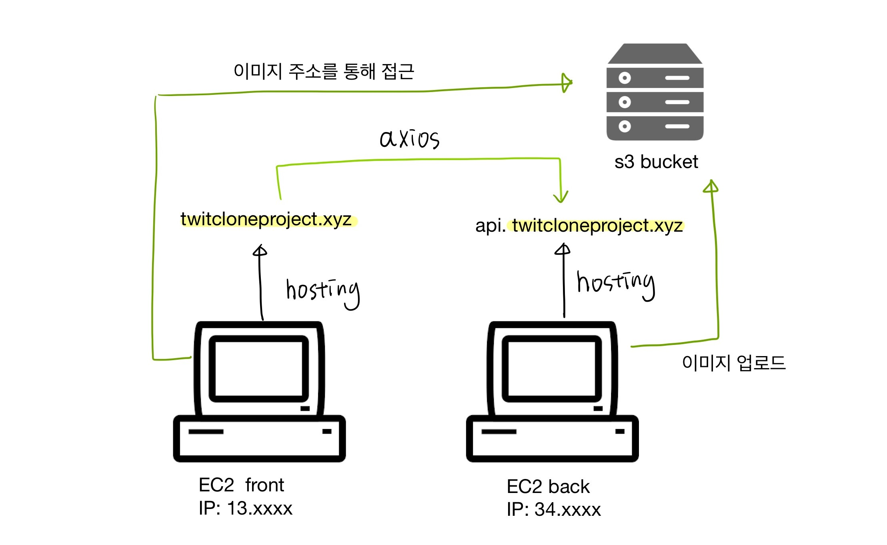

## Goal

- '배포'가 무엇인지 이해한다.
- EC2를 이용한 배포 흐름을 이해한다.
- S3에 이미지를 저장하는 방법을 이해한다.
- 최근 [트위터 클론 프로젝트](https://github.com/moonheekim0118/twitter-clone) 를 AWS EC2 - S3를 통해 배포하면서 배운점을 정리한다.

<br />

## 1. 배포란

- 배포란 최종 사용자에게 소프트웨어를 전달하는 과정으로, 개발용으로 사용하는 개발자의 컴퓨터 외 배포용 컴퓨터에 개발된 소스코드를 업로드 하여 다른 사용자들이 원격으로 해당 서버에 접근 할 수 있도록 해주는 과정을 뜻한다.

<br />

## 2. 개발환경을 통해 배포환경 이해하기

### 서버 개발 환경 ( dev )

- 서버 개발환경은 각 개발자들이 개발한 소스코드를 합쳐 서버환경에서 테스트 할 수 있는 환경이다.
- 각 개발자는 로컬에서 개발을 하게 된다.
- 여기서는 샘플 데이터를 이용해서 개발을 한다.

### 통합 개발 환경 (Integration)

- 프론트 개발과 백엔드 개발의 경우 통합 개발환경에서 통합 및 테스트를 하게 된다.
- 기존 서비스와 충돌이 없도록 통합하고, 충돌이 있을 경우 이전 단계로 돌아가 충돌을 해결한다.

### 스테이징 환경 (staging)

- 운영 환경과 거의 동일한 환경으로 만들어 놓고, 운영환경으로 이전하기 전에 여러 기능적 부분을 검증하는 환경이다.

### 운영 환경 (production)

- 실 서비스를 운영하는 환경이다.

<br />

## 3. AWS로 프로젝트 배포하는 과정

- 먼저 나는 프론트와 백 서버를 각각 EC2에 배포하였고, 도메인을 구입하여, route53을 통해 도메인을 설정해주었다.
- 트위터 클론이다보니 사용자가 업로드하는 이미지들은 S3 버켓에 업로드해주었다.

<br/>

- 전체적인 배포 흐름
  

## EC2란?

- 가상 컴퓨터 환경을 제공해준다.
- 탄력적 IP 주소를 연결함으로써 , IP 주소를 고정 시킬 수 있다. (연결하지 않을 경우 IP 주소가 일정 시간마다 변경된다.)

<br />

### 1. 두 개의 EC2 인스턴스를 각각 생성한다.

- 인스턴스 생성시, ubuntu를 선택해준다.
- 보안그룹 구성에서 http (80번 포트) 와 https(443번 포트) 규칙을 추가해주어 http , https로부터의 접근을 허용해준다.
  - 디폴트로 설정되어있는 ssh는 개발자가 터미널로의 접근을 허용하는 역할을 한다.
- 첫 인스턴스를 생성할 때 키페어를 새로 생성해주고, 다운받은 키페어를 프로젝트 상위폴더에 저장해준다. 이 때 해당 .pem 파일은 절대 깃허브에 올려서는 안된다. 두번째 인스턴스 생성시에는 기존 키페어를 사용한다.

<br />

### 2. 인스턴스 연결

- 인스턴스 연결에 ssh - 로 시작하는 주소를 복사하여 터미널에 입력하여 해당 가상 컴퓨터 환경에 접속 한다.
- 접속 후 git clone으로 프로젝트를 클론해온다.
- 필요한 것들을 설치해주는 작업을 진행한다. ( 프론트의 경우 Node js , pm2 / 백엔드의 경우 Node.js , pm2, MySQL)
- npm install을 통해 모듈을 설치해준다.
- 백엔드 서버에 .env 파일은 함께 클론되지 않았기 때문에 vim 에디터를 이용하여 .env 파일을 작성해주고 저장하여 디비 연결에서 문제가 없도록 한다.

<br />

### 3. 서버 구동 전 확인해야 할 사항들

- 프론트와 백엔드 각각의 package.json의 스크립트 및 url 설정을 수정해주어야 한다.

- 프론트 스크립트

```json
"build": "cross-env ANALYZE=true NODE_ENV=production next build",
"start": "cross-env NODE_ENV=production next start -p 80" // start하면 build한 파일을 .next 폴더에서 가져와 구동해준다.
```

- 백엔드 스크립트

```json
 "start": "cross-env NODE_ENV=production pm2 start app.js",
```

<br />

#### url 수정

- 기존에 리액트 앱은 localhost:서버포트 로 axios 요청을 보냈기 때문에 이를 aws 탄력적 ip 설정으로 부여받은 백엔드 ip 주소로 바꾸어 준다. 해당 Ip 주소는 추후에는 도메인 주소로 변경된다.
- 백엔드에서 역시 기존 프론트 주소를 변경해주지 않으면 cors 정책에 걸리기 때문에 프론트 ip 주소를 cors 설정에 입력해준다. 이 역시 추후에 도메인 주소로 변경된다.

```javascript
app.use(cors({
        origin:['http://3.xxx',],
        credentials: true,
    }));
}
```

<br />

### 소스코드에 변경사항이 있다면 ?

1. 변경된 소스코드를 깃헙에 푸시 해준다. (master 브랜치 혹은 자신이 해당 서버에서 배포중인 브랜치)
2. 우분투 서버에 돌아와서 `git pull` 을 실행해준다.
3. 백엔드 서버의 경우 `npx pm2 reload all` 을 해주면 변경사항이 바로 반영된다.
4. 프론트 서버의 경우 `npm run build` 를 통해 변경된 소스코드를 먼저 빌드해주는 과정을 거쳐야한다. 그 후 리로드를 해준다.
   - 프론트 서버에서 빈번히 새로 빌드하고 서버를 start하면 status 가 errored에 멈춰있는 오류를 만났다. 이 때는 `npx pm2 update`를 해주면 말끔히 해결 되었다.

<br />

### 4. 프론트 서버 배포와 쿠키 문제

- 이렇게 배포 설정을 마치고 , cors문제까지 해결하게 되면 프론트의 요청은 서버로 잘 전달이 되고 서버의 응답 역시 프론트로 잘 전달 된다. 하지만 한가지 문제는 `쿠키가 공유가 되지 못한다는 점`이다.
  - 왜냐하면, 쿠키는 응답-요청 간의 **도메인이 서로 같아야지 공유**되기 때문이다.
- 따라서 도메인을 구입한 후 aws route53에서 도메인을 설정해주어야 한다. (.xyz 나 .shop으로 끝나는 도메인은 최대 1년에 1500원 정도이니 구입해도 별 부담이 없다.)

<br />

### 5. 도메인 연결

- route53에 들어가서 구입한 도메인 이름 ('twitcloneproject.xyz') 으로 호스팅 영역을 생성해준다.
- 새로 생성하면 NS 유형과 SOA 유형이 디폴트로 생성되는데 NS 유형의 값 (주소 ) 을 도메인을 구입한 곳에서 도메인 설정 - > 네임 주소 값으로 설정해준다.
- 호스팅 영역 두 개를 새로 생성해준다.
  - 프론트 : 이름은 기존 도메인 값을 넣어준다. 'twitcloneproject.xyz' , 유형은 A 유형을 선택해주고 값에 EC2의 프론트 서버 IP 주소를 입력해준다.
  - 백엔드 : 이름은 'api.twitcloneproject.xyz' 와 같이 기존 도메인 값 앞에 api를 붙여서 넣어준다. 유형은 똑같이 A 유형을 선택해주고 값에 EC2의 백엔드 서버 IP 주소를 입력해준다.
- 변경된 도메인 주소 값을 각각 프론트 소스코드와 백엔드 소스코드에 반영해주는 것을 잊지 않도록 한다.
- 이렇게 프론트와 백의 도메인을 연결해주면 쿠키가 공유되는 것을 볼 수 있다.

<br />

<br />

## S3 연결 하기

- 왜 이미지를 백 서버에 안올리고 S3 에 올리는가?
  - 백 서버에 올리면 서버가 스케일링 될 때마다 이미지들이 복사되어 매우 비효율 적이다. 따라서 기존에 multer를 통해 백엔드 폴더에 업로드 하던 이미지를 aws S3 버킷에 올리는 것이다.

<br />

### 1. 버킷 생성

- aws S3에 가서 이미지를 업로드할 새로운 버킷을 생성해준다.
  - 버킷 생성시 모든 퍼블릭 엑세스 차단을 해제 해주도록 한다.
- 버킷 정책에 아래와 같이 입력해준다.
  - GetObject와 PutObject를 설정해줌에 따라서 해당 버킷의 리소스를 외부에서 참조(get) 및 쓰기(put)가 가능하진다.

```json
{
  "Version": "2012-10-17",
  "Statement": [
    {
      "Sid": "AddPerm",
      "Effect": "Allow",
      "Principal": "*",
      "Action": ["s3:GetObject", "s3:PutObject"],
      "Resource": "arn:aws:s3:::해당버킷이름/*"
    }
  ]
}
```

<br />

### 2. S3 엑세스 키 발급 받기

- 내 보안자격증명 -> 엑세스 키 -> 새 엑세스키 만들기
- 다운로드 받은 키 파일은 백 서버의 vim .env 로 .env에 입력해두도록한다.
- 해당 키 파일 역시 외부에 노출되지 않도록 조심한다.

<br />

### 3. MulterS3 를 이용해 S3에 이미지 업로드하기

```javascript
// 로컬환경
npm i multer-s3 aws-sdk
```

- 기존 multer 함수 변경

```javascript
const multer = require('multer')
const multerS3 = require('multer-s3')
const AWS = require('aws-sdk')

AWS.config.update({
  accessKeyId: process.env.S3_ACCESS_KEY_ID,
  secretAccessKey: process.env.S3_SECRET_ACCESS_KEY,
  region: 'ap-northeast-2', // 선택한 리전을 넣어준다
})

const upload = multer({
  storage: multerS3({
    s3: new AWS.S3(),
    bucket: '버킷이름',
    key(req, file, cb) {
      cb(null, `original/${Date.now()} ${path.basename(file.originalname)}`) // 업로드도리 파일명
    },
  }),
  limits: { fileSize: 20 * 1024 * 1024 }, // 20mg
})
```

- 업로드 되어 req.files 에 저장된 이미지 주소 다루기
  - 기존에는 프론트에서 [백엔드 서버 주소 ] / 저장된 이미지 소스 (filename) 으로 이미지를 읽었지만, 위와같은 multerS3 함수는 해당 S3 주소 자체를 req.files에 저장한다.
  - 따라서 프론트에서는 더 이상 이미지 소스 앞에 백엔드 서버 주소를 입력할 필요가 없다.
  - 주의할 점은 req.files[0].filename이 아니라 req.files[0].location 으로 접근해야 한다.

```javascript
exports.uploadImages = (req, res, next) => {
  res.json(req.files.map(v => v.location))
}
```

## 끝

- 위와같이 배포 과정이 끝이 났다. 아직 실무수준에는 미치지 못하지만, 이번 트위터 클론 배포 과정을 통해 도메인도 구매하여 연결하고, 난생 처음 AWS EC2를 통해 배포 할 수 있어서 매우 뿌듯했다. 다음 프로젝트도 AWS로 배포할 생각이다.
