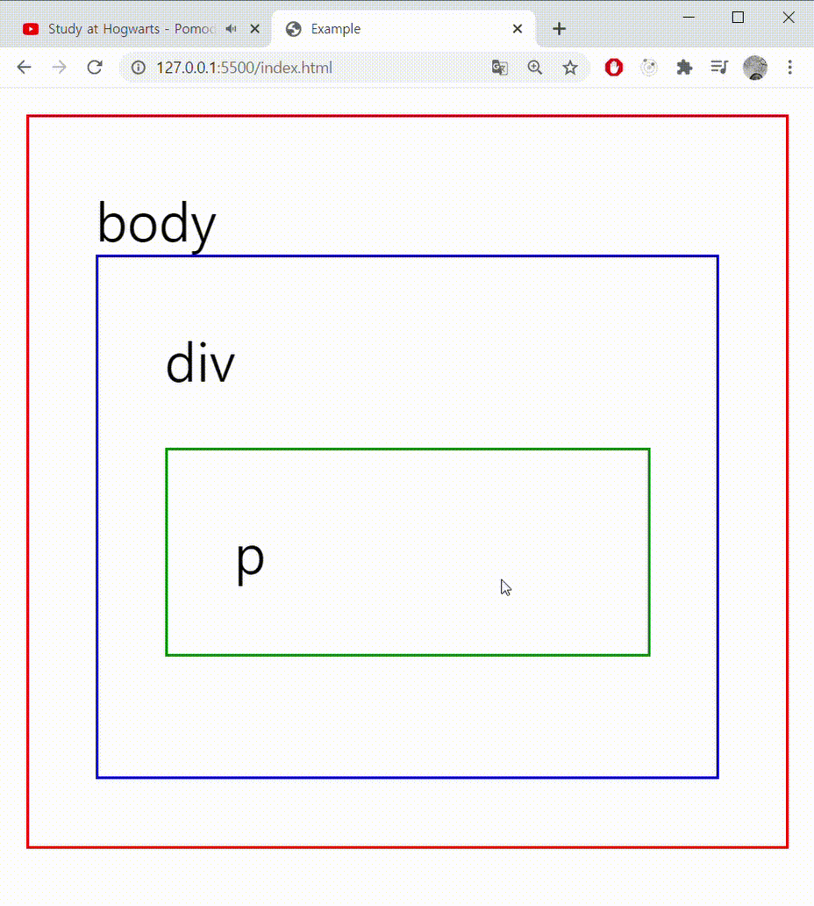
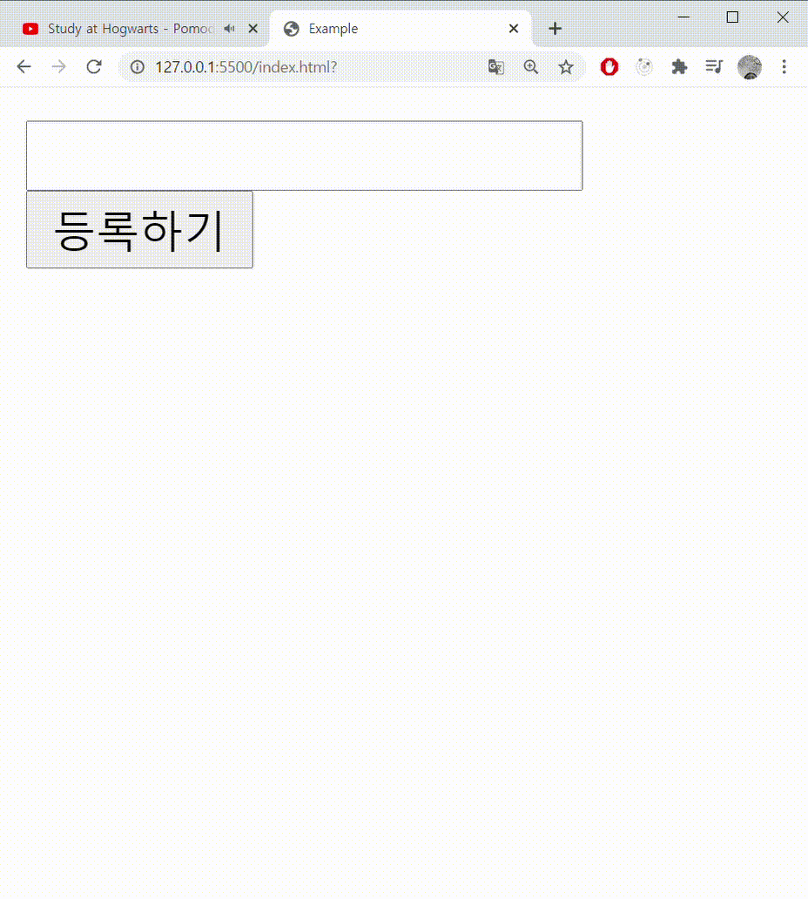

### Goal

- 자바스크립트 코드 내 이벤트 버블링과 캡쳐링을 이해한다.
- 이벤트 위임 패턴을 이해한다.

<br/>

<br/>

## 버블링(Bubbling)과 캡쳐링(Capturing)

이벤트 위임이 무엇인지 알기위해서는 먼저 이벤트 버블링과 캡쳐링이 무엇인지 알아야한다.
<br/>

### ☄️이벤트 버블링 ( Event bubbling )

특정 엘리먼트에 이벤트가 발생하면 **해당 이벤트가 그 엘리먼트의 조상들에게 까지 전달**되는 현상이다. <br/>

아래 예시를 통해 알아보도록 하겠다. 소스코드는 body > div > p 의 구조를 가지고 있으며 각각 엘리먼트에 click 이벤트 리스너를 등록해놓아서 클릭시 alert가 띄워지도록 하였다. <br/>

```html
<!DOCTYPE html>
<html lang="en">
    <meta charset="UTF-8">
    <meta name="viewport" content="width=device-width, initial-scale=1.0">
    <title>Example</title>
    <link rel="stylesheet" href="style.css">
</head>
<body>
    body
    <div>
        div
        <p>p</p>
    </div>
    <script src="app.js"></script>
</body>
</html>
```

```javascript
const $p = document.querySelector('p')
const $div = document.querySelector('div')
const $body = document.querySelector('body')

function Alert(message) {
  return function() {
    alert(message)
  }
}

$p.addEventListener('click', Alert('p tag event'))
$div.addEventListener('click', Alert('div tag event'))
$body.addEventListener('click', Alert('body tag event'))
```


p 태그에 클릭 이벤트가 발생하면 해당 이벤트가 부모인 div에 전달되고 최종적으로 body까지 전달된다. 이러한 현상을 이벤트 버블링이라고 한다. <br/>

<br/>

<br/>

### 타겟 엘리먼트 (Target Element)

이벤트 버블링이 일어났을 때 **최초로 이벤트를 발생시킨 엘리먼트**를(위 예제에서 p 태그) `타겟 엘리먼트(Target Element)`라고 한다. 이는 `event.target` 을 통해 접근 가능하다. <br/>

#### this 와 event.target의 차이점

- event.target - 최초로 이벤트를 발생시킨 엘리먼트를 가리킨다.
- this (=event.currentTarget) - 현재 이벤트가 발생된 엘리먼트를 가리킨다.

<br/>

아래 예시를 통해서 이벤트가 버블링된 부모가 타겟 엘리먼트을 기억하고 있음을 알 수 있다. <br/>

```javascript
const $body = document.querySelector('body')

function Alert(event) {
  alert(`타겟 엘리먼트: ${event.target.tagName} 
         현재 엘리먼트: ${this.tagName}`)
}

$body.addEventListener('click', Alert)
```



<br/>

<br/>

### 버블링 멈추기

버블링은 대체로 `<html>` 엘리먼트까지 올라간다. 이러한 이벤트를 멈추기 위해서는 최초로 이벤트가 발생되는 엘리먼트의 이벤트 핸들러에 `event.stopPropagation()` 라는 API 를 추가해주면 된다.<br/>

만약 하나의 이벤트에 여러 핸들러가 붙어 있는 경우 `event.stopPropagation()` API를 추가 해도 다른 이벤트는 버블링 될 것이다. <br/> 모든 이벤트 버블링을 멈추고 싶은 경우에는 `event.stopImmediatePropagation()` API를 사용하도록 하자 <br/>

<br/>

<br/>

### ☄️이벤트 캡쳐링 (Event capturing)

이벤트 캡쳐링은 특정 엘리먼트에 이벤트가 발생 했을 경우 **이벤트가 최상단의 부모 엘리먼트로부터 전달되어져 내려오는 현상**이다. <br/> 따라서 전달되는 이벤트는 부모 엘리먼트의 이벤트 핸들러를 작동시킨다. <br/> 캡쳐링을 수행하기 위해서는 이벤트 핸들러에 `{capture: true} 혹은 true` 로 캡쳐링 옵션을 true로 해주어야 한다. 디폴트는 false이이므로 별다른 옵션을 설정하지 않으면 캡쳐링은 일어나지 않는다. <br/>

아래 예제를 통해 캡쳐링이 어떻게 일어나는지 볼 수 있다.<br/>

```javascript
const elements = document.querySelectorAll('*')

for (let elem of elements) {
  elem.addEventListener('click', e => alert(`캡쳐링: ${elem.tagName}`), true)
}
```


예시를 통해 html > body > div > p 까지 이벤트가 전달 되는 것을 볼 수 있다.

<br/>

<br/>

### 전파 막기 ( 버블링 + 캡쳐링 모두 )

```javascript
e.stopPropagation()
```

위 API는 해당 이벤트가 전파 되는 것을 막아준다. <br/>버블링에서는 타겟 엘리먼트에만 이벤트가 발생하도록 해주고, 캡쳐링에서는 타겟 엘리먼트 기준으로 최상단 엘리먼트에만 이벤트가 발생하도록 해준다. <br/>

<br/>

<br/>

### ✔️ 이벤트의 3단계

그렇다면 버블링과 캡쳐링이 함께 일어날 수도 있을까? 이벤트가 특정 엘리먼트(타겟 엘리먼트) 에 일어날 경우 해당 이벤트는 3단계를 거친다. <br/>

- `1단계 - 캡쳐링 단계` : window 부터 타겟 엘리먼트까지 이벤트가 아래로 전달된다.
- `2단계 - 타겟 단계` : 이벤트가 타겟 엘리먼트에 도달한다.
- `3단계 - 버블링 단계` : 이벤트가 타겟 엘리먼트로부터 부모 엘리먼트들에게로 전달된다.


<br/>

아래 예시를 통해서 캡쳐링 - 타겟 - 버블링 3단계가 어떻게 연결되는지 알아보도록 하겠다. <br/>

```javascript
const elements = document.querySelectorAll('*')

for (let elem of elements) {
  elem.addEventListener('click', e => alert(`캡쳐링: ${elem.tagName}`), true) // 캡쳐링
  elem.addEventListener('click', e => alert(`버블링: ${elem.tagName}`)) // 버블링
}
```


<br/>

순서대로 캡쳐링 [ HTML -> BODY -> DIV-> P] 그리고 버블링 [P -> DIV -> BODY -> HTML] 이 일어나는 것을 알 수 있다. <br/>여기서 주의할 점은 타겟 단계는 캡쳐링과 버블링에서 각각 일어나는 것이 아니다. **캡쳐링과 버블링 모두 2단계에서 타겟 엘리먼트의 이벤트를 작동시킨다.** <br/>

<br/>

<br/>

## 이벤트 위임 (Event Delegation)

이벤트 위임은 캡쳐링과 버블링을 이용한 것으로, 여러 엘리먼트마다 각각 이벤트 핸들러를 할당하지 않고, 공통되는 부모에 이벤트 핸들러를 할당하여 이벤트를 관리하는 방식이다 <br/>

대표적으로 이벤트 위임이 어떻게 사용되는지 알아보도록 하겠다. <br/>

<br/>

<br/>

### 여러개의 자식 엘리먼트 이벤트 관리하기

정해진 액션에 따라서 다른 동작을 하는 여러 버튼에 대한 이벤트는 어떻게 처리해야할까 ? 모든 버튼에 대해서 이벤트 리스너를 등록하면 매우 비효율 적일 것이다. <br/>

해결 방법은 이벤트 위임 방식을 이용하여 공통 부모에 이벤트를 등록하고, 정해진 `data-action`에 따라서 다른 함수를 실행하는 것이다. <br/>

아래 예제는 서로 다른 역할을 하는 세 개의 버튼의 이벤트를 어떻게 이벤트 위임 방식으로 처리하는지 보여준다. <br/>

```html
<!DOCTYPE html>
<html lang="en">
    <meta charset="UTF-8">
    <meta name="viewport" content="width=device-width, initial-scale=1.0">
    <title>Example</title>
</head>
<body>
    <div id="Menu">
        <button data-action="save">저장하기</button>
        <button data-action="reset">초기화 하기</button>
        <button data-action="load">불러오기</button>
    </div>
    <script src="app.js"></script>
</body>
</html>
```

```javascript
const $Menu = document.getElementById('Menu')

const ActionFunctions = {
  save: () => alert('저장하기'),
  reset: () => alert('초기화하기'),
  load: () => alert('불러오기'),
}

$Menu.addEventListener('click', e => {
  const action = e.target.dataset.action
  if (action) {
    ActionFunctions[action]()
  }
})
```


<br/>

<br/>

### 동적 엘리먼트에 대한 이벤트 관리하기

동적으로 추가되거나 삭제되는 엘리먼트에 대한 이벤트는 어떻게 처리해야할까? 이에 대해 매번 이벤트 리스너를 추가하고 삭제한다면 코드의 효율성도 문제이며, 제대로 리스너가 삭제되지 않을 수도 있으므로 `메모리 누수` 가능성도 커진다. <br/>

이 때 이벤트 위임 패턴을 이용해서 이벤트를 관리해주면 편리하다. <br/>

아래 예제는 글자를 작성하고 submit하면 ul 엘리먼트 아래에 li 엘리먼트를 추가해준다. 그리고 추가된 li 엘리먼트를 클릭하면 li 엘리먼트의 내부 text 를 내용으로 alert를 띄워준다. <br/>

여기서 li 엘리먼트의 이벤트 처리시 li 엘리먼트마다 이벤트 리스너를 추가해주는 대신, 이벤트 위임 방식을 이용하여 공통 부모인 ul 엘리먼트가 자식들의 이벤트를 관리하게 하였다. <br/>

```html
<!DOCTYPE html>
<html lang="en">
    <meta charset="UTF-8">
    <meta name="viewport" content="width=device-width, initial-scale=1.0">
    <title>Example</title>
</head>
<body>
    <form>
        <input type="text"/>
        <button type="submit">등록하기</button>
    </form>
    <ul></ul>
    <script src="app.js"></script>
</body>
</html>
```

```javascript
const $form = document.querySelector('form')
const $input = document.querySelector('input')
const $ul = document.querySelector('ul')

$form.addEventListener('submit', e => {
  e.preventDefault()
  const li = document.createElement('li')
  li.innerText = $input.value
  $ul.appendChild(li) // li 엘리먼트 추가
  $input.value = ''
})

$ul.addEventListener('click', e => {
  // 이벤트 위임
  alert(e.target.innerText)
})
```



### Reference

- [Bubbling and capturing](https://javascript.info/bubbling-and-capturing)
- [왜 이벤트 위임(delegation)을 해야 하는가?](https://ui.toast.com/weekly-pick/ko_20160826)
