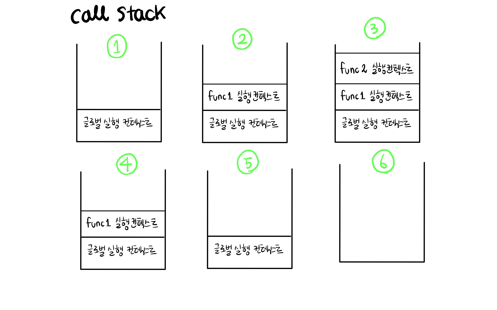
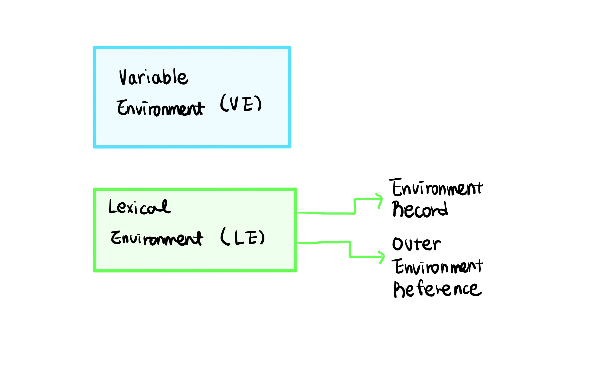
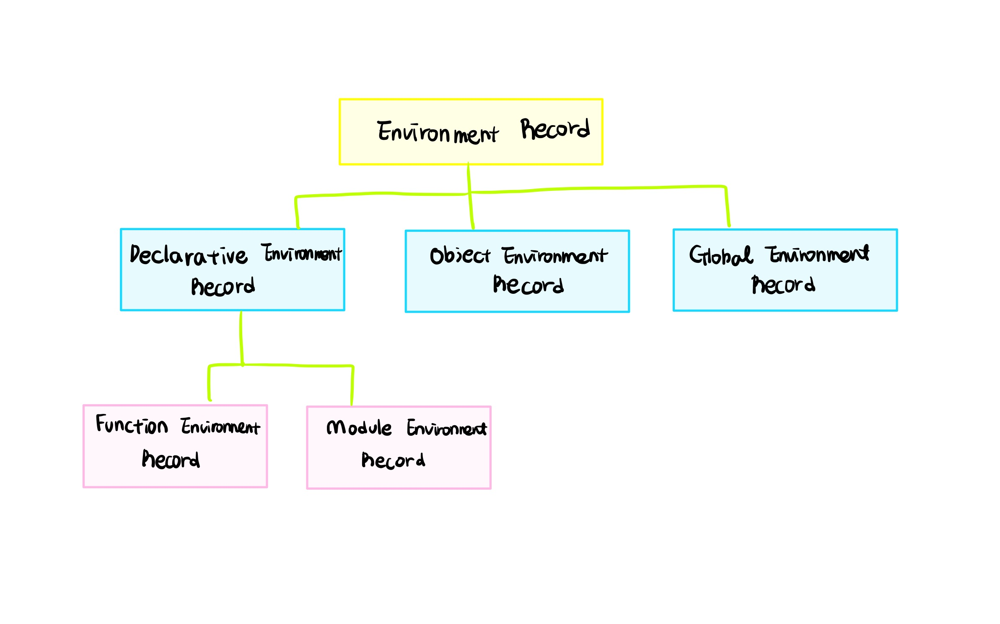

### Goal

- 실행 컨텍스트의 개념을 이해한다.
- 실행 컨텍스트의 종류를 이해한다.
- 실행 컨텍스트의 생성 원리를 이해한다.
- 스코프 체인의 원리를 이해한다.

<br/>

## 📍 실행 컨텍스트

- **실행할 코드에 제공할 환경 정보들을 모아 놓은 객체**를 말한다.
- `동일한 환경에 있는 코드들을 실행` 시, `필요한 환경정보`들을 모아 컨텍스트를 구성하고, 이를 콜스택 (call stack)에 쌓았다가 가장 위에 쌓여있는 컨텍스트와 관련있는 코드들을 실행한다.

### 실행할 코드의 종류

1. **글로벌 코드** : 글로벌 영역에 있는 코드
2. **eval 코드** : eval 함수로 실행되는 코드
3. **함수 코드** : 함수 내부에 있는 코드

<br/>

### 필요한 환경 정보

1. 변수 : 전역변수, 지역변수, 매개변수, 객체의 프로퍼티
2. 함수 선언
3. 변수 유효 범위 - Scope
4. This

<br/>

### 실행 컨텍스트 콜스택 예시

아래 예시를 통해 실행컨텍스트가 어떻게 구성되는지 알아보자. <br/>

```javascript
function func1() {
  let a = 1
  function fun2() {
    console.log('함수 실행 컨텍스트2')
  }
  console.log('함수 실행 컨텍스트1')
  func2()
}

console.log('글로벌 실행 컨텍스트')
func1()
```

<br/>



<br/>

1. 가장 먼저 코드 실행전 글로벌 실행 컨텍스트가 쌓이고, '글로벌 실행 컨텍스트' 가 콘솔에 찍힌다.
2. 이후 func1() 함수를 호출함으로써 func1 함수의 실행 컨텍스트가 쌓이고 '함수 실행컨텍스트 1' 가 콘솔에 찍힌다.
3. func1() 함수 내부에서 func2() 함수를 호출함으로써, func2() 함수 실행 컨텍스트가 쌓이고 '함수 실행 컨텍스트 2' 가 콘솔에 찍힌다.
4. func2() 함수가 종료됨으로써 func2() 함수 실행 컨텍스트가 콜스택에서 빠진다.
5. func1() 함수가 종료됨으로써 func1() 함수 실행 컨텍스트가 콜스택에서 빠진다.
6. 모든 코드를 다 실행하여 스크립트 맨 아래에 도달했으므로 글로벌 실행 컨텍스트가 콜스택에서 빠지고, 코드가 종료된다.

<br/>

#### 예시를 통해 알 수 있는 것

- 컨텍스트를 구성하는 것은 함수를 실행할 때와 동일 시점이다.
- 어떠한 실행 컨텍스트가 활성화 될 때, 자바스크립트 엔진은 해당 컨텍스트에 관련된 코드들을 실행하는데 필요한 환경정보를 수집하여 실행 컨텍스트 객체에 저장한다.

<br/>

## 📍실행 컨텍스트의 종류

<br/>



### 1. Variable Environment (VE)

- 현재 컨텍스트 내의 식별자 정보 및 외부 환경정보 (Outer Environment Reference)를 가진다.
- 선언 시점의 LE의 스냅샷으로 추후에 변경사항이 반영되지 않는다.
- 실행 컨텍스트를 생성 할 때, VE에 먼저 정보를 담은후 이를 그대로 복사하여 LE 를 만든다.
- 이후에는 LE를 주로 사용한다.

<br/>

### 2. Lexical Environment (LE)

- 처음에는 VE 와 같지만, 변경 사항이 실시간으로 반영 된다.
- LE 객체의 프로퍼티로는 **🟡 Environment Record**와 **🟡 Outer Environment Reference**이 있다.

<br/>

### 🟡 Outer Environment Reference

- 중첩 유효범위를 가질 수 있는 환경에서 상위의 Lexical Environment를 참조한다.
- 글로벌 컨텍스트의 경우 null을 참조한다.
- Outer Environment Reference를 통해 `스코프 체인이 연결`된다.

<br/>

### 🟡 Environment Record

<br/>



- 식별자들의 바인딩을 기록하는 객체로서 변수, 함수 등이 기록된다.

- 현재 컨텍스트와 관련된 코드의 `식별자 정보`가 저장 되며 , 컨텍스트 내부 전체를 순서대로 수집한다.
- 따라서 코드가 실행되기도 전에 자바스크립트 엔진이 이미 해당 환경에 속해있는 코드의 변수명을 모두 알게 된다==**호이스팅**
- Environment Record는 `✔️ Declarative Environment Record`와 `✔️ Object Environment Record` 그리고 `✔️ Global Environment Record` 로 구성되어 있다.

<br/>

### ✔️ Declarative Environment Record (DER)

- 변수 선언과 함수 선언을 저장한다.
- 자식으로는 1) Function Environment Record와 2) Module Environment Record가 있다.

<br/>

### 1) Function Environment Record

- DER 내부의 Function Environment Record 에는 new.target, super, this에 대한 정보를 갖는다.
- 이전에는 This binding을 실행 컨텍스트에서 관리했다면, ES6 이후 부터는 This binding을 Environment Record 내부인 DER => Function Environment Record 에서 관리한다.

<br/>

### 2) Module Environment Record

- DER 내부의 Module Environment Record 에는 `상위 레벨에서 정의된 모듈에 대한 바인딩을 저장`한다.
- 또한 모듈에서 명시적으로 import 된 바인딩도 포함한다.
- Module Environment Record의 [[OuterEnv]] 는 Global Environment Record 이다.

<br/>

### ✔️ Object Environment Record (OER)

- 글로벌 환경에 대한 Lexical Environment는 Object Environment Record를 포함한다.
- OER는 글로벌 객체를 기록한다.

<br/>

### ✔️ Global Environment Record (GER)

- 가장 바깥 스코프인 글로벌 스코프를 정의를 하는데 사용된다.

- Global Environment Record는 자바스크립트 빌트인 글로벌 객체들을 제공한다.

- Glboal Environment Record의 [[OuterEnv]] 는 null 이다.

<br/>

<br/>

## 📍 실행컨텍스트 생성 과정

실행 컨텍스트의 객체 종류를 알아보았으니, 그에 따라서 실행 컨텍스트의 생성 과정을 더 자세히 알아보도록 하겠다. <br/>

실행 컨텍스트는 위에서도 알아봤듯이, 실행 가능한 코드(글로벌 / eval / 함수) 를 실행하기 위해 필요한 환경이다. 이 때 실행 가능한 코드가 실행될때 실행하기 위해 필요한 환경 (실행 컨텍스트) 는 두 가지 단계로 생성된다. <br/>

1. 생성 단계
2. 실행 단계

### 생성 단계

컴파일러는 실제 코드를 '실행(2단계)' 하기 전에 코드를 두번 실행해준다.

1. 첫번째 실행 : 모든 함수 선언을 선택하여 참조와 함께 메모리에 저장한다.
2. 두번째 실행 : 모든 변수를 선택하여 데이터에 undefined를 할당한다. 이 때 함수선언과 변수선언 사이의 충돌이 일어날 시 변수는 무시된다.

<br/>

두번 실행을 통해서 Variable Environiment 와 Lexical Environment가 생성된다. 생성된 Lexical Environment는 다음과 같은 일련의 과정을 거친다. <br/>
<br/>

1. **Environment Record를 초기화한다.**
   - `함수 호이스팅` : 코드 내부 함수 선언을 대상으로, 함수명이 Environment Record의 프로퍼티로 생성되고, 생성된 함수 객체가 해당 프로퍼티의 값으로 설정된다.
   - `변수 호이스팅` : 코드 내부 변수 선언을 대상으로, 변수명이 Environment Record의 프로퍼티로 생성되고, 값은 undefined가 할당된다.
   - 주의할점 ! 여기서 함수 표현식은 변수 호이스팅과 같은 방식으로 설정된다.
2. **Outer Environment Reference**
   - 바깥 환경을 참조하여 스코프 체인을 생성한다.
3. **This binding**

<br/>

> **변수 호이스팅과 TDZ**
>
> - TDZ (Temporal Dead Zone )
>
>   TDZ란 변수 선언문 전까지 해당 변수에 접근할 수 없는 공간을 위치한다. TDZ에서 해당 변수를 참조하면 undefined가 아니라 ReferenceError가 뜬다.
>
>   ```javascript
>   // this is TDZ
>   // this is TDZ
>   // console.log(foo) 결과 : ReferenceError
>   let foo = 'bar' // No More TDZ
>   ```
>
> ES6에 도입된 let과 const 는 var와 달리 TDZ가 생성되므로, 변수 선언 이전에는 참조 할 수 없다. 이는 마치 직관적으로 ' 호이스팅 '을 막아놓은 것 처럼 보이지만, 실제적으로 호이스팅을 막은게 아니라 TDZ라는 개념을 추가한 것 뿐이다.
>
> <br/>
>
> **함수 선언식과 함수 표현식**
>
> - 함수 선언식은 함수 호이스팅으로 인해 함수 전체를 호이스팅하지만, 표현식은 변수 호이스팅으로 선언부만 호이스팅한다.
> - 따라서 표현식은 함수 선언 이전에 함수를 호출하면 '~ is not a function' 이라는 에러를 띄운다.

<br/>

<br/>

## 📍 스코프 체인

Lexical Environment 중에서 Outer Environment Reference에 의해서 형성되는 스코프 체인에 대해 알아보도록 하겠다.

### 스코프 ?

- 스코프란 식별자에 대한 유효범위를 말한다.
- 즉, 전체 코드 내에서 특정 변수에 접근 할 수 있는 범위를 일컫는다.

<br/>

### 스코프의 종류

1. 글로벌 스코프 : 코드에서 함수 내부나 블록 내부에 있지 않는 변수를 '글로벌 스코프'에 있다고 한다. 글로벌 스코프는 코드 모든 곳에서 접근 가능하다.

```javascript
var greeting = 'hello!'

function greet() {
  console.log(greeting) // 외부의 greeting 변수에 접근 할 수 있다.
}

greet() // "hello!";
```

<br/>

2. 함수 스코프 : 함수 내부에 선언된 변수를 말한다. 함수 내부에서만 접근 가능하다.

```javascript
function greet() {
  var greeting = 'hello!'
  console.log(greeting)
}

greet() // "hello!"
console.log(greeting) // Reference Error
// 글로벌 스코프에서 함수 내에서 선언된 변수에 접근이 불가능함을 알 수 있다.
```

<br/>

3. 블록 스코프 : let과 const 에서만 적용되는 스코프로서, 블록' { } ' 에 의해 생성되는 스코프이다. 블록 내부에서 선언된 let , const 변수는 외부에서 접근 불가능하다.

```javascript
{
  let greeting = 'hello!'
  var foo = 'bar'
}

console.log(foo) // "bar"
console.log(greeting) // Reference Error
```

<br/>

### 스코프 체인이란 ?

- 자바스크립트 엔진이 현재 스코프 내부에서 특정 변수를 찾지 못하면 한단계 바깥 스코프로 나가 해당 변수를 찾는 것을 말한다. 해당 변수를 찾을 때 까지 계속해서 한단계 바깥으로 나간다.
  <br/>
  <br/>

- 여러 스코프에서 동일한 식별자를 선언한 경우, 무조건 스코프 체니상에서 가장 먼저 발견된 식별자에만 접근 가능하다.
  - `변수은닉화` : 함수 내부와 글로벌 공간에서 동일한 식별자를 선언했다면, 함수 내부에서는 오로지 내부에 선언된 변수에만 접근 가능

<br/>

- Lexical Environment 가 생성될 때, Outer Environment Reference에 외부 스코프의 Lexical Environment를 참조한다.
  - `클로저` : 외부 함수의 실행 컨텍스트가 스택에서 사라지더라도 Outer Environment Reference가 가리키는 외부 함수의 실행 환경은 소멸되지 않고 참조 가능하다.
  - 즉, 외부 함수의 실행 컨텍스트가 소멸되어도 내부 함수의 스코프 체인에 의해 참조되고 있으므로 내부 함수에서 접근 가능하다.

<br/>

#### 스코프 체인 예시

```javascript
var name = 'voldMort'

function Outer() {
  var name = 'Tom Mavolo Riddle'
  function Inner() {
    var name = 'You Know Who'
    console.log(name) // "You Know Who"
  }
  Inner()
  console.log(name) // "Tom Mavolo Riddle"
}
Outer()
console.log(name) // "voldMort"
```

<br/>

위의 예시는 name이라는 같은 식별자를 가진 변수를 1. 글로벌 스코프 2. outer 함수 스코프 3. inner 함수 스코프에서 각각 선언했다. 이를 통해서 각 스코프 내부에 선언된 name에만 접근 할 수 있음을 알 수 있다.

<br/>

### Reference

[코어 자바스크립트 - 정재남 저 ](http://www.yes24.com/Product/Goods/78586788)

[[Javascript] Execution Context와 Lexical Environment](https://iamsjy17.github.io/javascript/2019/06/10/js33_execution_context.html)

[ECMAScript® 2021](https://tc39.es/ecma262/#sec-environment-records)

[What is the Temporal Dead Zone (TDZ) in JavaScript?](https://www.freecodecamp.org/news/what-is-the-temporal-dead-zone/)

[Understanding Scope and Scope Chain in JavaScript](https://blog.bitsrc.io/understanding-scope-and-scope-chain-in-javascript-f6637978cf53)

[자바스크립트 함수(3) - Lexical Environment](https://meetup.toast.com/posts/129)
