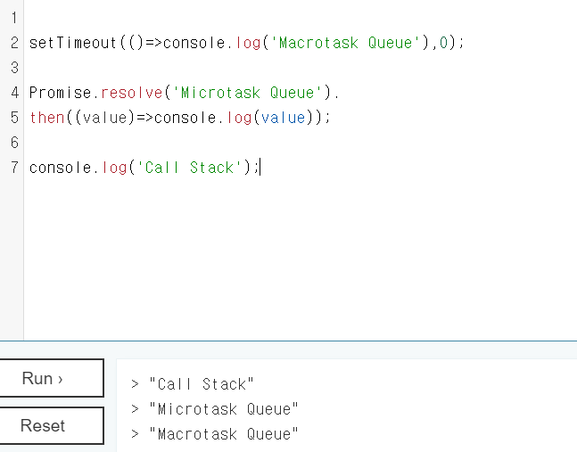
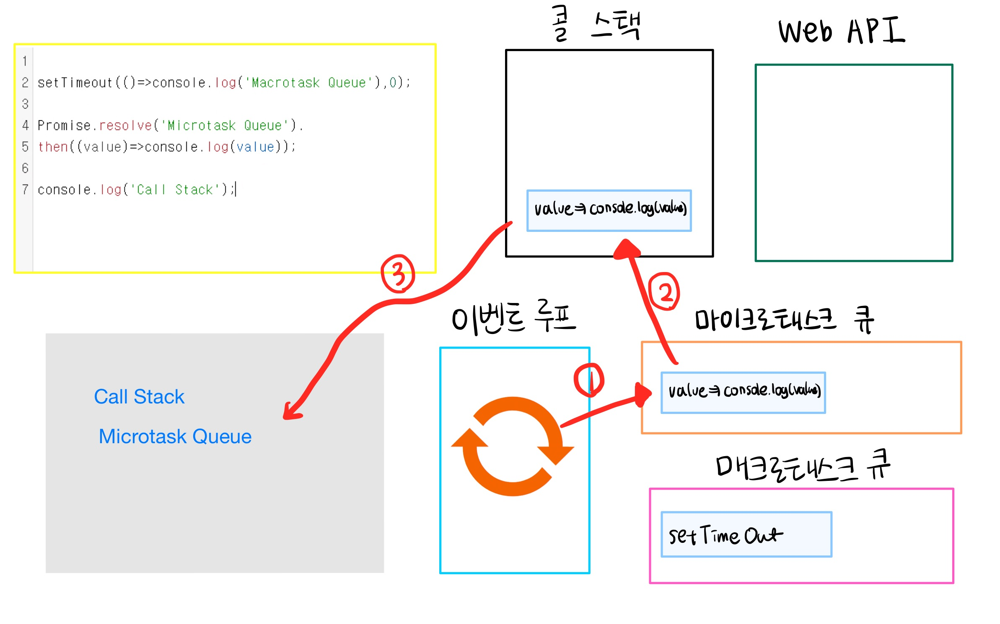

## 싱글 스레드 언어, 자바스크립트

자바스크립트는 싱글 스레드 (Single Thread) 언어이다. 즉, 하나의 콜 스택을 가지고, 한번에 하나의 일밖에 처리하지 못한다는 것이다.  

**그렇다면 비동기 요청은 어떻게 처리되는가**

실제로 자바스크립트의 비동기 요청은 자바스크립트를 실행하는 환경인 브라우저나 Node.js가 담당한다.  

먼저 아래 그림을 통해 브라우저 환경의 구성요소를 살펴보도록 하자.

 

`Web API` - 우리가 비동기 호출을 위해 사용하는 Ajax나 Timer들은 모두 Web API 영역에 정의되어 있다.  

`매크로태스크 큐와 마이크로 태스크 큐` - 자바스크립트 실행환경은 두가지의 큐를 가지고 있으며 각각 태스크의 종류에 따라 다른 큐에 담기게 된다. 아래에서 더 자세히 알아보도록 하겠다.  

`이벤트 루프` - 자바스크립트 엔진과 그 실행 환경(브라우저, Node.js)을 연동시켜주는 장치이다. 태스크 큐 or 마이크로 태스크 큐에 담겨있는 콜백 함수와 자바스크립트 엔진의 콜 스택을 연동 시켜준다. 아래에서 더 자세히 알아보도록 하겠다.  

 

즉, 자바스크립트가 싱글 스레드 언어로서 단일 콜 스택을 가져서 한번에 하나의 일밖에 처리하지 못한다는 것은 사실이지만, **실제 자바스크립트가 구동되는 환경에서는 주로 여러개의 스레드가 사용**된다.

 

## 매크로태스크 큐(macrotask queue) 와 마이크로태스크 큐(microtask queue)

태스크 큐에 담기는 것이 콜백 함수라면 그 종류에 따라서 각각 다른 큐에 담기게 된다.

- **태스크 큐** - setTimeout() , setInterval(), UI 렌더링, requestAnimationFrame() 을 담는다.
- **마이크로태스크 큐** - Promise, MutationObserver 를 담는다.

 

✔️ 마이크로태스크 큐에 들어간 태스크는 이벤트 핸들러나 렌더링 작업 혹은 다른 매크로태스크 큐에 들어간 태스크가 실행되기 전에 처리된다.

 

## 이벤트 루프 (event loop) 의 동작 과정

- 이벤트 루프는 태스크가 들어오길 기다렸다가, 태스크가 들어오면 이를 처리하고(이 때 자바스크립트 엔진이 활성화 된다), 처리할 태스크가 없는 경우에는 동작하지 않는다.
- 만약 지금 하고 있는 일이 있는데 새로운 태스크가 또 들어왔다면 새로 들어온 태스크를 매크로태스크 큐 혹은 마이크로태스크 큐에 넣고, **자바스크립트가 아무것도 하지 않을 때 (콜 스택이 비었을 때) 가 되면 해당 태스크를 처리**한다.

 

### 자바스크립트 엔진을 활성화 하는 대표적인 태스크(task)

1. 외부 스크립트가 로드 되었을 때, 해당 스크립트를 실행 한다. `<script src="">`
2. 사용자가 마우스를 움직였을 때 `mouseover` 이벤트와 이벤트 핸들러를 실행한다.
3. setTimeout 에서 설정한 시간이 다 된 경우, 콜백 함수를 실행한다.
   - 정확히 setTimeout은 코드 내에서 호출되면 Web API에서 타이머를 실시하고 설정된 시간이 다 되면 , 태스크 큐에 들어간다.

 

### 예시를 통해 보는 동작 과정

 

먼저 결과물을 보면 동기 요청 `console.log('Call Stack')` 이 가장 먼저 실행되고, 비동기 요청 중 마이크로태스크 큐에 들어가는 `Proimise~` 절이 실행된다. 그리고 마지막으로 태스크 큐에 들어가는 비동기 요청인 `setTimeout` 이 실행됨을 알 수 있다.  

아래 그림을 통해 더 자세히 알아보도록 하겠다.  

 

가장 먼저 스크립트가 로드 될때 `스크립트 실행`이라는 태스크가 먼저 매크로태스크 큐에 들어간다. 이 때 콜스택에는 이미 **글로벌 실행 컨텍스트**가 생성되어 있는 상태이고, 이 때 **스크립트 실행 이라는 태스크를 실행하게 됨으로써 글로벌 실행 컨텍스트 내에 있는 코드가 실행된다.**  

 

1)이벤트루프에 의해서 매크로태스크 큐에 들어가있던 스크립트 실행 태스크가 실행처리 된다.  

2)글로벌 실행 컨텍스트의 가장 처음에 있는 코드를 읽어서 콜스택에 담는다.  

 

setTimeout은 Web API에서 제공하는 함수이므로 Web API 내에서 타이머를 실행한다. 그 사이에 컨텍스트 내 다음 코드를 읽고 콜스택에 담는다.  

 

Web API에서 타이머가 종료되면 setTimeout 비동기 요청을 매크로태스크 큐에 담는다. 직전에 콜스택에 들어온 Promise.resolve 코드는 마이크로태스크 큐에 담는다.  

 

이 사이에 컨텍스트 내 다음 코드를 읽어서 콜스택에 담는다. 이번 코드는 비동기 요청이 아니므로 콜스택에서 나와서 바로 처리를 해준다. 따라서 결과창에 "Call Stack" 이 찍힌다.  

 

1)이제 콜스택이 비었으므로 이벤트 루프가 마이크로태스크 큐와 매크로태스크 큐에 있는 실행 완료된 콜백함수를 순서대로 콜스택에 담아줄 차례이다.   2)먼저 마이크로태스크 큐에 있는 코드를 콜스택에 담아준다.   3)콜스택에서 나와서 바로 처리를 해준다. 따라서 결과창에 "Microtask Queue"가 찍힌다.  

 

1)이제 또 콜스택이 비었고, 마이크로태스크 큐에 있는 작업까지 모두 마쳤으니 이벤트 루프가 매크로태스크 큐에 남아있는 실행 완료된 콜백함수를 콜스택에 담아줄 차례이다.  

2)매크로태스크 큐에 있는 코드를 콜스택에 담아준다.   3)콜스택에서 나와서 바로 처리를 해준다. 따라서 결과창에 "Macrotask Queue"가 찍힌다  

 

글로벌 실행 컨텍스트 내부에 있는 코드를 모두 실행하고 나서 콜스택과 태스크 큐들은 비어지게 되고, 이벤트 루프는 다음 작업을 기다리는 상태로 들어간다.  

 

### Reference

[자바스크립트 마이크로태스크](https://ko.javascript.info/microtask-queue)

[자바스크립트 이벤트 루프](https://github.com/baeharam/Must-Know-About-Frontend/blob/master/Notes/javascript/event-loop.md)

[JavaScript Visualized: Promises & Async/Await](https://dev.to/lydiahallie/javascript-visualized-promises-async-await-5gke?fbclid=IwAR3cfIk3iVpt1EoFOflRVs4VFe6GC2m2nbkP99bWgSduAkxVCIFSXVgKYzE)

[What the heck is the event loop anyway?](https://www.youtube.com/watch?v=8aGhZQkoFbQ&list=LL&index=2)
