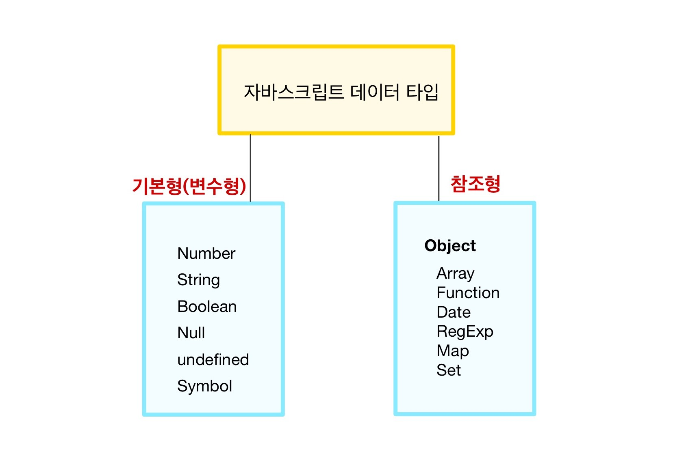
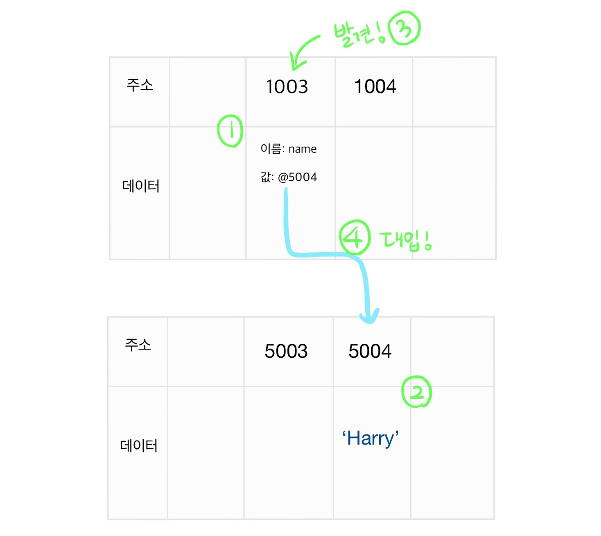
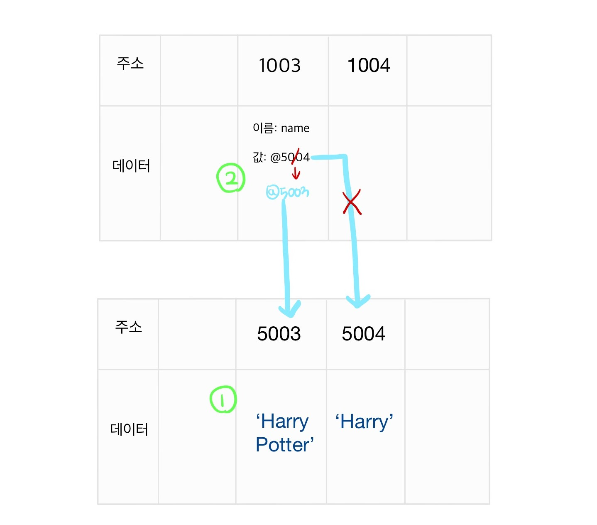
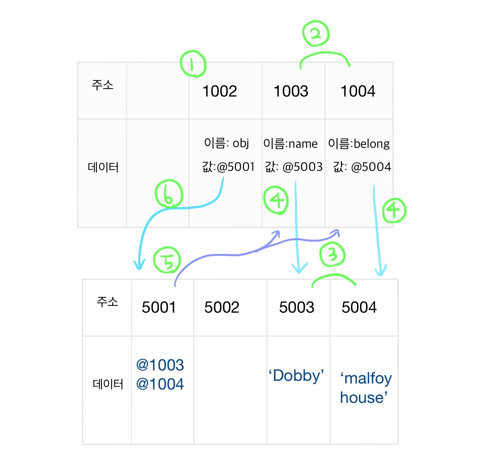
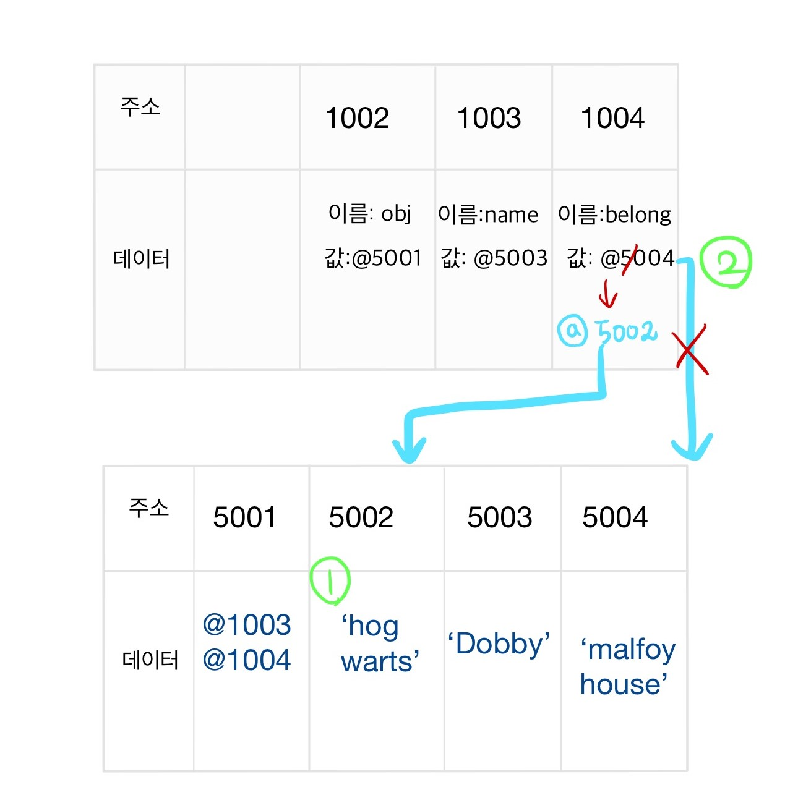
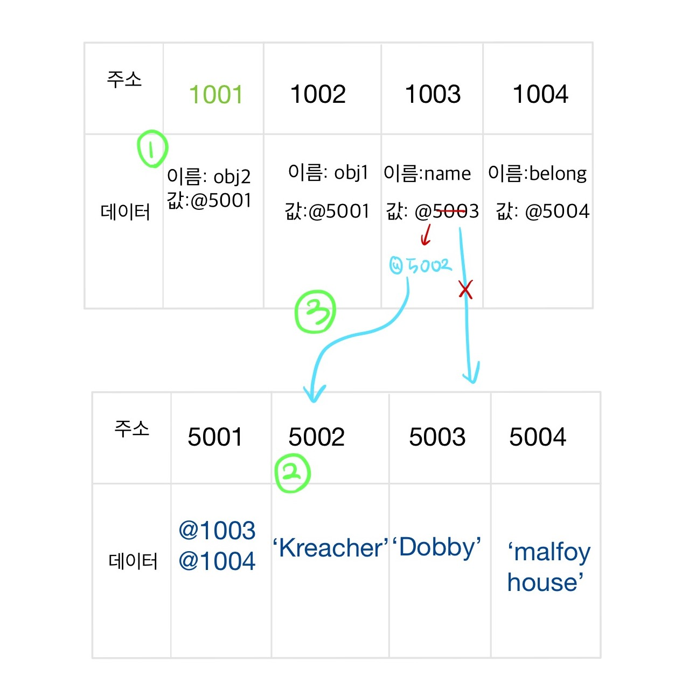

### Goal

- 자바스크립트에서 기본형과 참조형의 데이터 할당 과정이 어떻게 다른지 알아본다.
- 자바스크립트의 불변성(immutability) 개념을 이해한다.

먼저 들어가기전에 변수와 식별자의 차이, 그리고 불변성과 변수 상수의 차이를 구분해보도록 하겠다.

<br/>

### 변수와 식별자

`변수`는 변할 수 있는 데이터를 말하고, `식별자`는 어떤 변수를 식별하는데 사용되는 이름, 즉 변수명을 일컫는다.

<br/>

### 불변성과 변수상수 구분

- `불변성` 구분은 변경 가능성의 대상이 **'데이터 영역'** 메모리 , 즉 변수에 할당된 데이터 영역이 변할 수 있는가에 따라 결정

- `변수상수` 구분은 변경가능성의 대상이 **'변수 영역'** 메모리 , 즉 변수 자체가 변할 수 있는가에 따라 결정

<br/>

### 자바스크립트 타입의 구분



<br/>
<br/>

## 변수형의 데이터 할당 과정

```javascript
let name
name = 'Harry'
```

위와 같이 name이라는 변수를 선언하고, name 변수에 'Harry' 라는 문자열을 할당하는 과정은 아래와 같다.
<br/>



<br/>

1. 먼저 변수 영역에서 빈공간(@1003)을 확보한 후, 이름을 name이라고 붙인다.
2. 그 후 데이터 영역에 'Harry' 라는 문자열이 있는지 확인한다. 없다면 데이터 영역의 빈공간 (@5004)에 문자열 'Harry' 를 저장한다.
3. 자바스크립트 엔진이 name이라는 이름을 가진 변수 영역에 'Harry'라는 값을 할당하기 위해서 , 변수영역에서 name이라는 이름을 가진 변수 영역을 검색한다. (LHS 검색)
4. 앞서 저장한 문자열의 주소 (@5004)를 name이라는 이름을 가진 변수 영역(@1003)에 값으로 대입한다.

<br/>

### 변수에 할당된 데이터를 변경할 때

```javascript
let name = 'Harry'
name = name + 'Potter'
```

위와 같이 name이라는 변수의 데이터를 변경한다면 어떻게 될까? 단순하게 생각한다면 당연히 name에 할당된 데이터 영역의 값 자체를 변경한다고 생각할 수 있다. 하지만, 데이터 영역의 값은 변경할 수 없다. <br/>

<br/>



<br/>

즉, 위의 연산에서는 우리가 위에서 'Harry'라는 문자열을 저장한 데이터 영역 (@5004)의 데이터 자체를 변경하는게 아니라,

1. 아예 새로운 문자열 'Harry Potter'가 담긴 데이터 영역을 찾거나 새로 생성한다.
2. 그리고 name이라는 이름을 가진 변수 영역(@1003)에 새로 생성된 데이터 영역의 주소(@5003)를 저장한다.

<br/>

### 변수형의 불변성 (Immutability)

변수 타입의 데이터 할당 과정을 통해서, 변수타입의 데이터 영역은 불변하다는 것을 알 수 있다. 즉, 데이터 영역 자체의 데이터를 변경할 수 없기 때문에 ('Harry'를 'Harry Potter'로 변경할 수 없음) 새로운 데이터 영역을 할당('Harry' 영역과 'Harry Potter' 영역은 별개) 하고, 변수 영역에서 참조하는 데이터 영역의 주소를 바꿔야한다는 것이다. <br/>

한마디로 정리하자면 `불변성과 가변성은 변수 영역이 참조하는 데이터 영역이 바뀌느냐 안바뀌느냐의 차이이다.`

<br/>

<br/>

## 참조형의 데이터 할당 과정

```javascript
let obj = {
  name: 'Dobby',
  belong: 'malfoy house',
}
```

위와 같이 obj 라는 객체를 선언하고 프로퍼티로 name과 belong을 각각 정의해주었다. 객체의 데이터 할당과정은 아래와 같다.

<br/>



<br/>

1. 변수 영역의 빈공간(@1002)을 확보하여 이름을 obj 로 지정한다.
2. 빈 데이터 영역 (@5001)에 데이터를 저장하려고 하니, 여러개의 프로퍼티로 이루어진 데이터 그룹임을 알 수 있다. 각각 프로퍼티를 저장하기 위한 변수 영역의 빈공간 두 개를 찾아서 (@1003, @1004) 각각의 이름을 name과 belong으로 지정한다.
3. 데이터 영역에서 문자열 'Dobby' 와 'malfoy house'를 검색하고 없다면 새로운 데이터 영역 두 곳에(@5003, @5004) 각각 문자열 'Dobby'와 'malfoy house' 저장한다.
4. name 변수 영역 (@1003)은 문자열 'Dobby'가 저장된 데이터 영역의 주소 (@5003)를 참조하고, belong 변수 영역 (@1004)은 문자열 'malfoy house'가 저장된 데이터 영역의 주소(@5004)를 참조하도록 한다.
5. 각 프로퍼티의 변수 영역 주소를 데이터 영역 @5001에 저장하도록 한다.
6. obj라는 이름을 가진 변수영역은 프로퍼티 주소가 저장된 데이터 영역 (@5001)을 가리키도록 한다 .

<br/>

### 프로퍼티 데이터를 변경할 때

```javascript
let obj = {
  name: 'Dobby',
  belong: 'malfoy house',
}

obj.belong = 'howarts'
```

<br/>



<br/>

1. 먼저 문자열 'hogwarts'가 저장된 데이터 영역의 주소를 찾고 없다면 새로 생성해준다. 문자열 'hogwarts' 는 데이터 영역 @5002에 저장된다.
2. 프로퍼티 중 belong 이라는 이름을 가진 변수 영역이 가리키는 주소가 기존의 문자열 'malfoy house'이 저장된 @5004 에서 문자열 'hogwarts'이 저장된 @5002로 변경된다.

<br/>

### 참조 타입의 가변성 (mutability)

위의 예시를 통해서 우리는 자바스크립트 참조형 객체는, obj라는 이름을 가진 변수 영역이 가리키는 데이터 영역의 주소 (@5001) 의 변경 없이도 데이터를 변경 가능하다는 사실을 알 수 있다. 즉 , 변수영역이 가리키는 데이터 영역이 변경되지 않으므로 가변적이다고 할 수 있다. <br/>

<br/>

<br/>

## 자바스크립트 변수 복사 과정

이렇게 변수형과 참조형의 데이터 할당과정이 다르니, 당연히 변수 복사과정도 다를 수 밖에 없다. <br/>

먼저 변수형이 어떻게 복사되는지를 아래 예시를 통해 보자. <br/>

```javascript
let name1 = 'Harry'
let name2 = name1
console.log(name1, name2)
// 결과
// Harry, Harry
let name2 = 'Hermione'
console.log(name1, name2)
// 결과
// Harry, Hermione
```

변수형 name1을 변수형 name2에 복사하고, name2의 데이터를 변경해도 name1의 값이 변경되지 않는다. 두 변수 모두 처음에는 'Harry'라는 데이터를 담은 같은 데이터 영역 주소를 참조했지만, name2에 'Hermione'을 대입한 순간 `name2라는 이름을 가진 변수 영역이 가리키는 데이터 영역의 주소만 변경되기 때문`이다. <br/>

<br/>

하지만 참조형을 복사할 때는 조금 다르다. 아래 예시를 통해 보자. <br/>

```javascript
let obj1 = {
  name: 'Dobby',
  belong: 'hogwarts',
}
let obj2 = obj1
console.log(obj1, ojb2)
// 결과
// { name: 'Dobby', belong:'howarts'},
// { name: 'Dobby', belong:'howarts'}

obj2.name = 'Kreacher'
console.log(obj1, ojb2)
// 결과
// { name:'Kreacher', belong:'howarts'}
// { name:'Kreacher', belong:'howarts'}
```

obj2에 obj1 을 대입한 후, obj2의 프로퍼티 값을 변경하면 obj1의 프로퍼티값도 함께 변경된다. 아래 그림을 통해 알아보자<br/>

<br/>



<br/>

1. 먼저 obj2라는 이름을 가진 변수 영역(@1001)을 확보한 후, obj1를 대입했으므로 obj1의 값인 @5001의 주소를 넣어준다.
2. obj2.name 을 'Kreacher' 로 변경해줌으로써, 먼저 문자열 'Kreacher' 를 저장할 데이터 영역을 확보한다. (@5002)
3. 5001이 가리키고 있는 변수 영역 프로퍼티 중, name이란 이름을 가진 영역이 참조하는 주소를 문자열 'Kreacher' 를 가지고 있는 데이터 영역의 주소(@5002)로 변경한다.

<br/>

따라서 obj2의 프로퍼티 값을 변경하면 obj1의 프로퍼티 값도 변경된다. 따라서 아래와 같이 obj2에 아예 새로운 객체를 저장하면 obj1의 는 변경되지 않는다. 당연히 obj2 라는 이름을 가진 변수 영역 (@1001) 이 참조하는 데이터 영역 자체를 변경하는 것이기 때문이다.

```javascript
let obj2 = obj1
let obj2 = {
  name: 'Kreacher',
  belong: 'black house',
}
// obj1의 데이터는 변경되지 않는다.
```

<br/>

### 얕은 복사와 깊은 복사

- 얕은 복사 (shallow copy)

  - 위의 예시와 같이 참조형을 복사할 때 원래 값 (obj1)과 복사된 값(obj2)이 객체 내부(프로퍼티)까지 같은 주소를 참조하고 있는 것을 말한다.
  - 따라서 원래 값과 복사된 값의 데이터 변경이 서로에게 영향을 미친다.

- 깊은 복사 (deep copy)
  - 위의 예시와 달리 참조형을 복사 할 때 원래 값과 복사된 값이 객체 내부(프로퍼티)까지 다른 주소를 참조하고 있는 것을 말한다.
  - 따라서 서로 프로퍼티의 데이터 값은 같지만, 참조하는 주소는 달라지므로 각각의 변경이 서로에게 영향을 미치지 않는다.

<br/>

<br/>

---

이렇게 자바스크립트가 변수에 데이터를 어떻게 할당하는지와 불변성과 가변성 개념 , 그리고 얕은 복사와 깊은 복사를 알아보았다. 특히 리액트 개발을 할 때 불변성 가변성 개념을 숙지하는 것이 중요하다. <br/>

상태 관리를 할 때 불변성을 지키지 않고, 객체를 변경하면 리액트는 해당 객체가 변경된지 감지하지 못하기 때문이다. 위에서도 보았듯 객체 프로퍼티를 변경할 시 객체 obj 가 저장된 변수 영역이 가리키는 데이터 영역의 주소는 변경되지 않는다. <br/>

이러한 실수를 방지하기 위해서 immer라는 라이브러리가 있긴 하지만, 그래도 불변성과 가변성 그리고 깊은 복사와 얕은 복사의 개념은 자바스크립트 개발자라면 꼭 알고 있어야한다! <br/>

이번 포스팅에서 깊은복사와 얕은복사를 깊게 설명하지 않았으므로 [이 포스팅](https://medium.com/@manjuladube/understanding-deep-and-shallow-copy-in-javascript-13438bad941c) 을 참고할 것을 추천한다!

<br/>

<br/>

### Reference

[코어 자바스크립트 - 정재남 저 ](http://www.yes24.com/Product/Goods/78586788)

[Mutable and immutable in JavaScript](https://medium.com/dev-genius/mutable-and-immutable-in-javascript-78a3cbc6187c)

[객체와 변경불가성](https://poiemaweb.com/js-immutability)
