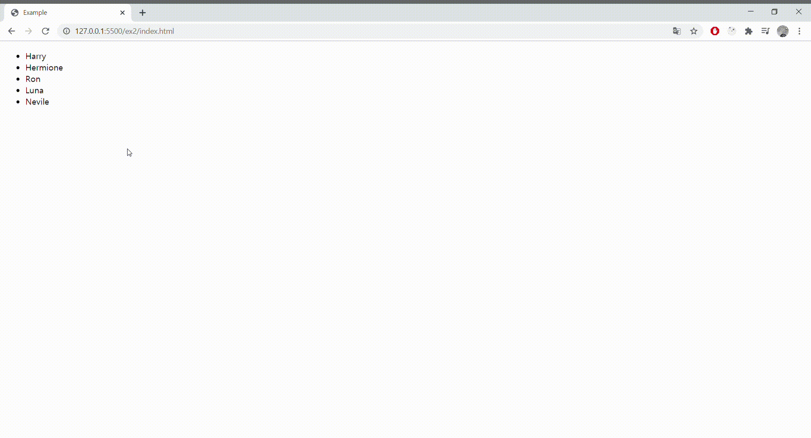
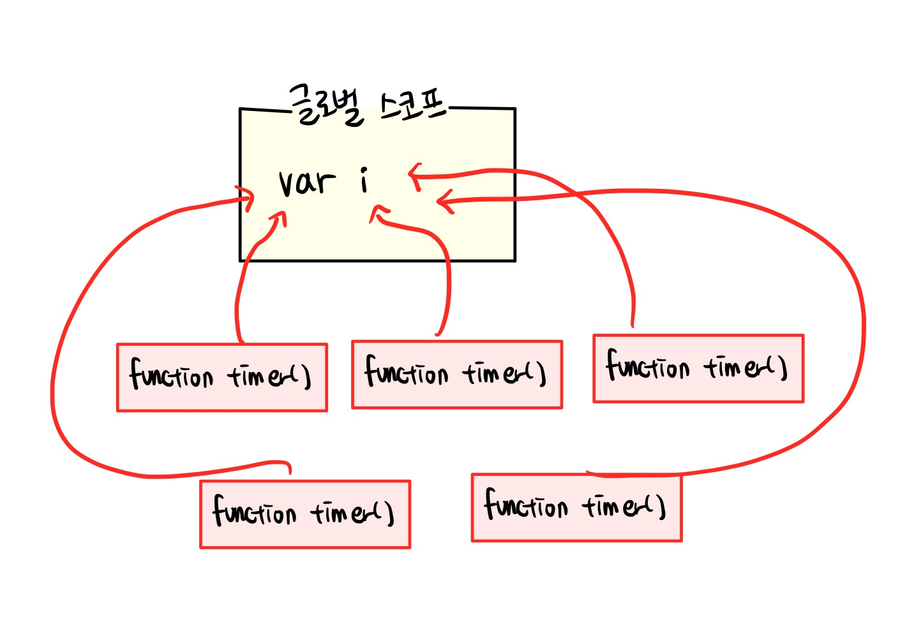
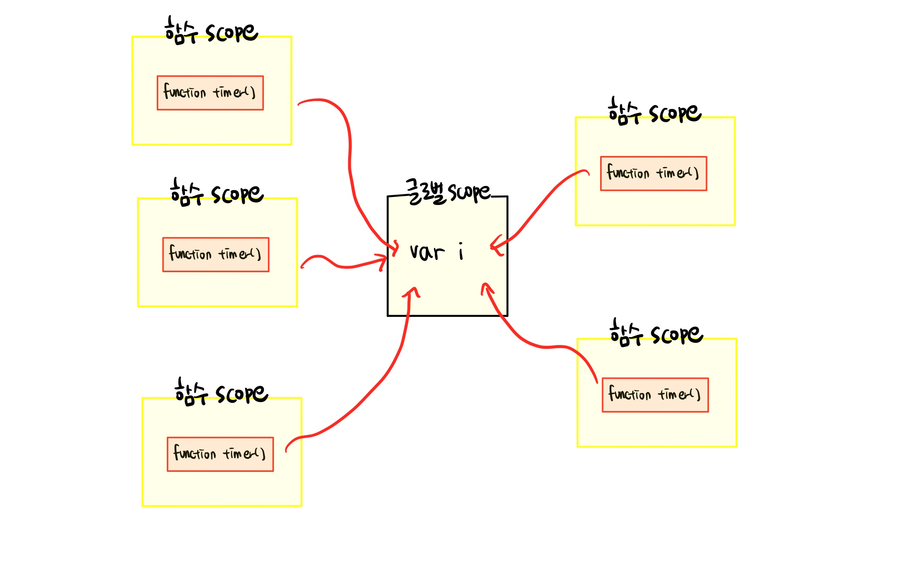
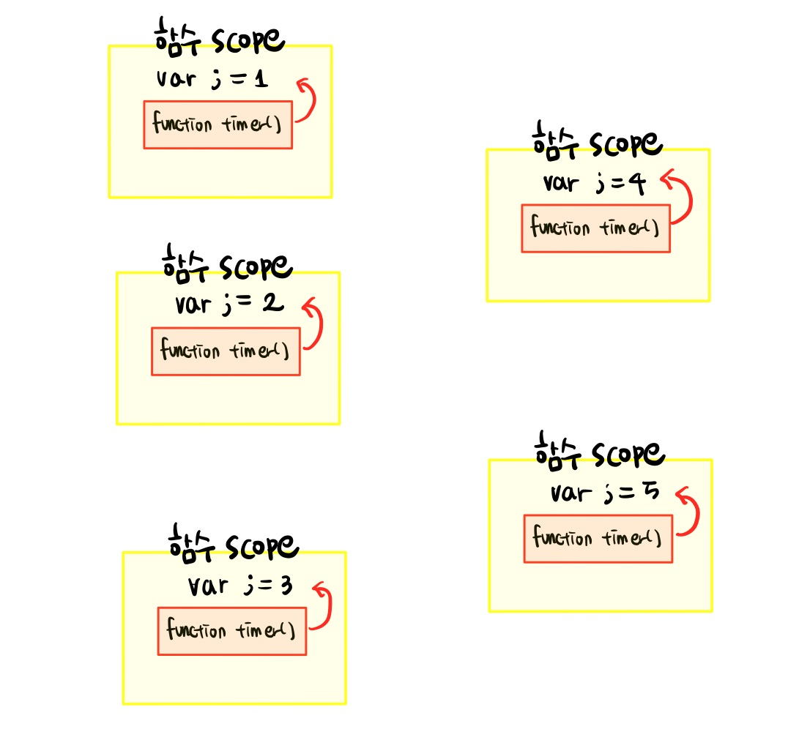
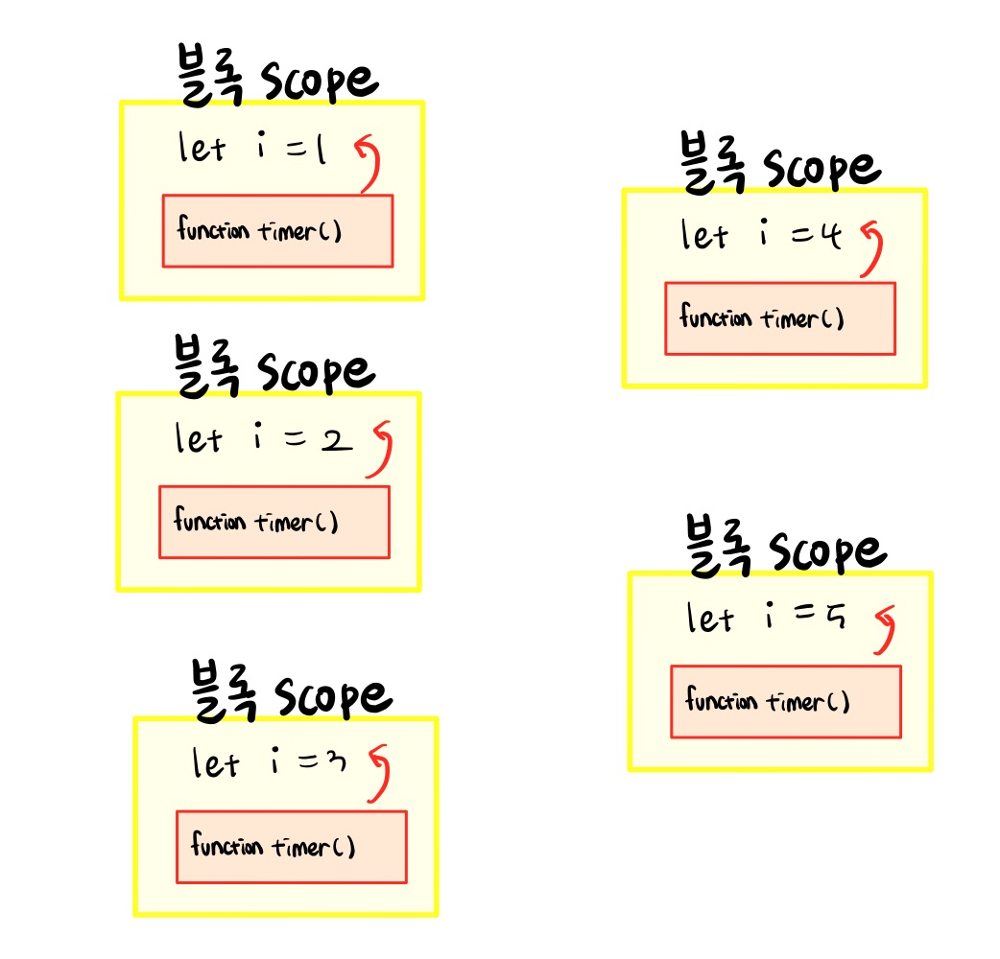

### Goal

- 클로저의 개념에 대해서 이해한다.
- 클로저가 어떻게 활용되는지 이해한다.
- 반복문 예제를 통해 클로저를 더 깊이 이해한다.

<br/>

<br/>

## 클로저

클로저란, 해당 함수가 속한 렉시컬 스코프를 기억하여, **함수가 렉시컬 스코프 밖에서 실행될 때에도 이 스코프에 접근 할 수 있게하는 기능**이다. <br/>

아래 예시를 통해서 클로저에 대해 더 알아보도록 하자 <br/>

```javascript
function charm() {
  const name = 'Lumos!'
  function wisper() {
    console.log(name) // 1번
  }
  return wisper
}

const MyWisper = charm() // 2번
MyWisper() //"Lumos!"
```

<br/>

📍 1번 <br/>
wisper 함수 내부에서 변수 name을 선언 하지 않았으므로, wisper의 렉시컬 환경 중 Outer Environment Reference에 지정된 상위 컨텍스트인 함수 charm의 렉시컬 환경에 접근하여 변수 name을 찾았다. <br/>이 역시 클로저의 기능중 일부이다. **함수 wisper는 charm 스코프 뿐만 아니라 글로벌 스코프에 대한 클로저도 가진다.** 왜냐하면 `함수 wisper의 스코프가 함수 charm 스코프에서 닫히기 때문`이다. 즉 여기서는 함수 wisper가 _선언된 위치_ 덕분에 함수 charm과 글로벌 스코프에 대한 클로저를 가지는 것이다. <br />

<br/>

📍2번 <br/>
함수 charm를 실행하여 반환한 값 , 즉 wisper 함수를 참조하는 객체 자체를 MyWisper라는 변수에 대입하고, 실재로 MyWisper() 함수를 호출한다. <br/>이는 곧 다른 확인자 참조로 내부 함수인 wisper() 를 호출한 것이다. 이 때 **함수 wisper는 함수가 선언된 렉시컬 스코프 밖에서 실행되었다.** 원래대로라면 함수 charm 이 실행된 후에 함수 charm의 내부 스코프가 가비지컬렉터에 의해 사라져야 하는게 맞지만, 함수 wisper가 함수 charm의 내부 스코프를 사용하고 있기 때문에 함수 charm은 사라지지 않는다. 함수 wisper가 선언된 위치 때문에 wisper는 charm에 대한 렉시컬 스코프 클로저를 가지고 있고, 따라서 **함수 charm은 함수 wisper가 나중에라도 참조할 수 있도록 스코프를 살려두는 것**이다. 따라서 우리는 `MyWisper를 호출함으로써 원래 코드의 렉시컬 스코프에 접근 할 수 있는(변수 name에 접근 가능) 것`이다. <br/>

<br/>

<br/>

## 클로저를 어떻게 활용 할까

### 1. 콜백 함수 내부에서 외부 데이터를 사용하고자 할 때

```javascript
const names = ['Harry', 'Hermione', 'Ron', 'Luna', 'Nevile']
const $ul = document.createElement('ul')

names.forEach(name => {
  // 1번 함수
  const $li = document.createElement('li')
  $li.innerText = name
  $li.addEventListener('click', function() {
    // 2번 함수
    alert('This is ' + name)
  })
  $ul.appendChild($li)
})

document.body.appendChild($ul)
```

<br/>



위의 예제 코드는 ul 엘리먼트를 생성하고, ul 엘리먼트의 자식으로 li 엘리먼트를 추가한다. 이 때 li 엘리먼트의 innerText는 names이며 , 각각의 li 엘리먼트에는 이벤트리스너가 붙어서 해당 엘리먼트를 클릭하면 해당하는 name을 alert로 띄워준다. <br/>

📍 1번 함수 <br/>
names 배열을 forEach로 반복하므로 **names의 개수만큼 함수가 실행**된다. 따라서 그 때마다 새로운 실행 컨텍스트가 활성화 되므로 **names의 개수만큼 각각 새로운 실행 컨텍스트가 활성화** 되는 것이다. <br/>

📍2번 함수 <br/>
**클릭 이벤트에 의해 각 실행 컨텍스트가 생성**되고 이 때 1번 함수의 실행 종료와 무관하게 2번 함수의 렉시컬 환경 내부 Outer Environment Reference가 1번 함수의 렉시컬 환경을 참조한다. 2번 함수는 결국 1번 함수 내부에 선언되어 있기 때문이다. **따라서 2번 함수 내부에서 참조할 변수 name은 각각의 1번 함수, 즉 5개의 1번함수가 모두 종료 된 후에도 가비지 컬렉터에 의해 수거되지 않는다**. <br/>

<br/>

### 2. 디바운싱을 구현하며 알 수 있는 클로저

```javascript
// sendRequest는 API 요청을 보내는 함수

const debouncing = (func, limit) => {
  // 1번함수
  let inDebounce
  return function(event) {
    // 2번 함수
    const value = event.target.value
    const context = this
    if (inDebounce) {
      // 900ms가 지나지 않았는데 input 이벤트가 들어왔다면
      clearTimeout(inDebounce) // 다시 900ms 세기
    }
    inDebounce = setTimeout(func.bind(context, value), limit) // Input 이벤트 발생후 최소 900ms 이후에 ajax 요청 보내기
  }
}

$input.addEventListener('input', debouncing(sendRequest, 900))
```

<br/>


디바운싱 개념은 [디바운싱 관련 포스트](https://mooneedev.netlify.app/Frontend/%EB%94%94%EB%B0%94%EC%9A%B4%EC%8B%B1%EA%B3%BC%20%EC%93%B0%EB%A1%9C%ED%8B%80%EB%A7%81/) 에 설명 되어있다. 위 코드는 디바운싱을 클로저를 통해서 구현한 것이다. <br/>

✔️ 먼저 \$input의 이벤트리스너의 콜백함수로 debouncing이라는 1번 함수를 호출한다. 이 때 sendRequest 함수와 limit 시간을 매개변수로 넣어주었다. debouncing 함수는 호출됨과 함께 2번 함수를 반환한다. 따라서 이벤트가 실행될 때마다 deboucing 함수에서 반환한 2번 함수가 호출 된다. <br/>

✔️ 2번 함수는 debouncing - 1번 함수 내부에서 선언되었고, 2번 함수의 렉시컬 환경 내부 Outer Environment Reference가 1번 함수의 렉시컬 환경을 참조하고 있으므로, **1번 함수에 정의된 변수 inDebounc와 매개변수 func, limit에 접근 가능**하다.

✔️ 따라서 이벤트가 호출 될 때마다 2번함수가 호출되어 실행 컨텍스트가 새로 생성되어도 **func, limit, 그리고 inDebounce는 기존의 1번 함수의 것을 참조**하므로 디바운싱을 구현한다.

<br/>

## 클로저와 반복문

for 반복문을 통해서 클로저를 더 깊이 알아보도록 하겠다. <br/>

아래 반복문을 통해서 1초 후에는 1이 2초후에는 2가.. 이렇게 5까지 출력되게 하고 싶다면 어떻게 구현해야할까?

<br/>

### 첫번째 시도

```javascript
for (var i = 1; i <= 5; i++) {
  setTimeout(function() {
    console.log(i)
  }, i * 1000)
}
```

### 결과

```javascript
6
6
6
6
6
```

<br/>

### 왜 이런 결과가 나오는가?



<br/>

결과값 6은 반복문이 끝났을 때 변수 i 의 값이다. 또한 `setTimeout의 콜백 함수는 반복문이 끝나고 나서야 작동`한다. 즉 5개의 콜백 함수는 모두 글로벌 스코프 클로저를 공유하여 **하나밖에 존재하지 않는 i 에 대한 참조를 공유**하는 것이다. (ES6 이전에는 함수 스코프 밖에 존재하지 않았으므로, 반복문마다 새로운 스코프가 생기지 않는다. ) 그렇다면 이를 원래 의도대로 출력하게 하기 위해서는 어떻게 해야 할까? <br/>

### 반복마다 i 의 복제본을 잡아두는 닫힌 스코프가 필요하다.

따라서 우리는 각각 반복문마다 닫힌 스코프를 생성해야한다. 따라서 '함수'를 정의해야하고, 바로 실행해야 하므로 즉시실행함수 (IIFE)를 정의해야 한다. <br/>

### 두번째 시도

```javascript
for (var i = 1; i <= 5; i++) {
  ;(function() {
    setTimeout(function timer() {
      console.log(i)
    }, i * 1000)
  })()
}
```

### 결과

```javascript
6
6
6
6
6
```

<br/>



<br/>

분명 즉시실행함수로 각각 반복문마다 닫힌 스코프를 생성했음에도 불구하고 똑같이 6이 다섯번 출력된다. 왜냐하면, 여기선 스코프만 생성했다뿐이지, 실질적으로 각각 함수가 하나의 i 에 대한 참조를 공유하고 있기 때문이다. 따라서 스코프마다 i 를 해당 스코프에 저장 해서 닫아놓아야 한다. <br/>

<br/>

### 세번째 시도

```javascript
for (var i = 1; i <= 5; i++) {
  ;(function(j) {
    setTimeout(function timer() {
      console.log(j)
    }, i * 1000)
  })(i)
}
```

### 결과

```javascript
1
2
3
4
5
```

<br/>



<br/>

반복문마다 새로운 스코프를 생성한다고 해결되는게 아니라 각각 스코프에 변수 i 를 복사하여 복사된 상태로 존재하게 함으로써 해당 반복문일 때 i 값을 유지 할 수 있다. <br/>

### ES6 블록 스코프를 이용한 해결방법

우리는 위의 문제를 해결하기 위해 반복문마다 새로운 스코프를 생성해야 했다. 그래서 즉시실행함수를 이용했다. 그렇다면 ES6에서부터 제공되는 블록 스코프를 이용하면 블록 단위로 스코프를 생성할 수 있으므로 더 쉽게 문제를 해결 할 수 있을 것이다. <br/>

```javascript
for (let i = 1; i <= 5; i++) {
  setTimeout(function timer() {
    console.log(i)
  }, i * 1000)
}
```

### 결과

```javascript
1
2
3
4
5
```

<br/>



<br/>

ES6에서 let과 const에 적용되는 블록스코프에 의해서 이제 각각 반복문마다 i 는 서로 다른 스코프의 i 값을 참조하게 되는 것이다. <br/>

또한 ES6에서 let으로 선언된 변수는 한 번만 선언되는 것이 아니라 반복할 때 마다 선언된다. 즉, 반복마다 이전 반복이 끝난 이후의 값으로 초기화되는 것이다. <br/>

<br/>

---

이렇게 클로저에 대해 간략하게 정리해보았다. 클로저는 결코 새로운 개념이 아니라, 우리가 여태껏 작성한 자바스크립트 코드 안에 자연스럽게 녹아져 있는 것이다. 이렇듯 클로저라는 개념을 깊이 안다면 더 좋은 자바스크립트 코드를 작성할 수 있지 않을까싶다. <br/>

<br/>

### Reference

- [코어 자바스크립트 정재남 저 - 클로저](http://www.yes24.com/Product/Goods/78586788)
- [You Don't Know JS 카일 심슨 저 - 스코프 클로저](http://www.yes24.com/Product/Goods/43219481)
