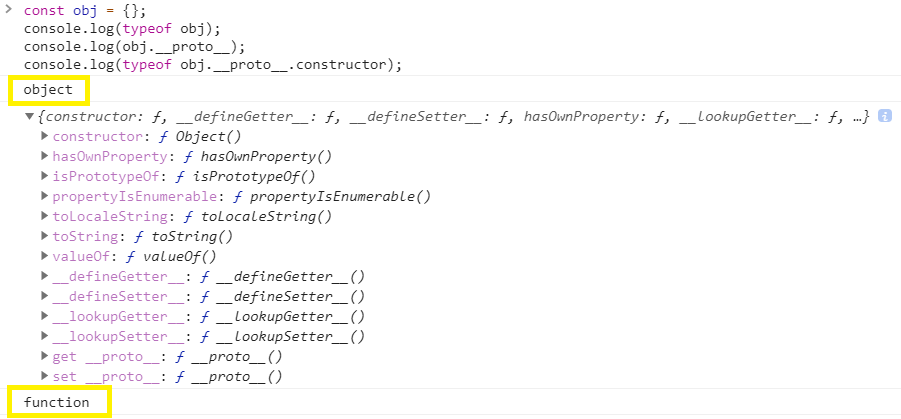

### Goal

- 프로토타입 개념에 대해 이해한다.
- 프로토타입 객체와 프로토타입 링크에 대해 이해한다.

<br/>

## 프로토타입 (Prototype)

자바와 C++, 파이썬과 달리 자바스크립트에는 클래스가 없다. 따라서 클래스로부터 상속받지 않고, 자바스크립트는 `기존의 객체의 프로토타입을 복사하여 새로운 객체를 생성`한다. <br/>

따라서 자바스크립트의 모든 객체는 **자신의 원형이 되는 객체**를 가지며 이를 프로토타입이라고 한다. <br/>

간단하게 예시를 보며 프로토타입이 어떤 것인지 알아보도록 하겠다 <br/>

```javascript
function Person() {}
let Harry = new Person()
Harry.__proto__
// 객체 Harry의 원형(프로토타입)은 Person
```


- 객체는 `new 함수이름()` 을 통해서 생성될 수 있다.

- `prototype`은 어떤 객체의 원형이 되는 객체를 뜻한다.
- `__proto__` 는 어떤 객체의 prototype에 접근할 수 있는 프로퍼티이다. 자바스크립트는 [[prototype]] 이라는 숨김 프로퍼티를 통해서 객체의 prototype을 참조하는데, `__proto__`는 **[[prototype]]용 getter/setter**이다. <br/>

<br/>
일단 여기까지만 정리한 후 프로토타입 개념에 대해 더 알아보도록 하겠다.

<br/>

## 모든것이 함수로부터

먼저 들어가기 전에 자바스크립트의 참조형은 `모두 함수로부터 생성`된다는 것을 이해해야 한다. 자바스크립트의 모든 참조형은 **'객체(object)'** 이지만, 이 객체 역시 `함수 Object()`로부터 생성된다는 것이다 . 아래 예시를 살펴보도록 하자<br/>



생성된 객체는 Object 라는 Constructor를 가지고 있고, 이 Object의 데이터 타입은 결국 `function` 이다. <br/>


Object 뿐만 아니라 배열을 생성해주는 Array, 함수를 생성해주는 Function의 Constructor들 역시도 결국 자바스크립트에서 제공해주는 `네이티브 함수`이다. <br/>


또한, Array와 Function 과 같은 참조형은 이전에 알고있었던 것 처럼 **객체**로부터 파생되었음을 알 수 있다. 배열을 타고 타고 올라가다보면 예제처럼 결국 `Object()` 가 나오기 때문이다. <br/>

그러면 이렇게 자바스크립트 참조형에 대한 지식을 가지고 프로토타입에 대해 더 깊이 알아보도록 하겠다.

<br/>

## 프로토타입 - 1.프로토타입 객체 (Prototype Object)

프로토타입 객체란, 어떤 함수로부터 생성된 객체들이 참조하는 객체를 의미한다. 이 때 생성된 프로토타입 객체는 new 생성자로부터 생성된 모든 객체들이 참조한다. <br/>

```javascript
function Person() {} // 함수
let Harry = new Person()
```

<br/>

### 함수가 생성될 때 일어나는 일

```javascript
function Person() {}
```

#### 함수에 Constructor를 부여한다.

생성된 함수에 Constructor 를 부여함으로써 new 키워드를 사용할 수 있게 해준다. 따라서 다른 객체의 프로토타입이 될 수 있다.

<br/>

#### 함수의 프로토타입 객체를 생성하고 연결한다.


해당 함수의 프로토타입 객체를 생성하고, 원형 함수 내부의 prototype 속성이 프로토타입 객체를 참조한다. 이 때 원형 함수가 참조하는 프로토타입 객체는 new 생성자로부터 생성되는 모든 객체의 원형 객체이다. <br/>


이렇게 생성된 프로토타입 객체는 `원형함수.prototype`으로 접근할 수 있다. 여기서 constructor 는 원형 함수를 참조하고 있다. <br/>

그리고 생성된 프로토타입 객체 내부의 constructor 속성은 원형 함수를 참조하여 서로 연결된다. `__proto__` 속성은 아래에서 설명하도록 하겠다. <br/>

<br/>

<br/>

## 프로토타입 - 1.프로토타입 링크 (Prototype Link)

프로토타입 링크는 new 키워드로 생성된 객체가 자신의 원형 함수.prototype, 즉 `프로토타입 객체`에 접근할 수 있게 해주는 속성이다. <br/>
<br/>
new 키워드로 생성된 객체는 다음과 같이 프로토타입 객체를 참조한다. <br/>
<br/>


prototype 속성이 원형 함수에만 있었던 것과 달리 `__proto__`속성은 모든 객체에 존재하므로, 모든 객체는 `__proto__` 링크를 이용해서 프로토타입 객체를 참조 할 수 있다.

<br/>

따라서 생성된 프로토타입 객체에 접근하는 방법은 두가지 이다. <br/>

1. 함수의 프로토타입 참조를 타고 간다.
2. 객체의 프로토타입 링크를 타고 간다.

```javascript
function Person() {} // 함수
let Harry = new Person() // 객체 생성

Person.prototype // 첫번째 방법
// 원형 함수의 프로토타입 참조를 타고 간다.

Harry.__proto__ // 두번째 방법
// 생성된 객체의 프로토타입 링크를 타고 간다.
```

<br/>

### 프로토타입 체인

위에서 잠깐 언급 했듯이, 프로토타입 객체에도 `__proto__` 속성이 있다. 이렇게 `__proto__`에서 또 다시 `__proto__`로 이어나가는 것을 **프로토타입 체인** 이라고 한다. <br/>

위 Person 함수의 프로토타입 객체의 `__proto__`를 보면 `Object`라고 되어있는 것을 볼 수 있다. 결국 모든 프로토타입 객체는 `Object` 프로토타입 객체로부터 파생된 것을 알 수 있다.


<br/>
<br/>

### Reference

- [Javascript 프로토타입 이해하기](https://medium.com/@bluesh55/javascript-prototype-%EC%9D%B4%ED%95%B4%ED%95%98%EA%B8%B0-f8e67c286b67)
- [JavaScript : 프로토타입(prototype) 이해](http://www.nextree.co.kr/p7323/)
- [프로토타입 상속](https://ko.javascript.info/prototype-inheritance)
