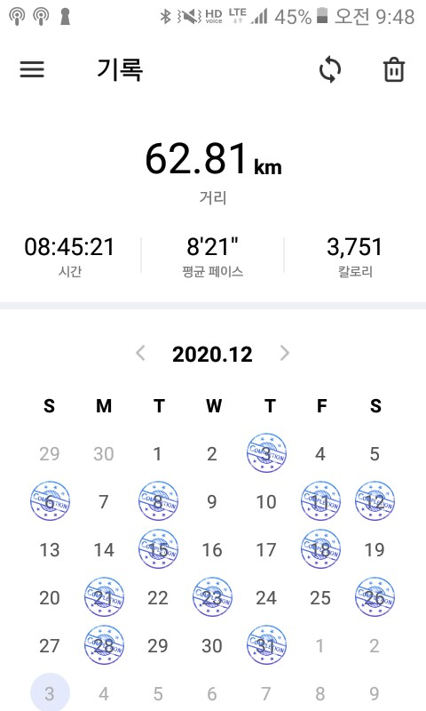

늦었지만 20년을 보내며 회고를 작성해본다.  프로그래밍을 시작한지는 이제 2년 반정도 되었지만 첫 1년 반동안은 사실 웹 개발을 배워본 적이 없었다.   그 때는 도저히 뭘 해야할지 모르기도 했고 알고리즘, 자료구조와 같은 CS 기초과목들을 외국 대학의 mooc로 학습하며 컴퓨터 과학 자체에 푹 빠져 살다보니 웹 개발을 배워야겠다는 생각이 들지 않았었다.   그리고 2020년은 내가 웹개발에 발 담가본 해이므로 꽤나 의미 깊은 해라고 할 수 있겠다. 그래서 이렇게 회고를 적어본다.

 
 

### 힘들었던 2019년을 보내고 난 후

내가 개발을 시작한 이유는 알고리즘이라는 과목 때문이었다.   자료구조 과목을 책으로 공부한 후 MIT의 유튜브 강의를 보며 혼자 알고리즘을 정리하고 분석하는 것에 흠뻑 빠져있었다. 이렇듯 처음 느껴본 학문에 대한 열망 때문에 컴퓨터 과학부 편입을 시도하기도 했다.   원하던 대학교에 합격까지 했지만 개인 사정으로 진학 할 수 없었기 때문에 2019년은 많이 우울한 한 해 였다.  스스로를 과거 속에 옭아매기에 급급했고, 프로그래밍으로부터 도망치려고 시도도 해봤었다. 하지만 결국 2020년 초반에 내린 답은 `난 코딩 할때가 제일 행복하다` 였다.  

프로그래밍으로부터 도망쳤던 6개월동안 많은 것들을 시도해봤다. (일본어 공부, 제빵 등등..)   하지만 그 어떤것도 프로그래밍 만큼 나에게 의지를 불어 넣을 수 없었고 결국 나는 '그래 니가 이겼다! 다시 돌아간다!' 라는 마음으로 6개월의 공백을 끝으로 2020년도에 다시 프로그래밍의 세계로 돌아왔다.   그리고 프로그래밍 공부를 다시 시작하고부터 속이 뻥 뚫리는 기분을 느꼈다. 

 
 

### 백엔드에서 프론트엔드로

나는 왜 백엔드를 고집했었을까 ? 아마 이전에 내가 생각한 프론트엔드는 '자바스크립트-제이쿼리-CSS-HTML' 로 단순히 페이지를 그려주는 작업이라고 생각했기 때문일 것이다.  그리고 CSS를 늘 기피하던 나에게 프론트엔드 작업은 지옥과 다름없었다. 그렇다 이렇게 프론트엔드에 무지했었다.  

그래서 2020년도의 반 정도는 백엔드 공부를 하는데 보냈다. 자바의 정석 책을 보고, 서블릿, JSP, 스프링을 공부하는 전형적인 자바 백엔드 루트를 타고 있던 나에게 신선한 정보가 들어왔다. 바로 [우아한 형제들 이동욱 개발자님의 비전공자로서 백엔드 공부 시작하기](https://jojoldu.tistory.com/505) 라는 포스팅 이었다.  

이때에 나는 자바와 스프링을 공부하며 별 흥미를 느끼지 못하고 있었고, 마침 위의 포스팅을 보고 `굳이 자바로 백엔드 개발을 시작하지 않아도 된다` 라는 팁을 얻게 된 것이다. 그래서 파이썬 - 장고와 노드JS - 익스프레스를 고민하다가 **노드 JS -익스프레스**를 배워보기로 결정했다.  

노드 JS - 익스프레스는 유데미 강의로 학습하였고, 간단한 쇼핑몰 웹사이트까지 제작할 수 있었다.   그리고 이 때 코딩을 하며 정말 오랜만에 **재미있다**는 느낌을 가질 수 있었다. 특히나, 이전에 C, C++, 자바만 배웠던 나에게 자바스크립트 생태계가 너무 신선하게 다가왔고 그렇게 나는 자바스크립트에게 폴인럽 하게 된 것이다.  

쇼핑몰 웹사이트를 완성하고 , 연습이 더 필요하다고 판단한 나는 투두리스트 웹사이트를 만들었다.   백엔드는 익스프레스로 하고, 프론트는 바닐라 자바스크립트와 템플릿 엔진으로 구현을 했는데, 이 과정에서 바벨과 웹팩 설정을 하게 되었다. 그리고 이 프로젝트를 기점으로 깨닫게 되었다. `나는 프론트를 짤 때가 더 재미있다!!`

 
 

### 자바스크립트 개발자로 가는 여정

프론트엔드 개발자가 되기로 진로 계획을 변경한 것은 7월 중순 즈음 이었다. 그리고 아래는 내가 진로를 변경하고 한 공부들이다.

1. **자바스크립트 기초** : 정재남 선생님의 코어 자바스크립트라는 책을 위주로 공부했고 매우 도움되었다.
2. **바닐라 자바스크립트 미니 프로젝트** : 이벤트리스너, 돔 조작, CSS 효과 등을 더 깊게 배울 수 있었다.
3. **HTTP 네트워크** : 그 유명한 다람쥐 책으로 네트워크의 기초를 다졌다.
4. **리액트** : 제로초 선생님의 리액트 웹 게임 만들기 강좌를 통해서 리액트의 기초 문법을 배울 수 있었다.
5. **리액트 - next js 풀스택 프로젝트** : 두 개의 프로젝트를 진행했다. 하나는 트위터 클론이고 또 하나는 영화 리뷰 플랫폼이었다. 이 두 프로젝트를 통해서 서버사이드 렌더링을 구현해볼 수 있었다.
6. **최근에 한 바닐라 자바스크립트로 리액트 따라잡기 프로젝트** : 간소하지만 바닐라 자바스크립트로 어떻게 페이지 라우팅을 하고, 컴포넌트화 시키는지 학습하기 위해 간단한 투두리스트를 만들어봤다.

 
 

### 일단 잘부탁해 리액트..언제 떠날지는 모르겠지만,

나는 리액트의 생태계가 너무 재미있다. 그리고 리액트로 프로그래밍 하는 것이 재미있다. 하지만 제이쿼리가 저렇게 한순간에 고릿짝 취급을 받는 것을 본 이상 리액트를 평생 믿을 수 없다는 것을 안다. 그리고 이러한 마인드가ㅡ*내가 사용하고 있는 기술이 언젠가 교체될 것을 알고 늘 대비하고 있어야 한다는 마인드*ㅡ 소프트웨어 개발자에게 필요한 덕목이라는 것을 깨달았다.  

그러면 이를 위해서 나는 무엇을 할 수 있을까 ? 빠르게 변화하는 프론트엔드 생태계를 열심히 뒤따라가기 위해서 나는 무엇을 하면 좋을까? 아래는 내가 내린 결론이다.

1. **자바스크립트는 변하지 않는다.**

그렇다. 아무리 사용하는 라이브러리 , 프레임워크가 교체 된다고 해도 브라우저와 자바스크립트라는 관계는 변함없을 것을 우리는 모두 안다. 따라서 꾸준히 자바스크립트의 동작 원리를 공부할 것이다.

2. **브라우저에 대해 알아야 한다.**

결국 자바스크립트는 브라우저에서 동작하는 언어이므로, 브라우저의 동작 원리에 대해 더 깊게 알아야한다. 그러므로 2021년에는 리액트로 사이드 프로젝트를 진행함과 함께 자바스크리븥와 브라우저의 원리를 더 깊게 알아가며 더욱더 탄탄한 프론트엔드 개발자로 발돋움 하고자 한다.

 

 

### 개인적으로 2020년에 도움을 주었던 것, 그리고 올해에도 지속할 것들

사실 2020년에 나의 가장 큰 키워드는 '프론트엔드 개발'이었지만, 내가 코로나 상황에서도 꾸준히 프론트엔드 개발 공부를 지속해나갈 수 있던 것은 작지만 큰 힘이 되었던 습관들 덕분이다.  

1. **매일 아침 1시간 독서**

갑자기 멘탈에 지진이 났던 9월부터 가지게 된 습관이다. 책을 읽으면 아주 잠시라도 걱정들이 정리되는 기분이 좋기 때문에 시작했다.  원래는 독서량이 많았는데 취준을 시작하며 공부를 핑계로 독서를 등한시 했었다.   하지만 책은 시간 날 때 읽는게 아니라 시간 내서 읽는 것을 알고 있고, 책을 읽을 수록 내면의 지반이 탄탄해지는 것을 몸소 경험해보았기 때문에, 멘탈이 힘들었던 이 시기 부터 매일 아침 도서관 개관 2시간 전에 일어나서 커피를 먹으며 책을 읽기 시작했다. 

9월 부터 12월 까지 아침 시간을 통해 읽었던 책들은 아래와 같다. 지금은 버지니아 울프의 올랜도를 읽고 있다.

- 목소리를 드릴게요 - 정세랑
- 보건교사 안은영 - 정세랑
- 숨 - 테드창
- 당신 인생 이야기 - 테드창
- 철의 시대 - 존 쿳시
- 성소녀 - 쿠라하시 유미코
- 바람의 열 두방향 - 어슐러 K 르 귄
- 노생거 사원 - 제인 오스틴
- 이성과 감성 - 제인 오스틴
- 죄와 벌 - 표도르 도스토옙스키

 
 

2. **런데이**

이 역시 우울감을 떨쳐내기 위해서 시작했다. 런데이 어플을 통해서 일주일에 3번씩 저녁시간에 달리기를 하고 있고 11월 부터 시작해서 벌써 6주차를 달려가고 있다.  

처음에는 기분전환을 위해 시작했는데 달릴수록 체력이 점점 향상되는 것을 느껴서 체력향상을 목표로 꾸준히 달리고 있다! 이 역시 21년동안에도 지속하고 싶다. 

 

 

### 자 이제 시작이야

과연 내가 좋은 개발자가 될 수 있을까. 라는 불안감은 늘 나를 뒤따라 온다. 그리고 이 불안감 때문에 종종 힘들었고 회의감을 느끼기도 했다.  

하지만 이제부터는 이러한 불안감을 우울의 원료가 아니라 노력의 원료로 사용하고자 한다.  

올해 나의 가장 큰 목표는 '무엇이든 꾸준히 지속하기' 이다.  

- `지속하기`는 지금 하고 있는 것들을 꾸준히 지속하는 것이다. 더 이상 '매일 하기' 와 같은 판타지같은 목표는 세우지 않기로 했다. '매일 하기' 라는 목표는 너무나 깨져버리기 쉽다. 단 하루라도 약속을 지키지 못하면 전체 목표를 달성하고자 하는 힘을 상실해버린다. 따라서 앞으로 나는 '지속하기' 를 하고 싶다. 잠시 쉬었다가도 좋다. 하지만 절대 놓지는 말자. 이게 나의 목표이다.

 
 

내가 오르고 있는 이 산이 , 자그마한 언덕인지 바벨탑인지는 알 수 없다.   정상에서 보게 될 풍경이 허허벌판일지, 신들의 궁전일지는 모른다.   하지만 내가 꾸준히 산을 오르고 있다는 이 사실, 포기하지 않고 내 두 발을 굴리고 있다는 그 사실 하나만으로 나라는 사람의 존재 의미는 충분하다고 생각한다.   내일 죽더라도 오늘 사랑하는 것들 속에서 열심히 사는 것을 잊지 않으려고 노력하고자 한다. 올해는 이런 것들을 마음에 간직하며 살아가고 싶다.  

 

 
