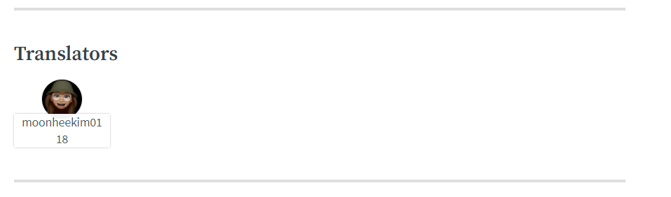

벌써 상반기가 갔다. 앞으로 남은 하반기를 더 잘 채워보자는 의미에다가 상반기 회고를 해보고자 한다.
이것저것 많이 한 것 같은데 막상 그렇지도 않은 것 같다. 반성..

 

## 1. 리액트 / 타입스크립트 학습

연초에는 토이프로젝트 두개를 진행했다.

- [메모장 어플리케이션](https://github.com/moonheekim0118/Atomic-Memo)
- [빌보드 음악 서치 어플리케이션](https://github.com/moonheekim0118/search-music)

두 개를 만들면서 리액트와 타입스크립트를 학습했다. 이전에는 주로 Next.js 프레임워크를 사용했었는데, 리액트 라우터로 라우팅을 해보았다.

리액트 컴포넌트 설계 자체에 대한 고민이 많았고, 더 잘하고싶었기에 진행한 프로젝트들이었다. 메모장은 아토믹 패턴으로 구현해봤고, 빌보드 음악 서치 어플리케이션은 그냥 원래 하던대로 해봤었다.

여러 설계법을 도입해보면서 느낀 점은 **설계에 답은 없다**라는 것이다.

_어떤 설계가 최선이에요 ?_ 라는 질문은 마치 _어떤 코드가 좋은 코드에요?_ 와 같은 질문이다.

그 누구도 명확히 대답해줄 수 없고, 엔지니어가 묵묵히 부딛혀가며 찾아내야한다.

가령, 아토믹 패턴 같은 경우는 디자인 시스템을 제대로 구축 할 수 있고 이에 따라 유지보수가 쉬운 반면 처음 설계할 때 시간이 오래걸렸다. bottom-up이 아니라 top-down 식으로 구현해야하기 때문이다.

따라서 설계는 그 때 그 때 요구사항에 맞게, 최선의 방법으로! 라는 교훈을 얻었다.

 

 

## 2. 댕댕로드

- [댕댕로드](https://github.com/moonheekim0118/DangDangRoad)

댕댕로드 프로젝트는 한 달동안 진행했는데, 프론트는 리액트와 Next.js로 백엔드는 파이어베이스로 구축했다.

댕댕로드 하면서 많은 트러블슈팅 과정을 거치고 많이 배워갔다. 그 중에 가장 기억에 남는 것 두개는 아래와 같다.

1. **Next.js 에서 파이어베이스 인증 지속**
   - Next.js 는 서버사이드렌더링을 하기 때문에 파이어베이스가 제공해주는 Session 인증이 아니라 Node (새로고침하면 인증 사라짐) 인증 밖에 구현할 수 없었다.
   - 이를 해결하기 위해서 Next.js에서 백엔드 코드를 작성했고 파이어베이스의 admin SDK를 이용해서 해결했다!
2. **알고리아 연동**
   - 지역명 검색에서 파이어베이스가 제공해주는 쿼리만으로는 한계가 있어서, 알고리아를 연동했다

댕댕로드는 간단하게 vercel로 배포를했고 구현하는 동안 나름 많이 고민하고 여러 새로운 방법들을 도입해봤기 때문에..결과는 어떨지 몰라도 스스로에게 얻어가는게 많은 프로젝트였다.

그리고 ,늘 UI 구현에 시간을 많이 할애해서, 이를 조금이나마 개선시키고자 storybook도 사용하여 atoms 컴포넌트들에 storybook 을 작성했다.

다만, 이 때 부터 진짜 `좋은 구현이 뭐지? 나 잘하고 있는건가? 내 코드 괜찮은가?` 라는 의문이 증폭했고 이는 나의 다음 행보로 이어진다

 

 

## 3. Next Step JS 스터디 참여 Level1, Level2, Level3 까지

정말 우연히 Next step의 깃헙 레포지토리를 봤고, 재밌겠다! 싶어서 바로 신청했었다. Step1 부터 했고 정말..하면서 그동안 혼자 공부했던 것보다 100배는 더 많이 성장한 것 같다.

### Level1

- 투두리스트 구현

다른 분들에게 내 코드를 리뷰 받아야한다는 압박감 때문에 가독성이나 효율성을 따져가면서 코드를 더 깔끔하게 작성하고자 노력했고, 이는 결국 온전히 나의 프로그래밍 습관으로 남겨졌다.

그리고 다른 분들 코드를 보면서 정말 많이 배우기도 했다.

Step1 에서는 레벨1~2는 옵저버패턴으로 구현했다가 레벨 3에서는 Flux 패턴으로 투두리스트를 구현하기도 했고 ,추후에 이걸 다시 양방향 바인딩으로 바꿔보기도 하면서 많이 이것저것 실험해볼 수 있었다!

### Level2

- 레이싱 게임 / 로또 / 계산기를 구현하고 이에 대한 E2E 테스트 작성

이전에는 테스트하면 유닛테스트 밖에 구현해보지 않았는데, cypress 사용법을 알고 싶어서 레벨 2도 신청했다.

아주 간단한 프로그램부터 추후에는 조금 복잡한 프로그램에 대해 테스트 코드를 작성해나가면서 cypress 사용법과, 이를 뛰어넘어서 테스트코드 작성방법을 배울 수 있었다.

### Level3

- 나만의 유튜브 강의실
- 지하철 노선도

대망의 레벨 3...정말 얻어가는게 많았고 어려웠다. 마지막 주차는 다음 기수로 이월되었지만...일단 끝내본대로 정리해보겠다.

#### 나만의 유튜브 강의실

일단 나만의 유튜브 강의실 미션에서는 처음으로 Component를 추상화해서 조금이나마 리액트스럽게 구현해보려고 했다. 그리고 타입스크립트를 사용해서 안정성을 높였고, 원래 요구사항에는 없었지만 cypress 테스트 코드도 작성했다.

하지만 이 때의 문제점은 상태관리였다. 하나의 상태를 컴포넌트들이 공유하기 위해 props 지옥이 펼쳐졌다 ㅎ

그리고 이 미션 때 준일님께서 너무 유익한 리뷰들을 많이 남겨주셔서 이를 바탕으로 다음주차에 꽤 많이 나름 발전시켰다.

#### 지하철 노선도 ~ ing

지하철 노선도 미션 step1은 끝냈지만 아직 step2는 끝내지 못한 상태이다. 아직 리팩토링하고 수정해야할 부분이투성이 이다. 그래도 여러 시도를 했고 나만의 바닐라 자바스크립트 구현법을 익히게 된 미션이다. 인상깊은 점들을 몇개 꼽아보자면 아래와 같다.

[리뷰 받은 것 모음](https://www.notion.so/mooneedev/e2fee249328f47d1b5c338016968636a)

- **Store 구현**

  - 위 미션에서 props 지옥을 벗어나고자 전역상태를 구현했다. Store 클래스를 구현하여 이를 상속받는 식이다.
  - 처음에는 단순히 해당 상태를 사용하는 컴포넌트를 Store의 관찰자로 직접 등록해줬는데, 준일님의 리뷰 덕분에 이를 리덕스처럼 나름 자동화 시킬 수 있었다.
  - 결국 컴포넌트나 페이지 내부에서 특정 액션에 대한 Dispatch를 호출하면 Store에서 Service를 호출하고, 그에 따라 상태값을 바꾸는 식으로 수정했다!

- **Component 내부 로직 작성**
  - 이전에는 단순히 Render, Update 만 구현했다면 이번에는 아래와 같이 세부적으로 구현했다.
  - 처음 컴포넌트를 생성해주는 setUp -> 해당 페이지가 로드 될 때 mount -> 컴포넌트 뷰를 보여주는 Render -> (컴포넌트가 업데이트 되어야 할 경우 ComponentWillUpdate-> ComonentUpdate) -> 페이지에서 벗어날 경우 ComponentWillUnmount
  - 이거 구현하면서 정말 많이 애먹었다^^;; 특히 이벤트랑 돔 처리 관련해서 삽질을 정말정말정말 많이 했다.
  - 하지만 이렇게 구현 될 경우 사용하는 전역 상태값이 바뀔 경우 리렌더링 되므로 리액트처럼 input의 value 값 같은 상태를 따로 state에 저장해줘야한다.
- **바닐라 라우팅**
  - 이전에 한번 해보긴 했지만 이번에는 완벽히 추상화해서 라우터 클래스를 만들 수 있었다.
  - 리액트 라우터나 Next.js만 사용하다가 직접 Router.push 같은 메서드를 구현해보니 실제로 프론트엔드에서 라우팅이 어떻게 동작하는지 알 수 있었다.

 

 

## 4. Road of Coder 스터디 참여

- https://github.com/Road-of-CODEr/stupid-week-2021
- 일주일간 3개의 목표를 세우고 달성하는 스터디

Next Step 스터디를 참여하면서, 다른 사람과 함께 목표를 공유하는게 얼마나 큰 도움이 되는지 깨달았다. 그래서 Road of Coder 스터디에 참여하여 그 중 Stupid week 스터디에 참여하고 있다.

사실 스터디라기 보다는, 서로 목표를 세우고 목표 달성을 체크해주는 것에 가깝지만, 그래도 최소한 일주일에 3가지의 과제는 끝내야하기 때문에 도움이 된다!  

하반기에는 Road of Coder에서 진행중인 자바스크립트 스터디에도 참여하고 싶당..

 

 

## 5. 자바스크립트 코딩테스트 준비

상반기에 정말 열심히 한 것중에 하나를 꼽으라면 코테준비이다.

작년에는 상반기까지는 백준을 열심히 풀다가, FE 개발을 시작하고나서는 잘 하지 않았는데..그러다가 깨달은 것은 `코딩 테스트를 준비하지 않으면 많은 기회를 놓친다`는 것이다.

실제로 좋은 교육프로그램, 인턴쉽 프로그램은 모두 코딩테스트가 1차 전형이고 이를 통과하려면 적어도 프로그래머스 레벨2 수준의 문제는 풀 수 있어야 했기 때문이다.

그래서 올해 1월부터 다시 심기일전해서 각각 프로그래머스와 릿코드에서 알고리즘 문제를 꾸준히 풀어왔다. 하루에 적어도 1문제씩 풀었고 코딩테스트가 목전에 있을 경우 10문제 정도씩 풀어왔다.

6월 26일을 기준으로 프로그래머스에서는 136문제, 릿코드는 159문제를 풀었다.

다행히 DFS/BFS/DP 와 같은 기본적인 자료구조/알고리즘 지식은 있는 상태였기 때문에 어려움은 없었다고 생각한다.

`왜 자바스크립트로..?` 라고 물어본다면, 이전에는 C++나 자바로 코테준비를 했지만, 이왕 FE 개발자로서 JS가 내 주력 언어가 되었기 때문에 JS 로 코테를 준비하기로 했다 ㅎㅎ

처음에는 C++의 STL이 없어서 많이 헤맸고, 불편하다고 생각했지만 이로 인해 JS의 여러 내장 메서드 / 자료구조를 알 수 있었다ㅎㅎ

 

 

## 6. 정보처리기사

드디어 취득했다..가벼운 마음으로 책을 버렸다 ㅎㅎ

한달정도 공부했고..정처기 공부 자체가 단순 암기라서 엄청 큰 도움은 되지 않았지만 한가지 도움되었던 것은 SQL 문법을 공부했던 것이다. 당시에 SQL 문법을 익히기 위해서 프로그래머스에서 문제도 풀었다.

_왜 땄나_ 라고 물어본다면 난 비전공자이기 때문에 정보처리기사로서라도 컴퓨터공학에 대한 지식을 증명해야하기 때문이다.

전공자에게 정처기는 그다지 메리트있는 자격증은 아니겠지만, 비전공자는 확실히 따둬서 나쁠 것 없다고 생각한다.

 

 

## 7. 첫 NPM 패키지 배포

- [create-moonee-app](https://github.com/moonheekim0118/create-moonee-app)

CRA 를 따라해서 내 버전의 CMA를 만들어보았다. 아직 npx 로 바로 install은 안되는 문제가 있지만 그래도 구현하는 동안 너무너무 재미있었다.

사실 정보처리기사 시험 끝나고 뭐라도 만들고싶어서 즉흥적으로 만들게 되었다.

실제로 잘 사용하고 있고, 너무 편리하다. 하지만ㅋㅋㅋ버전이 계속 바뀔텐데 :sob:그렇게 되면 사실 별로 유용한 프로그램은 아니다 ㅋㅋ그래도 만든 것 자체에 의의를 둔다.

 

 

## 8. 우테캠 도전

- 1차 코딩테스트 합격
- 2차 과제 테스트 합격
- 최종면접 불합격 :sob:

아쉽지만 최종면접까지 본 것에 의의를 둔다. :thumbsup:

확실히 우테캠 준비하면서 코딩테스트랑 바닐라 자바스크립트 공부를 더 열심히 했기 때문에, 나는 넘어졌지만 뭐라도 주워왔다 ㅎㅎ

 

 

## 9. 오픈소스 기여

- https://github.com/line/webpack.kr
- https://webpack.kr/plugins/environment-plugin/

드디어 오픈소스에 기여하게 되었다! 라인에서 진행하는 웹팩 번역작업에 기여했고, 나는 그 중에서 환경변수 플러그인 문서를 번역했다.

감사하게도, 번역자까지 하단에 표기해주셔서..너무나 영광이다ㅎㅎ

조금 더 여유로워지면 남은 문서들 몇개를 더 번역하여 기여하고 싶고 이 기세를 유지하여 하반기에 있을 컨트리뷰톤에도 참여하고 싶다.

 

 

---

## 아쉬운 점

### 프로젝트

하고싶어서 생각해둔 프로젝트는 한 2개 정도 더 있는데, 스터디 참여하고 코테준비하느라 시작하지 못하고 있다. 정말 간단한 토이프로젝트인데..후딱 했으면 후딱 끝내놨을 텐데 미루고 미루다보니까 이렇게 되어버렸다.. :weary: .. 여름 안에 프로젝트 하나는 더 하도록 노력해야지

 

### 독서

개발 서적도 그렇고, 그 외의 독서활동도 제대로 하지 못한 것 같아서 아쉽다. 연초에는 한달에 2~3권씩 읽어갔는데 점점 바빠지다보니까 그럴 여유가 나지 않았다. 사실 책은 `시간 날 때` 읽는게 아니라 `시간 내서 읽는 것` 인데 바빴다는건 핑계에 불과하다. 하반기에는 시간을 더 내서 책을 많이 읽고 싶다

 

### 운동

작년에 런데이를 정말 꾸준히했고 그 덕분에 30분동안 달릴 수 있는 체력을 길러놨었다. 근데 이번 4월 되면서 운동을 바쁘단 핑계로 안하다보니 최근에 다시 달릴 때 정말 힘들었다 ^^... 런데이 혹은 등산을 좀 꾸준히 해서 체력을 길러놓고 싶다. 정말 요즘 많이 깨닫는건 체력이 중요하다는 것이다. 아무리 개발이 재미있어도 체력이 안따라주면 아무것도 할 수가 없다.

 
 

이렇게 상반기가 벌써 가버렸다. 너무 빨리 간 것 같지만..하반기에는 더욱더 유의미하고 재미있는 일들로 채워나가고 싶다.

 

 
