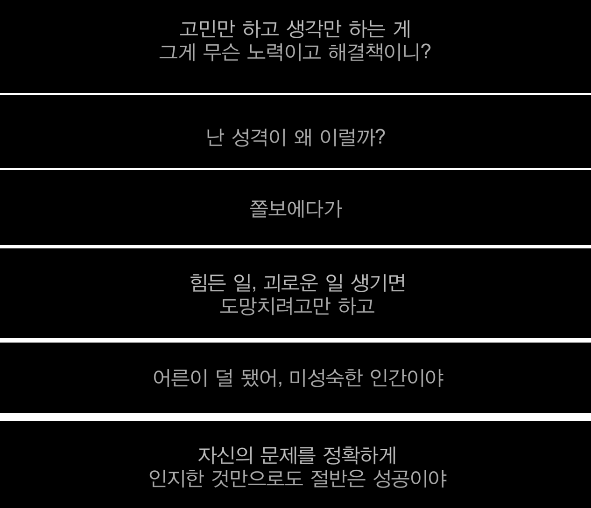

최근에 운좋게 기술면접 기회를 얻어서 진행했고, 진행하면서 `나 정말 아무것도 몰랐군!!` 을 깨달았다.

내 지식이나 논리의 빈틈을 너무나 많이 발견해서 마음이 아팠고, 지금까지 제대로 된 공부를 하지 않은 것 같아서 매우 괴로웠지만, 그럼에도 불구하고 이런 기회를 얻어서 나의 부족한 점을 이렇게 빨리 깨닫게 된 것은 큰 행운이라고 생각한다.

그리고 정말 많이 부끄럽기도 했다. 내가 당연하게 사용하던 것들의 원리나 이유 조차도 제대로 파악하지 못하고 있었기 때문이다. 그래서 순간 또.. _나 정말 개발자 적성에 맞는걸까_ 라며 헛된 고민을 했지만, 적성에 맞고 안맞고는 없다고 생각한다. **이대로 포기하면 개발자가 되지 못하는 거고, 지금 실패와 좌절을 계단 삼아 앞으로 나아가면 좋은 개발자가 되는거고**

그래서 저번주 동안은 좀 심신안정의 시간을 가졌다ㅋㅋ책도 읽고..정말정말 오랜만에 (거의 1년만에..) 늦잠이라는 것을 자보기도 했다. 그리고 이제는 다시 돌아와야할 시간이 머지 않았다. 물론 다다음주에 휴가계획때문에 또 약간은 흐트러지겠지만 ? 그래도 흔들리는 마음이라도 붙잡아놓고 싶다.

## [refactor] 자바스크립트

### AS-IS

- 나름 잘 사용한다고 자부했지만 무슨..아직 동작원리도 제대로 모르고, 남에게 제대로 설명도 못하므로 아무것도 모르는 것과 마찬가지인 상태
- 사용만 했지, 비동기나 프로토타입의 동작원리나 등장배경을 잘 모른다.
- 왜 자바스크립트가 비동기이고, 비동기에서 이런저런 조건이있을때 어떤문제점이 있고 이런 것들을 모른다.
- 나는 걍..타입스크립트를 정말 타입붙이기 용도로만 사용했지 제대로된 원리나 사용이유도 모르고 편하자고 마구마구 사용함
- 동작 원리와 등장 배경을 묶어서 이해하지 못하고 있음. 내가 지금 이 기술을 사용하는 이유를 완벽히 이해하지 못한 상태
- 자바스크립트 엔진 동작 원리를 겉핥기 식으로만 알고 있지, 제대로 이해하지 못한 상태

### TO-BE

- **자바스크립트 문법 원리를 파악한다**
  - 예를 들어, 프로토타입의 내부 구조라던지, 어디서 사용되고 왜 사용되는지, 자바스크립트는 왜 프로토타입 기반 언어가 되었는지
- **비동기 관련 이해를 단단히 한다**
  - async await, promise , 콜백함수의 차이 및 각자의 장단점
  - 언제 promise를 쓰면 좋은지
  - 왜 자바스크립트는 비동기인지
- **왜 A 문법이 B 문법보다 좋은지 파악한다**
  - 예를들어 반복문에서 for-of 이 for-in 보다 성능상 좋은지, 이런 것들을 알고 써야한다.
- **타입스크립트를 명확히 사용한다.**
  - 각 타입별 특징 및 차이를 이해해야 한다.
  - 왜 타입스크립트를 써야하는지 알아야한다.
- **ES6 문법을 명확히 사용한다.**
  - ES6 이전과 ES6 이후 문법의 차이를 알아야한다.

## [refactor] CS

_다시 스스로에게 말하지만, CS 좀 못해도 괜찮다..! 어차피 CS 지식 한번 배운다고 머리에 콱 박혀있는 것도 아니고, 개발하면서 필요할 때 공부하는게 훨씬 효율적이다. 그럼에도 불구하고 네트워크 관련한 지식들은 잘 알아두자_

### AS-IS

- CORS, 프리플라이트, OSI7 계층을 원론적으로 이해하지 못한다. 그냥 외운 것 처럼 들린다.
- 실제로 왜 네트워크에서 이렇게 되는지? 에 대한 이해가 많이 부족하다.
- 객체지향, 함수형에 대한 이해가 깊지 않다. 설명하라면 못하겠으므로 결국 모르는 상태

### TO-BE

- **CORS 관련해서 더 자세하게 안다.**
  - CORS 해결방법, 왜 프론트엔드에서 처리해줘야하는지
  - CORS 가 왜 생기는지..등등
- **네트워크 원리를 이해한다**
  - 이건 그냥..꼭 알아야겠다고 생각한다.
  - OSI 7 계층 관련해서 겉핥기식으로 외우지말고 정말 이해를 하자
- **객체지향**
  - 사실 JS로 개발할땐 객체지향 별로 신경안썼는데..음..그래도 Class로 구현하는데 객체지향도 잘 신경써줘야한다고 생각한다.
  - 예전에 자바공부할때 사놨던 오브젝트라는 책이 있는데 그걸 읽어보던가 해야겄다.

## [refactor] 프론트엔드 지식

### AS-IS

- 브라우저 렌더링 과정만 알고있지 해당 과정에서 어떤 연산이 진행되고, 그러므로 어떻게 최적화해야하는지 모른다.
- 웹팩 / 바벨 / SPA의 등장 배경을 알고 있지만, 제대로 설명하지 못한다. 결국 제대로 알지 못하는 상태
- 리덕스와 같은 상태관리 도구의 원리를 제대로 알지 못한다.

### TO-BE

- **브라우저 렌더링 과정을 이해하고, 이를 코드에 적용할 수 있다.**
  - 각 렌더링 과정 별 특징 및, 어떤 동작이 일어나는지 알아두기
- **웹팩 사용 이유와 웹팩의 동작 원리를 설명할 수 있다.**
- **바벨 사용 이유와 바벨의 동작 원리를 설명할 수 있다.**
- **린트/포맷터 사용하는 이유를 설명할 수 있다.**
- **프론트엔드에서 라우팅은 어떻게 구현되는지 이해한다.**

  - 이건 내가 급 궁금해졌다. 리액트에서는 그냥 리액트라우터나 next.js로 짠 하고 구현했는데 더 알아봐야겠다.

- **예외처리는 프론트에서 해줘야할까 백에서 해줘야할지에 대한 의견을 가지고 있다.**
  - ...이것도 걍 내가 궁금해서...

## [refactor] 나

나 스스로도 리팩토링해야한다..이번에 수많은 불합격 메일을 받고 멘탈이 깨지는 과정에서 깨달았다..후후..깨진 멘탈은 다시 이어붙어서 담금질하면된다. 원래 담금질 할 수록 경도가 높아지는 법

여기서는 as-is to-be로 설명하지 않겠고 그냥 바로 액션플랜만 적어놓겠다.  

- **혼자 공부하지 말자**

  - 개발 공부 하면 할 수록 깨닫는 것. 혼자 공부하면 좋지 않다. 함께 공부해야한다.
  - 혼자가면 빨리가고 함께가면 멀리간다.

- **수치심 극복하기 - 수치심 회복 탄력성 기르기**
  - 면접을 두번이나 말아먹고..아 정말 나 넘 멍청하다.. 나 넘 별로다.. 이런 생각에 잠식되어있었다. 그래서 이 감정의 원인을 파악해서 해결 하고 싶었다. 그리고 결론은 **수치심**이었다.
  - 지금 책 `수치심 권하는 사회` 를 읽고 있다. 나는 스터디할 때나 면접 볼 때나 늘 `나의 부족함`이 드러나는 것에 엄청난 두려움을 느끼곤 했다. 말 할 때도 실수 할 까봐 무서웠다. 근데, 이게 **자존감의 문제가 아니라 수치심의 문제**라고 한다. 이런 수치심을 많이 느낄 수록 성취 경험이 줄어들 수 밖에 없다. 수치심 느끼는 것을 두려워해서 뭔가를 시도해보지 않기 때문이다. 특히나 여성들이 외모, 커리어, 육아와 같은 문제에 대해 지적을 받으면 수치심을 엄청나게 느낀다고 한다. 이렇게 주입된 수치심은 곧 우울증이나 경력단절로 이어진다. 떠올려보면 나도 과거에 그리고 현재까지 수치심에 잠식된 적이 많다. 무언가 실수를 해도 내 노력 전체가 부정당한 기분이 들었고 이는 곧 의욕 저하로 이어져서 새로운 도전을 막았기 때문이다. 이런 점을 많이 고쳐나가고 싶다.
  - 즉 책에서 말하듯 **수치심 회복 탄력성**을 길러야 한다. 아직 책을 다 읽진 못해서..이 부분은 스킵하지만 나의 마음가짐은 아래와 같다.
  - 실수해도 돼! 멍청해보이면 어때! 다들 처음에는 그랬어..이러다가 성장하는거지 뭐^^ 좀 뻔뻔해져도 됨. 실수에 뻔뻔한 자만이 살아남는다.
  - **개발 능력 != 나의 존재 가치**임을 잊지말자. 일을 사랑하는건 좋지만 일에 자아가 잠식되지는 말자
  - 넘어졌다면 무언가를 줍자. 무릎이 까졌다고 울고만 있을게 아니라
- **논리력 기르기**
  - 모르는 문제가 나오면 `모르겠다`라고 포기하지 말고, 천천히 되짚어가면서 이유를 추측해보자.
  - 틀려도 된다. 포기하는 것 보다 틀리는 게 낫다.
  - 알고리즘 문제 많이 풀기
  - 내가 사용하는 라이브러리의 원본 소스코드 보면서 동작 원리 파악해보기
- **도망치는건 부끄럽기만하고 도움이 안될 때가 더 많다.**

  - 헝가리의 속담 `도망치는건 부끄럽지만 도움이 된다`를 변형해봤다. _사실 헝가리 속담으로 먼저 안게 아니라 드라마로 알았지만.._
  - 많은 불합격 통보 속에서 정말 도망치고 싶었다. 아마 코로나만 아니었다면 도피성 워홀을 떠났을 것이다.
  - 하지만, 많이 도망쳐봐서 나는 안다. 도망치는거는 부끄럽기만하고 전혀 도움이 안된다. 물론 도움 될 때도 있지만 도망쳐봤자 또 다시 도망치고 싶은 상황이 반복된다.
  - 도망치는건 습관이 되고, 습관은 결국 삶이 된다. 그러므로 도망치지말고 하던거나 잘하자~! 적정 기한을 정해두고 그만큼 했는데 성과가 안나온다면 그건 도망치는게 아니라 떠나는 것이다.

- **공부가 지칠 땐 다른걸 공부해보자**
  - 쉬는동안 그래도 쉬고싶지만은 않아서 놓고있던 일본어 공부를 다시 시작했다. 하루에 1시간정도밖에 안하지만 그럼에도 불구하고 새로 시작한 공부에서는 늘 인사이트와 첫 시작의 설렘을 느끼는 것 같다.
  - 일본어 한자 공부를 체계적으로 다시 시작했는데, 한자를 외우고 한자의 음독,훈독을 일본어 단어에 적용하고, 여러 동사변형을 거치는 과정은 정말 논리적이다.
  - 기승전코딩 ... 결국 언어 능력이 프로그래밍적 사고 능력과 비슷한 구조를 가지고 있다는게 맞는 것 같다. 언어는 정말 논리적으로 굴러간다.
  - 이렇게 다른걸 공부하다보니..기존에 공부하던게 생각나고, 삶에 큰 활력이 생기는 것 같다. 번아웃이 오거나 무기력해질 때 새로운걸 배우는건 굉장히 좋은 습관인 것 같다.
- **조급해하지 말자**

  - 솔직히..나 조급하지 않아도 되는데 엄청 조급해하고 있었다. 친언니가 그걸보더니 `진짜 조급해하지 않아도 돼..아무도 압박하고 있지 않고 천천히 해도돼 무엇보다 너한테는 코로나시국이라는 카드가 있잖아..`라고 해줬다ㅋㅋㅋㅋㅋㅋ
  - 이제는 **빨리 취직해야겠다** 라는 마음보다는 **제대로 해보자**라는 마음가짐을 갖기로 했다.

- **체력 기르기**

  - 육체 건강은 정신 건강과 함께 간다는 것을 잊지 말자
  - 런데이 안한지 몇달 되었다. 근데 최근에 런데이하러 나갔다가 정말로 찜통 속에서 달리기 하고 있는듯했다.
  - 그래서 어제부터 다시 홈트레이닝 시작했다. 홈트레이닝으로 10kg 뺀 전적이 있기때문에 이번에도 한 8kg 정도 건강하게 빼려고 한다.
  - 최근에..스트레스 많이 받아서 피자,햄버거,치킨 이런 자극적이고 기름진 음식 많이 먹었는데 이런거 다 끊고 채소 위주 식단으로 바꿔야한다. 기름지고 단거 많이 먹을 수록 스트레스 지수가 높아진다고 한다.

### 마지막으로

_슬기로운 의사생활 시즌 2 5화에서 석형이와 송화의 대화_

보면서 내가 석형이 같아서 많이 찔렸고 많이 힘을 얻었다. 자신의 문제를 정확히 아는 것만으로도 절반은 성공이고, 나머지 절반은 해결책을 찾고 부딪히는데 있다. 화이팅!

위에 적어놓은 목표들은 2021년도 하반기까지 달성하는 것을 목표로한다.

 
