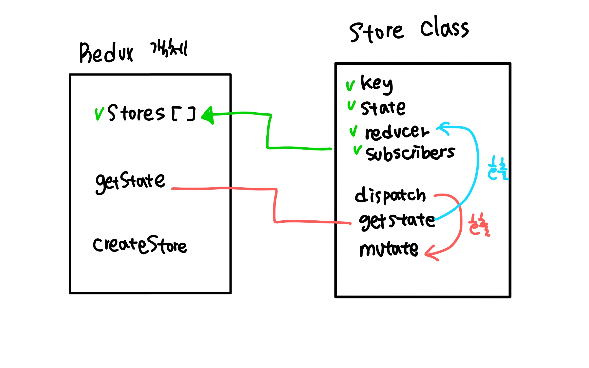
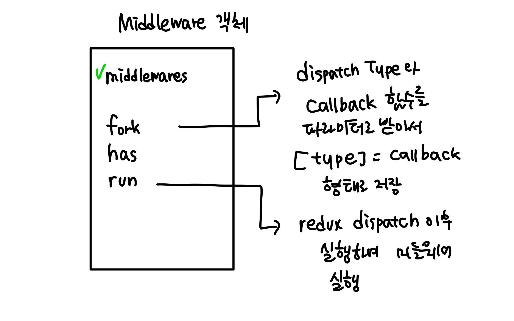
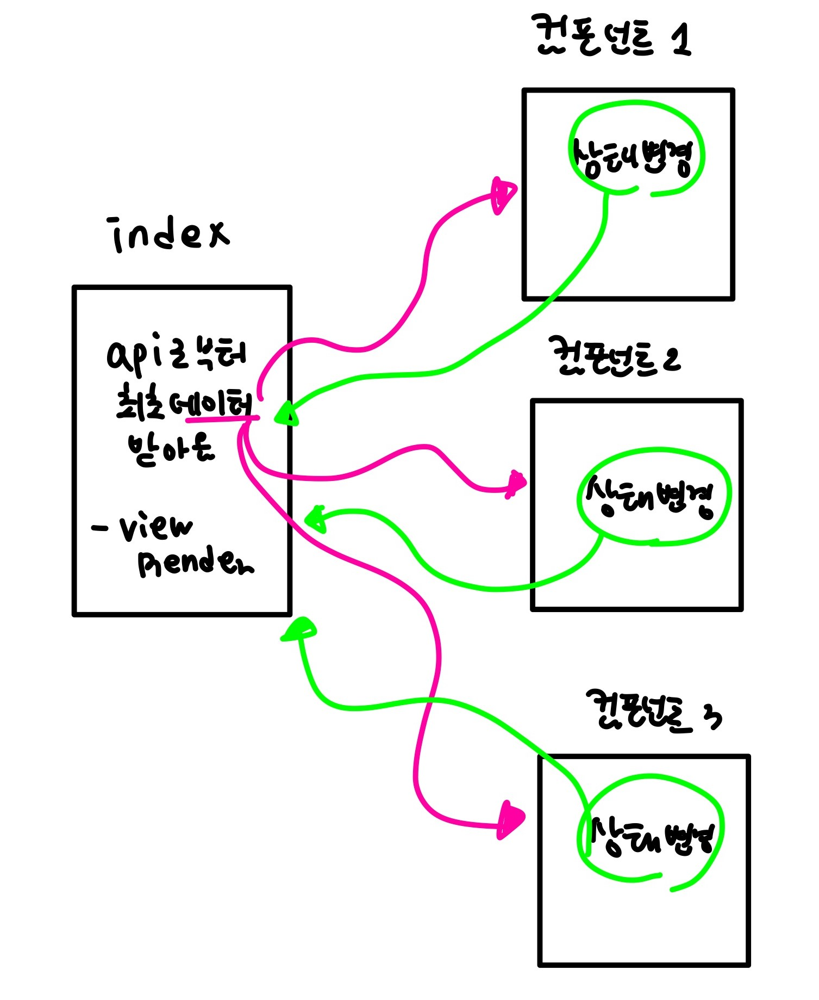

<!-- ---
title: 블랙 커피 프론트엔드 레벨 1 스터디 3주차  정리
date: 2021-05-12 23:30:50
category: essay
draft: false
--- -->

3주차가 끝난지 벌써 2주가 되었다. 결론부터 말하자면 첫 3주차에는 flux 패턴으로 구현을 해봤었고, 최근에 한번 더 디자인패턴 싹 없애고 그냥 구현을 다시 해봤었다. <br/>

일단, flux 패턴으로 구현하기 위해서 리덕스, 리듀서, 미들웨어를 어설프게나마 구현해봤었는데, 이게 참 잘 구현된게 아니다보니까 너무 불필요한 리렌더링이 많이 발생하게되었다.

그래서 어제오늘 다시 패턴 없이 구현을 해봤는데, 매우 간단해지고 리렌더링은 줄었지만, 상태관리 문제가 역시나 골칫거리였다. <br>

이번에는 3주차 미션에 대해서 어떤 고민과 시도를 했는지에 대해 간략하게 정리해보도록 하겠다.

### 3주차 미션 요구사항

- 이제 투두리스트를 팀단위로 작성한다. 팀 내부에는 여러명의 유저가 있을 수 있다.
- 팀을 추가 삭제할 수 있고 팀 내부에서 유저를 삭제 추가 할 수 있어야 한다.
- 각 유저에 대한 투두 연산은 그대로이다.

## 1. Redux 따라하기

### Redux 와 Store



```javascript
class Redux {
  constructor() {
    this.stores = []
  }

  dispatch(action) {
    this.stores.map(store => store.dispatch(action))
  }

  getState(obj, storeKey, key) {
    const index = this.stores.findIndex(store => store.key === storeKey)
    if (index === -1) throw '존재하지 않는 스토어입니다.'
    return this.stores[index].getState(obj, key)
  }

  createStore(key, reducer) {
    const existedCheck = this.stores.findIndex(store => store.key === key)
    if (existedCheck !== -1) {
      throw '이미 존재하는 key 값입니다.'
    }
    this.stores.push(new Store(key, reducer))
  }
}

const redux = new Redux()
```

- **createStore** - 먼저 사용자가 `createStore` 에 `key` 값과 `reducer` 를 등록하면 미리 생성해둔 Redux 객체 내부 `stores` 에 새로운 store가 생성되어 저장된다.
- **dispatch** - 사용자가 앱의 어디에서나, 정해진 action을 파라미터로 주고`dispatch` 를 호출한다면, Redux 객체 내부에서, 저장된 store를 돌면서 store 객체 내부의 dispatch 메서드를 실행해준다.
- **getState** - 사용자가 컴포넌트에서 특정 store의 상태를 가져올 때 사용하게 된다. 이 때 obj 로 state가 참조되는 컴포넌트 정보가 담겨오게 되고, 이제 해당 state의 변경이 있을 경우 해당 컴포넌트가 리렌더링 된다.

<br/>

```javascript
import middleWare from '../middleware/index.js'

class Store {
  constructor(key, reducer) {
    this.key = key
    this.state = {}
    this.reducer = reducer
    this.subscribers = new Set()
  }

  dispatch(action) {
    const state = this.reducer(this.state, action)
    if (state !== this.state) {
      this.state = state
      this.mutate()
    }
    if (middleWare.has(action.type)) {
      return middleWare.run(action)
    }
  }

  getState(obj, key) {
    try {
      this.subscribe(obj)
      return key ? this.state[key] : this.state
    } catch (error) {
      throw '존재하지 않는 프로퍼티'
    }
  }

  subscribe(obj) {
    this.subscribers.add(obj)
  }

  mutate() {
    this.subscribers.map(obj => obj.componentDidUpdate())
  }
}
```

- **constructor** - 생성자의 파라미터로 key 값 (Store를 나타내는 key 값)과 reducer를 받아와서 저장한다.
- **dispatch** - dispatch가 호출되면, action의 state에 따라서 reducer가 실행된다. 이 때 실행된 결과에 변화가 있다면 store의 state를 변경해주고, mutate 메서드를 실행함으로써, 현재 store를 참조하는 모든 컴포넌트를 리렌더링 해준다. 이 때 middleware에서 해당 action.type을 watch 하고 있다면, middleware를 실행해준다.
- **getState** - 해당 store를 참조하는 컴포넌트를 구독자로 등록해준다.

<br/>

### Middleware



```javascript
class MiddleWare {
  constructor() {
    this.middlewares = {}
  }
  fork(type, cb) {
    return (this.middlewares[type] = cb)
  }

  has(type) {
    return !!this.middlewares[type]
  }

  run(action) {
    return (
      this.middlewares[action.type] && this.middlewares[action.type](action)
    )
  }
}

const middleWare = new MiddleWare()

export const fork = (type, cb) => {
  return middleWare.fork(type, cb)
}
```

미들웨어 객체는 위와 같이 구현했다.

- **fork** 를 통해 watch 할 action.type과 , 해당 action.type이 dispatch로 들어왔을 때 실행해줄 콜백함수(cb)를 받아 저장한다.
- **has** - 주어진 type이 미들웨어 리스트에 있는지 확인해준다.
- **run** - 미들웨어를 실행해준다.

```javascript
import { fetcher, options } from '../utils/api.js'
import { fork } from './index.js'
import { dispatch } from '../redux/functions.js'
import { ACTIONS, TYPES } from '../actions/team.js'

const addTeamAPI = name => {
  return fetcher('/', options.POST({ name }))
}

const addTeam = async action => {
  try {
    const result = await addTeamAPI(action.data)
    dispatch(ACTIONS.AddTeamSuccessActon(result))
  } catch (error) {
    dispatch(ACTIONS.AddTeamFailAction(error))
  }
}

const watchAddTeam = () => {
  fork(TYPES.ADD_TEAM_REQUEST, addTeam)
}

export default () => {
  watchAddTeam()
}
```

1. api 호출부
   - api 에 요청을 보내고 결괏값을 가져온다.
2. api 호출 후, 결과 dispatch 부
   - api 요청 함수를 실행한다.
   - 실행결과에 따라 성공이면 dispatch - 성공 을 해주고, 실패면 dispatch - 에러 를 해준다.
3. action.type이 들어왔을 때 2번 메서드가 실행되도록 미들웨어에 fork

## 해당 구현 방법의 장점과 단점

### 장점

- dispatch, getState와 같은 함수들을 어디서든 쓸 수 있기 때문에 컴포넌트간 결합도가 매우 낮아진다.
- 즉, 컴포넌트들이 특정 state나 메서드로 연결되어 있지 않다.
- 말그대로 단방향 바인딩의 장점을 갖는 것 같다.

### 단점

- 컴포넌트에 리렌더링이 너무 많이 일어나게 구현되어버렸는데, 이는 리팩토링이 가능할 것 같다.
- 리듀서와 3개의 상태 (로딩, 성공, 실패)에 대한 액션 및 타입 설정이 너무 오래걸린다.

<br/>

<br/>

## 2. 패턴 없이 구현하기



패턴 없이 구현하다보니 상태 변경시 양방향으로 데이터가 움직인다. <br/>

1. index 혹은 main 에서 api로부터 데이터를 받아오고 저장한다.
2. 각 컴포넌트에서 해당 데이터를 참조한다.
3. 컴포넌트에서 데이터 변경 연산이 일어날 경우, 다시 index / main 에 이를 알려준다.
4. index / main 리렌더링

이런식으로 전개가 된다. <br/>

## 해당 구현 방법의 장점과 단점

### 장점

- 데이터 흐름 및 구현이 간단하다.

### 단점

- 상태를 하나 변경할 때마다, main 컴포넌트의 상태를 참조 및 메서드를 실행해야한다. 컴포넌트 간 결합도가 높아진다.
- 이렇게 컴포넌트 간의 상태를 계속 변경하고, 반영하다 보면 컴포넌트 A 에서 컴포넌트 B에서 변경된 상태가 반영되지 않는 문제가 발생할 수 있다.

<br/>

<br/>

## 마치며

역시 리액트 없이 잘 구현하는건 어렵다. 특히나 상태관리는 너무 어려운 것 같다. 바닐라 자바스크립트에서 단방향으로 구현하자니, 앱 자체가 너무 복잡해지고.. 양방향으로 구현하자니 그것도 그것대로 복잡해지고 반복되는게 너무 많아진다. <br/>

그래도 지금까지 구현한 것 중에는 간단하게 옵저버 패턴으로 구현한게 가장 최적이었다고 생각한다 :sob: 그냥 store만 저장하는 옵저버 패턴으로 구현하면 컴포넌트간 의존도도 낮아진다. <br/>

그래도 Redux를 어설프게나마 따라하기 위해서 페이스북의 redux 레포지토리도 꽤 탐색했고 좋은 시간이었다. <br/>

이렇게 블랙커피 레벨 1 스터디가 모두 끝났다! 3주 모두 다 풀리퀘스트를 보냈고, 온라인 세션에 참여하여 실시간 코드리뷰도 하며 꽤 유익한 시간을 보냈다. <br/>

그리고 그동안 모르고 지냈던 자바스크립트의 여러 기능들과, 잊고 지내왔던 Dom API를 리마인드 할 수 있었던 좋은 시간이었다 :sparkles: 또, 마지막에는 최종회고를 했는데..굉장히 유익한 시간이었다. `앞을 달려나가는 것 만큼 뒤를 돌아보는것도 중요하다` 라는 것을 깨달은 시간이 되었다. <br/>

레벨 2가 열리면 참여하기를 기약하며 :sparkles:
